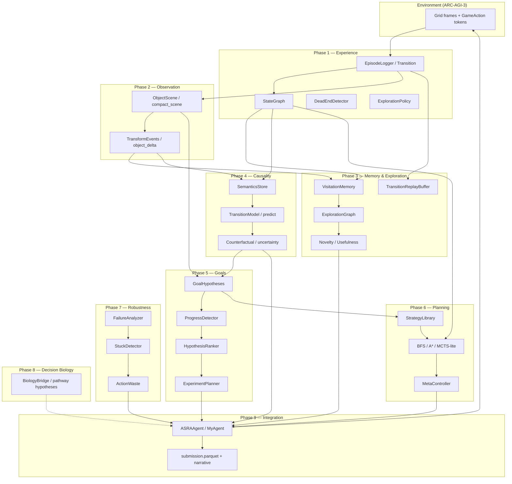

# ASRA Integrated Architecture

**Author:** Ilakkuvaselvi Manoharan  
**Affiliation:** Nature Foundation Models  
**Date:** May 2026  
**Version:** 1.0 — unified stack reference (companion to Phase 1–9 SciLayer preprints)

> **Purpose:** One document for the full nine-layer cognitive stack: what each layer does, what it reads and writes, how data flows, and where to read deeper theory.  
> **Index of phase papers:** https://sci-layer.vercel.app/articles (collection **ASRA — Phase Preprints**)

---

## 1. Design principle

ASRA treats adaptive intelligence as **intervention-centric reasoning under uncertainty**:

```text
Observe state → act → log transition → abstract structure → infer semantics & goals
→ plan → monitor failure → revise → repeat
```

Every layer consumes **transition evidence** produced by the layer below and emits **structured artifacts** the layer above can use. Nothing assumes predefined action labels or win conditions.

**Canonical transition:**

```text
τ = (s, a, s′, r, terminal, diff, metadata)
```

---

## 2. Stack overview



---

## 3. Layer reference — reads, writes, modules

| Phase | Layer | Primary question | **Reads** | **Writes** | Research library (`asra-arc/`) | Kaggle embed (competition agent) |
|-------|-------|------------------|-----------|------------|--------------------------------|----------------------------------|
| **1** | Experience | What happened when we acted? | Raw grid frames, `GameAction`, reward proxy | `Transition` rows, `state_hash`, cell `diff`, dead-end flags | `memory/transition_schema.py`, `episode_logger.py`, `state_graph.py`, `agent/dead_end_detector.py`, `agent/exploration_policy.py` | `ActionSemanticsInferencer`, hash + diff in template agent |
| **2** | Observation | What structural entities exist? | Grid `int[][]` | `object_scene` (components, bboxes), `object_delta` | `perception/objects.py`, `snapshot.py`, `transforms.py`, `rules.py` | `compact_scene()`, `object_delta()` |
| **3** | Memory & exploration | Where have we been? What's novel? | `state_hash`, edges, rewards | Visit counts, frontier scores, replay buffer, strategy patterns | `exploration/visitation_memory.py`, `exploration_graph.py`, `novelty.py`, `usefulness.py`, `replay.py` | `CompactExplorationHints` |
| **4** | Causality | What does this action do? | `(state_hash, action)` history, diffs | Semantic labels, predictions, confidence, uncertainty | `causality/transition_model.py`, `effect_summarizer.py`, `counterfactual.py`, `semantics_store.py` | `CausalSemanticsEngine` |
| **5** | Goals | What are we trying to achieve? | Object scenes, progress signals | Goal hypotheses, ranked templates, experiment plans | `goals/goal_hypothesis_generator.py`, `hypothesis_ranker.py`, `progress_detector.py`, `experiment_planner.py` | `GoalHypothesisEngine` |
| **6** | Planning | How do we sequence actions? | Transition graph, leading goal | Plans, strategy IDs, plan-repair signals | `planning/bfs_planner.py`, `strategy_library.py`, `meta_controller.py` | `PlanningEngine` |
| **7** | Robustness | Where do we fail? | Visit loops, action waste | Stuck penalties, failure reports | `robustness/stuck_detector.py`, `action_waste.py`, `failure_analyzer.py` | `RobustnessEngine` |
| **8** | Decision Biology | Same loop on cells? | Perturbation semantics (bridge) | Pathway hypothesis labels (optional bias) | `decision_biology/*` | `BiologyBridgeEngine` (lightweight) |
| **9** | Integration | Present & submit coherently | Phases 1–8 outputs | `asra-v1.0-phase9` agent, docs, eval narrative | CLI `asra complete-phase1`, export pipeline | `ASRAAgent` / `MyAgent`, `FinalStackEngine` marker |

**Phase paper (depth):** see §7 for SciLayer links.

---

## 4. End-to-end data flow (one ARC-AGI-3 step)

```text
1. ENV delivers FrameData (grid, status, available_actions)
2. AGENT.choose_action(frames, latest_frame)
   READ:  latest grid, available actions, GLOBAL_EXPLORER + GLOBAL_SEMANTICS state
3. AGENT emits GameAction
4. ENV returns next FrameData (+ reward / levels_completed proxy)
5. AGENT.append_frame (post-step hook)
   READ:  prev grid, curr grid
   COMPUTE: state_hash(prev), state_hash(curr), cell diff, object_scene ×2, object_delta
   WRITE: semantics.observe(s, a, diff, r)
         explorer.update(s, s′, a, diff, r)  → dead_ends, visit counts, goal engine
6. Repeat until WIN or MAX_ACTIONS
7. EPISODE END (local / Swarm)
   WRITE: transitions/*.jsonl, episodes/*.json, graphs/state_graph.json
         exports/asra_v0_* (optional)
8. KAGGLE SCORING RERUN
   gateway records actions → submission.parquet (row_id, game_id, end_of_game, score)
```

### Per-step artifact enrichment (cumulative)

| After step | New / updated fields on transition or in memory |
|------------|--------------------------------------------------|
| Phase 1 | `state`, `action`, `next_state`, `reward`, `diff.num_changed_cells`, `state_hash` |
| Phase 2 | `object_scene_before/after`, `delta_num_objects` |
| Phase 3 | visit counts, edge novelty/usefulness, replay buffer entry |
| Phase 4 | semantic label, predicted diff, confidence, uncertainty |
| Phase 5 | goal hypothesis scores, progress delta, experiment value |
| Phase 6 | plan bonus, strategy template id |
| Phase 7 | stuck / waste penalties applied to action score |
| Phase 8 | optional biology-bridge tag on semantics |

---

## 5. Action selection (integrated score)

In the Phase 9 competition agent, `ASRAExplorer.choose_action` fuses hints from all embedded layers:

```text
score(a | s) =
    exploration prior        (Phase 1 — local visit count)
  + uncertainty bonus        (Phase 4)
  + semantics confidence     (Phase 4)
  + prediction bonus         (Phase 4)
  + goal alignment           (Phase 5)
  + experiment discrimination(Phase 5)
  + object-effect bonus      (Phase 2)
  + novelty / usefulness     (Phase 3)
  + plan bonus               (Phase 6)
  + stuck / waste penalty    (Phase 7)
  + biology bridge (small)   (Phase 8)
  + noise
```

Dead-end taboo (Phase 1): if `(s, a)` marked dead-end → candidate excluded.

**Weights:** env-tunable in `asra_phase9_my_agent.py` (`ASRA_*_HINT_WEIGHT`).

---

## 6. Storage & schemas

### 6.1 Transition row (canonical log)

Defined in `asra-arc/src/asra/memory/transition_schema.py`:

| Field | Type | Description |
|-------|------|-------------|
| `transition_id` | UUID | Row id |
| `episode_id` | str | Episode scope |
| `game_id`, `level_id` | str | ARC game / level |
| `step_index` | int | Step in episode |
| `state`, `next_state` | object | grid, shape, status, **`state_hash`** |
| `action` | object | name, index |
| `reward` | float | Progress proxy |
| `terminal_state` | bool | Episode-ending step |
| `diff` | object | Cell change stats (+ object fields when enabled) |
| `metadata` | object | timestamp, agent_version, policy, notes |

**Hash rule:** SHA-256 over canonical grid JSON (shape + cell values).

### 6.2 Runtime paths (`asra-arc/data/`)

| Path | Producer | Consumer |
|------|----------|----------|
| `transitions/{episode_id}.jsonl` | Phase 1 `EpisodeLogger` | Export, replay viewer, hash audit |
| `episodes/{episode_id}.json` | Phase 1 finalize | Summary stats |
| `graphs/state_graph.json` | Phase 1 `StateGraph` | Analysis, planning (Phase 6) |
| `analysis/action_reports/` | Phase 1 action tester | Dead-end / semantics evidence |
| `exports/asra_v0_*.{jsonl,parquet,csv}` | `export/dataset_exporter.py` | Training, external eval |

### 6.3 Kaggle competition output

| Artifact | When | Schema |
|----------|------|--------|
| `submission.parquet` | Validation (gate) | Dummy: `row_id`, `game_id`, `end_of_game`, `score` |
| `submission.parquet` | Scoring rerun | Gateway-produced real scores |
| `/tmp/my_agent.py` | Notebook | Template agent (not in working output) |

Gateway pattern: see `kaggle-notebooks/_shared/gateway_notebook.py` in the [ASRA repository](https://github.com/ilakkmanoharan/asra/tree/main/kaggle-notebooks/_shared).

---

## 7. Phase papers (theory & depth)

| Phase | SciLayer preprint |
|-------|-------------------|
| Foundations | [Architectures for Adaptive Scientific Reasoning Under Uncertainty](https://sci-layer.vercel.app/articles/architectures-adaptive-scientific-reasoning-under-uncertainty) |
| Primer (Phase 1) | [Understanding Action Semantics Inference Through State Transitions](https://sci-layer.vercel.app/articles/understanding-action-semantics-inference-through-state-transitions-in-asra) |
| 1 — Experience | [Transition-Centric Experience (Phase 1)](https://sci-layer.vercel.app/articles/transition-centric-adaptive-reasoning-asra-phase-1) |
| 2 — Observation | [Object-Centric Reasoning (Phase 2)](https://sci-layer.vercel.app/articles/object-centric-adaptive-reasoning-asra-phase-2) |
| 3 — Memory | [Exploration & Memory (Phase 3)](https://sci-layer.vercel.app/articles/directed-exploration-episodic-memory-asra-phase-3) |
| 3 — Spec | [Phase 3 Technical Specification](https://sci-layer.vercel.app/articles/asra-phase-3-exploration-memory-navigation-spec) |
| 4 — Causality | [Causal Action Semantics (Phase 4)](https://sci-layer.vercel.app/articles/causal-action-semantics-asra-phase-4) |
| 5 — Goals | [Goal Inference (Phase 5)](https://sci-layer.vercel.app/articles/goal-inference-hypothesis-ranking-asra-phase-5) |
| 6 — Planning | [Planning & Strategy (Phase 6)](https://sci-layer.vercel.app/articles/planning-strategy-invention-asra-phase-6) |
| 7 — Robustness | [Robustness (Phase 7)](https://sci-layer.vercel.app/articles/robustness-generalization-asra-phase-7) |
| 8 — Biology | [Decision Biology Bridge (Phase 8)](https://sci-layer.vercel.app/articles/decision-biology-bridge-asra-phase-8) |
| 9 — Integration | [Final Research Story (Phase 9)](https://sci-layer.vercel.app/articles/final-submission-research-story-asra-phase-9) |

**Local companions (same manuscripts):** `kaggle-notebooks/phaseN/asra-phaseN-*.md` in the [ASRA repository](https://github.com/ilakkmanoharan/asra).

---

## 8. Two deployment shapes

| Shape | Where | Phases active | Use case |
|-------|-------|---------------|----------|
| **Research library** | `asra-arc/src/asra/` | Full modules per package | Local episodes, export, viewer, pytest |
| **Kaggle embedded** | `kaggle-notebooks/phaseN/asra_phaseN_kaggle_template_agent.py` | Compact engines inlined in `MyAgent` | ARC Prize 2026 competition scoring |

Phase N Kaggle agents **embed** a subset of Phase 1…N logic (no full `asra-arc` import on Kaggle). Phase 9 template is the **maximal** embedded stack; Phase 1 template is the **minimal** baseline.

**Build / submit:** `kaggle-notebooks/_shared/` (gateway notebook builder, extract, push/submit).

---

## 9. Repository map

| Path | Role |
|------|------|
| `asra-arc/src/asra/` | Full integrated research library |
| `asra-arc/data/` | Runtime logs, graphs, exports |
| `kaggle-notebooks/phase1…9/` | Per-phase agent, notebook, conceptual paper |
| `kaggle-notebooks/_shared/` | Gateway notebook tooling |
| SciLayer (this article) | https://sci-layer.vercel.app/articles/asra-integrated-architecture |
| GitHub | https://github.com/ilakkmanoharan/asra |

---

## 10. Gaps & extensions (not yet in this architecture doc)

| Topic | Status |
|-------|--------|
| Greg-style repeated-run eval (setup #1/#2, ls20/bp35) | Described in X thread; not formalized here |
| Cross-run persistence protocol | Partially in Phase 3 replay; eval spec TBD |
| Unified eval report + architecture SVG | Phase 9 narrative deliverables (pending) |

---

## 11. One-page summary

ASRA is a **nine-layer stack** over a single object — the **transition** — with hash-stable state IDs as the join key across layers. Phase 1 logs evidence; Phases 2–3 structure and navigate; Phases 4–5 infer semantics and goals; Phases 6–7 plan and guard; Phase 8 bridges to biology; Phase 9 integrates and submits. The research library implements each layer in `asra-arc/`; the Kaggle agent embeds compact versions into `MyAgent` for competition scoring via the official gateway sidecar.

**Read next:** [Phase 1 paper](https://sci-layer.vercel.app/articles/transition-centric-adaptive-reasoning-asra-phase-1) → [Phase 9 paper](https://sci-layer.vercel.app/articles/final-submission-research-story-asra-phase-9).
