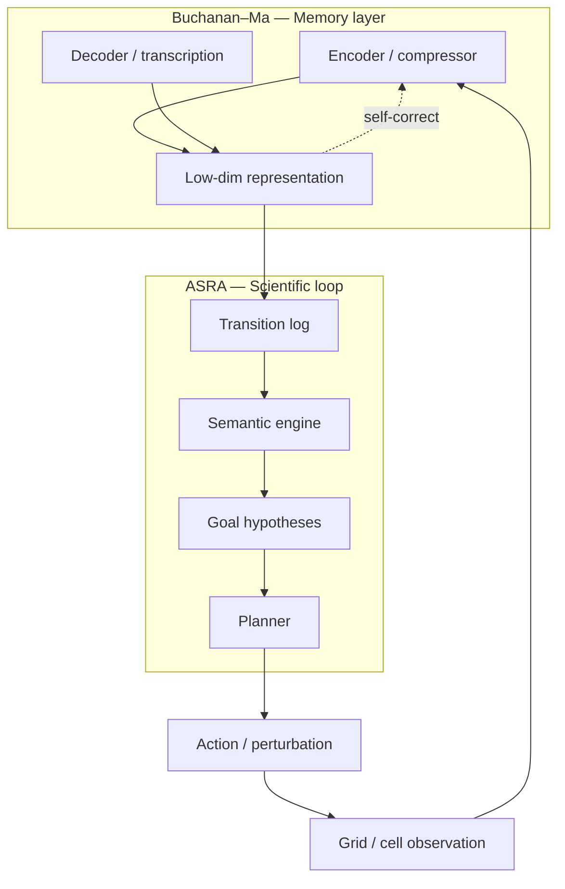

# ASRA vs Buchanan–Ma: A Mathematical Theory of Memory

**Author:** Ilakkuvaselvi Manoharan  
**Affiliation:** Nature Foundation Models  
**Date:** June 2026  
**Version:** 1.0 — SciLayer concept paper  
**Buchanan et al.:** [arXiv:2606.06624](https://arxiv.org/pdf/2606.06624) — *Principles and Practice of Deep Representation Learning: or A Mathematical Theory of Memory*  
**ASRA source:** [content/asra research bundles](https://github.com/ilakkmanoharan/SciLayer/tree/main/content/asra) (Phases 1–9 manuscripts + Kaggle notebooks)

---

## Executive summary

Buchanan, Pai, Wang, and Ma (2026) ask: **how should machines learn memory**—compact representations of predictable structure in high-dimensional data? ASRA asks: **how should machines reason scientifically in unknown interactive worlds**—where actions, semantics, goals, and experiments must be inferred from transitions?

The two programs are **complementary, not competing**.

**Buchanan–Ma (memory theory)**

- **Primary input:** passive or weakly labeled sensory corpora
- **Core object:** low-dimensional data distribution / representation
- **Learning mode:** compression, auto-encoding, Bayesian inference on priors
- **World model:** encoder–decoder memory of *what the world looks like*
- **Intelligence target:** Levels 1–2 (distributional memory + self-correction)
- **Implementation:** white-box deep nets (CRATE, diffusion, LLMs)

**ASRA (scientific reasoning architecture)**

- **Primary input:** action-conditioned state transitions
- **Core object:** transition graph, semantics, goals, plans
- **Learning mode:** exploration, intervention, hypothesis rank/refute
- **World model:** layered engines for *what changes when we act and why*
- **Intelligence target:** Levels 3–4 (semantics, goals, experiments, planning)
- **Implementation:** modular symbolic/heuristic stacks + competition agents

Buchanan–Ma supplies the **representational substrate** ASRA largely defers: how to compress grids, motion, or cell profiles into stable memory. ASRA supplies the **interactive scientific loop** the book flags as open: close the loop, test hypotheses, discriminate goals—what Chapter 9 calls **Popper-level** intelligence.

---

## 1. What Buchanan–Ma optimizes

### 1.1 Memory as compressed structure

The book’s preface frames the universal problem:

> Learn a low-dimensional distribution in a high-dimensional space, then transform it into compact structured representation—**memory** or empirical knowledge.

Everything else—PCA, transformers, diffusion, LLMs—serves that objective via **compression**, **denoising**, and **rate–distortion**.

### 1.2 Architecture story

```text
Classical models (PCA, ICA, DL)
        ↓
Compression as universal principle
        ↓
DNNs = unrolled compressors (ResNet, CNN, Transformer)
        ↓
Closed-loop auto-encoding (Stackelberg transcription)
        ↓
Priors for inference / generation (Ch. 7–8)
        ↓
Open: autonomous loop + scientific intelligence (Ch. 9)
```

### 1.3 Intelligence ladder (their taxonomy)

```text
phylogenetic → ontogenetic → societal → scientific
   DNA           brain         language    math + falsification
```

The textbook **formalizes the first three** as distributional learning. **Scientific intelligence**—hypothesis, deduction, experiment—is explicitly **out of scope** except as open problems.

### 1.4 Critical quote for ASRA alignment

Chapter 9 cites Pearl: **causal relationships cannot be learned from distributions alone**. Buchanan–Ma’s machinery is overwhelmingly **associative / compressive** on observed samples. Intervention semantics require a different loop—which is exactly where ASRA starts (Phase 1+).

---

## 2. What ASRA optimizes

### 2.1 Cumulative stack (Phases 1–9)

```text
Phase 1   Experience Engine        — transitions, hashes, effect logging
Phase 2   Observation Engine       — objects, transforms, scenes
Phase 3   Navigation & Memory      — exploration graph, novelty, subgoals
Phase 4   Causal Semantics         — action meaning, prediction, counterfactuals
Phase 5   Goal Inference           — win-condition hypotheses, discrimination experiments
Phase 6   Planning                 — multi-step strategies toward leading goals
Phase 7   Robustness               — generalization, reset, cross-game transfer
Phase 8   Decision Biology Bridge  — cell state ↔ grid state isomorphism
Phase 9   Unified research story   — ARC + biology narrative
```

Each phase adds an **interpretable engine** with explicit evidence objects (transitions, `ChangeReport`, semantic signatures, ranked hypotheses)—not a monolithic end-to-end policy.

### 2.2 Memory in ASRA is not primarily compressive

ASRA “memory” is **episodic and structural**:

**Buchanan memory**

- Latent code \(z\) minimizing coding length
- Global generative prior \(p(x)\)
- Continuous weight updates (backpropagation)

**ASRA memory (Phase 3+)**

- Visitation counts, edge stats, exploration graphs
- Per-(state, action) effect signatures
- Append-only transition JSONL + rank/refute counters

Phase 3’s exploration graph is closer to **model-based RL memory** than to Ma-style representation autoencoders—but ASRA keeps graphs **sparse and inspectable** for competition constraints.

### 2.3 Where ASRA already answers Buchanan’s Chapter 9 questions

- **Close the perception–action loop (Phases 1–3):** `choose_action` → `append_frame` → update memory
- **Self-correct knowledge (Phase 4):** hypothesis confirm/refute on semantic signatures
- **Hypothesis generation & falsification / Popper test (Phases 4–5):** causal hypotheses + goal templates ranked by progress/refute
- **Designed experiments (Phase 5):** `discrimination(a) = |match(h₁) - match(h₂)| × uncertainty`
- **Beyond passive distributions (Phases 1, 4, 8):** interventions required; Phase 8 maps perturbations

ASRA is architecturally closer to **Level-2 → Level-4** in Buchanan’s §9.3.3 taxonomy than to Level-1 generative replay—though v1 agents remain heuristic, not neural.

---

## 3. Side-by-side comparison

### 3.1 World models

**Definition**

- Buchanan–Ma: learned distribution + encoder/decoder
- ASRA: transition-centric stack of engines

**Training data**

- Buchanan–Ma: images, text, motion corpora
- ASRA: interactive ARC-AGI-3 episodes

**Latent variables**

- Buchanan–Ma: compression codes, CRATE tokens
- ASRA: state hashes, object scenes, semantic labels

**Dynamics**

- Buchanan–Ma: diffusion / autoregressive next-token
- ASRA: empirical `(s, a) → s'` with causal inference

**Evaluation**

- Buchanan–Ma: reconstruction loss, CLIP accuracy, perplexity
- ASRA: hypothesis stability, progress correlation, WIN hindsight

Buchanan–Ma **world models** predict sensory streams. ASRA **world models** predict **effects of interventions** under uncertainty—closer to scientific simulators than to generative media models.

### 3.2 Compression vs abstraction

The book’s deepest open question:

> Is there any difference between **compression** and **abstraction**?

ASRA’s answer (implicit in Phases 2–5):

- **Compression** (Buchanan): fold high-D pixels into low-D codes preserving observational structure.
- **Abstraction** (ASRA): assign **role-bearing symbols** (`translate`, `move_to_target`, `INCREMENT@(0,1)`) that support **intervention and goal reasoning**.

Phase 2 object scenes are a shallow abstraction layer (connected components, bboxes)—not Ma-style optimal coding. Phase 4–5 lift abstractions to **causal and teleological** forms compression alone does not guarantee.

### 3.3 Cybernetics lineage

Both cite **Wiener**: closed-loop learning from feedback.

**Store information**

- Buchanan–Ma: encoder weights, CRATE features
- ASRA: transition logs, exploration graphs

**Correct prediction errors**

- Buchanan–Ma: decoder transcription game
- ASRA: semantic refute, goal refute

**Decide under environment**

- Buchanan–Ma: generative conditioning / guidance
- ASRA: hint-weighted `choose_action`, planners (Phase 6)

**Game theory**

- Buchanan–Ma: Stackelberg encoder–decoder
- ASRA: experiment discrimination between hypotheses

Buchanan–Ma closes the loop **inside representation learning**. ASRA closes the loop **between agent and environment**.

### 3.4 Scientific intelligence tests

Buchanan §9.3.3 proposes three tests:

1. **Wiener** — autonomous self-correction of empirical knowledge
2. **Turing** — abstract concepts vs memorized statistics
3. **Popper** — generate and falsify hypotheses

**ASRA mapping**

- **Wiener test**
  - Buchanan concern: continuous self-improving memory
  - ASRA status (v1): partial — online transition accumulation + refute; no neural self-transcription
- **Turing test**
  - Buchanan concern: true number/logic understanding
  - ASRA status (v1): out of scope — no LLM core
- **Popper test**
  - Buchanan concern: hypothesis + experiment
  - ASRA status (v1): **core** — Phases 4–5 explicitly; Phase 6 sequences experiments

ASRA is a **Popper-first architecture sketch** built on **non-neural** modules; Buchanan–Ma is a **Wiener-first representation theory** aspiring toward Popper.

### 3.5 Efficiency and scalability

Buchanan emphasizes:

```text
incomputable → computable → tractable → scalable → natural
```

ASRA emphasizes **competition-grade execution** under step budgets: embedded compact engines in `my_agent.py`, venv isolation, hint stacks instead of large forward passes.

Trade-off: ASRA sacrifices **representational optimality** for **interpretability and deployability**; Buchanan sacrifices **end-to-end simplicity** for **mathematical transparency** in nets.

---

## 4. Phase-by-phase: what Buchanan theory could add to ASRA

- **Phase 1**
  - ASRA today: cell-diff transitions
  - Buchanan–Ma potential: learned hash embeddings compressing grid state (rate–distortion stable IDs)
- **Phase 2**
  - ASRA today: heuristic connected components
  - Buchanan–Ma potential: dictionary-learning / CRATE object tokens; sparse scene codes
- **Phase 3**
  - ASRA today: visit-count graph
  - Buchanan–Ma potential: compressed episodic memory; continuous online encoding of frontier states
- **Phase 4**
  - ASRA today: effect signature histograms
  - Buchanan–Ma potential: generative transition model in latent space (Dreamer-style, interpretability-constrained)
- **Phase 5**
  - ASRA today: template library
  - Buchanan–Ma potential: learned goal encoders when templates saturate (book Ch. 6–7 priors)
- **Phase 6**
  - ASRA today: BFS/A* on observed graph
  - Buchanan–Ma potential: planned rollouts in learned latent dynamics model
- **Phase 7**
  - ASRA today: robustness heuristics
  - Buchanan–Ma potential: self-consistent transcription when game distribution shifts
- **Phase 8**
  - ASRA today: LINCS / scPerturb bridge
  - Buchanan–Ma potential: **strong fit** — Ma framework targets high-D bio data compression + intervention inference
- **Phase 9**
  - ASRA today: narrative unification
  - Buchanan–Ma potential: position ASRA Popper-loop as complement to Ma memory-loop in one scientific-AI stack

**Highest-synergy locus:** Phase 8 Decision Biology—cell states are exactly the high-dimensional distributions Buchanan–Ma formalizes; ASRA supplies perturbation–response **experiment design** Ma’s passive inference chapter does not.

---

## 5. What ASRA adds that the book under-specifies

1. **Opaque action APIs** — ARC `ACTION1…7` with hidden semantics: no amount of image compression discovers action meaning without **intervention logging** (ASRA Phase 1–4).

2. **Latent objectives** — Buchanan discusses goals briefly via conditioning; ASRA Phase 5 treats **win conditions as hypotheses** to rank and discriminate—teleology as uncertain science.

3. **Exploration under sparse reward** — Book focuses on dataset compression; ASRA Phase 3 addresses **where to go** when rewards are rare but structure is informative.

4. **Competition engineering** — Swarm orchestration, parquet validation, reasoning strings—operational science not covered in the textbook.

5. **Cross-domain isomorphism** — Phase 8 explicitly maps game reasoning → perturbation biology; the book’s applications stop at motion/language unless extended.

---

## 6. Unified architecture sketch (hypothetical integration)



**Division of labor:**

- Buchanan–Ma learns **what the state is** (compact, self-consistent).
- ASRA learns **what actions mean, what the task is, and what to try next**.

Neither alone is sufficient for scientific intelligence in unknown dynamical systems; together they approximate the book’s Level-2 memory plus ASRA’s Level-4 experiment loop.

---

## 7. Verdict

- **Do they conflict?** No — different layers of the same cybernetic stack.
- **Does ASRA replace Buchanan?** No — ASRA barely addresses optimal representation learning.
- **Does Buchanan replace ASRA?** No — passive compression does not yield intervention semantics, goal discrimination, or ARC-style planning without an explicit action loop.
- **Strongest overlap:** Wiener closed-loop learning; Pearl’s insistence on interventions; Popper falsification (ASRA Ph. 4–5 vs Ma Ch. 9).
- **Strongest synergy:** Phase 8 bio bridge + Ma-style compressive cell-state models.
- **ASRA citation pitch:** “Ma explains **memory**; ASRA explains **experiments**.”

---

## References

1. Buchanan, S., Pai, D., Wang, P., Ma, Y. (2026). *Principles and Practice of Deep Representation Learning: or A Mathematical Theory of Memory.* arXiv:2606.06624.  
2. Ilakkuvaselvi Manoharan. [Architectures for Adaptive Scientific Reasoning Under Uncertainty](https://sci-layer.vercel.app/articles/architectures-adaptive-scientific-reasoning-under-uncertainty). SciLayer.  
3. Ilakkuvaselvi Manoharan. [ASRA phase articles](https://sci-layer.vercel.app/authors/0009-0008-8073-5416). SciLayer.  
4. Pearl, J. (2009). *Causality.* (cited in Buchanan Ch. 9; central to ASRA Phase 4.)  
5. Wiener, N. (1948). *Cybernetics.* (shared intellectual ancestor.)

---

*Related: [ASRA concept review](https://sci-layer.vercel.app/articles/architectures-adaptive-scientific-reasoning-under-uncertainty) · [Phase 4 Causal Semantics](https://sci-layer.vercel.app/articles/causal-action-semantics-asra-phase-4) · [Phase 8 Decision Biology](https://sci-layer.vercel.app/articles/decision-biology-bridge-asra-phase-8) · [Buchanan et al. source PDF (arXiv)](https://arxiv.org/pdf/2606.06624)*

*Correspondence: ilakkmanoharan@gmail.com*
