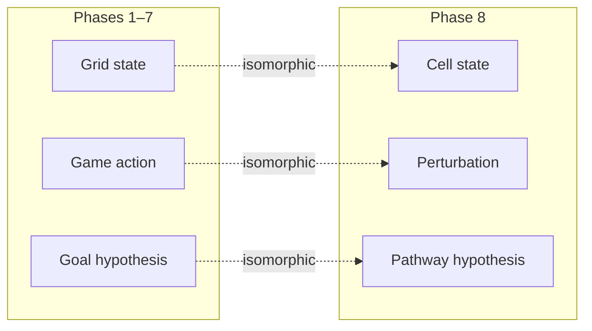
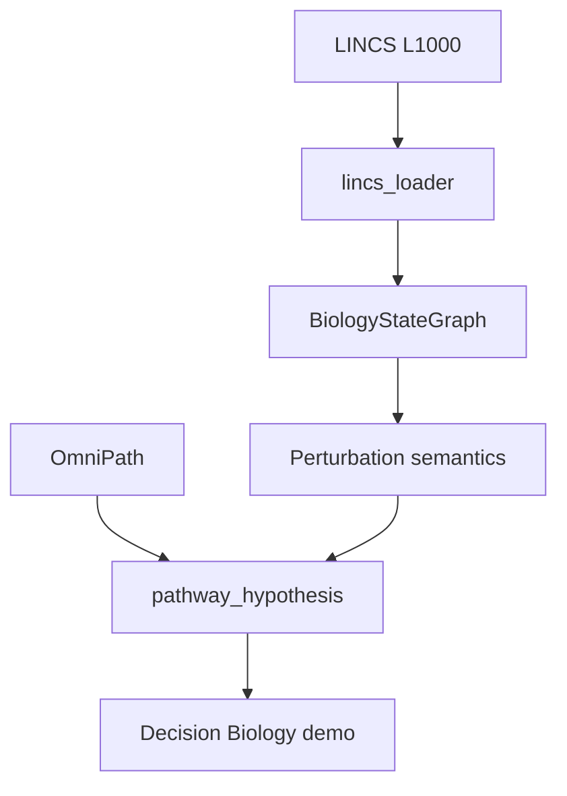

# Decision Biology Bridge: ASRA Phase 8 — From Grid Worlds to Perturbation–Response Reasoning

**Author:** Ilakkuvaselvi Manoharan  
**Affiliation:** Nature Foundation Models  
**Date:** October 2026  
**Version:** 1.0 — SciLayer preprint (companion: [Phase 8 Kaggle notebook](https://www.kaggle.com/code/ilakkmanoharan/asra-phase-8-arc-prize-2026))


## Abstract

Phases 1–7 of the Adaptive Scientific Reasoning Architecture (ASRA) built and hardened a transition-centric cognitive stack for interactive grid environments. From Phase 4 onward, the project drew conceptual parallels to **Decision Biology** — intervention–response reasoning under latent objectives — but remained game-bound in implementation.

We describe **ASRA Phase 8** as the **Decision Biology Bridge**: an isomorphic extension mapping environment states to **cell states**, game actions to **perturbations**, and goal hypotheses to **pathway survival objectives**. The bridge reuses Phase 1 transition schema, Phase 4 intervention semantics, Phase 5 hypothesis ranking, and Phase 6 experiment sequencing on biological datasets — LINCS L1000, OmniPath, scPerturb, Cell Painting, and Human Cell Atlas context.

The research library lives in `asra-arc/src/asra/decision_biology/`; the Kaggle agent carries bridge identity without requiring biology data in the sandbox. A **Decision Biology demo notebook** provides the scientific narrative artifact for Phase 9.

---

## 1. The architectural gap Phase 8 closes

```text
Phase 1–4   Intervention–response structure (games)
Phase 5     Latent objectives (win conditions)
Phase 6–7   Planning + robustness (games)
Phase 8     Same loop, biological domain
Phase 9     Unified research story
```

Phases 4–5 established the analogy:

```text
game state  →  action  →  next state  →  progress toward hidden goal
```

Phase 8 makes it operational:

```text
cell state  →  perturbation  →  next cell state  →  survival / pathway objective
```

Without Phase 8, ASRA remains an ARC competition project. With Phase 8, it becomes a **Nature Foundation Models** narrative: one architecture for adaptive reasoning in unknown dynamical systems — whether those systems are grid worlds or living cells.



---

## 2. Theoretical stance: one transition calculus, two domains

ASRA's core commitment is **transition-centric reasoning**:

```text
τ = (s, a, s′, r, terminal, metadata)
```

Phase 8 asserts that τ is **domain-agnostic** if state and action representations are appropriately defined. The cognitive operations — logging, semantics inference, hypothesis ranking, experiment planning — apply without modification to the **form** of reasoning.

| Operation | Game | Biology |
|-----------|------|---------|
| State identification | Grid hash | Gene signature hash |
| Action | ACTION1–5 | Compound, CRISPR, cytokine |
| Effect | Cell diff | Differential expression |
| Reward | WIN, level | Viability, pathway activation |
| Latent objective | Win template | Survival pathway |
| Experiment | Discriminating action | Next perturbation in screen |

This is not claiming that **pixels equal genes**. It claims that the **reasoning loop** — observe, intervene, compare, hypothesize, test — is shared between adaptive game play and adaptive experimental design.

| Paradigm | Phase 8 stance |
|----------|----------------|
| Separate bio ML pipeline | Complementary — ASRA adds reasoning layer |
| End-to-end neural biology FM | Deferred — Phase 8 is symbolic + graph |
| Hand-wavy analogy only | Rejected — operational schema + demo |
| Full clinical prediction | Rejected — demo scale with explicit limits |
| Shared transition schema | **Adopted** |

---

## 3. Perturbation-as-action semantics

Phase 4 learned that ACTION3 might mean `translate` in one game and `recolor` in another. Phase 8 learns that BRD-K12343256 might mean `inhibit_pathway` for one cell line and `no_response` for another.

**Perturbation semantics (v1):**

| Label | Biological reading |
|-------|-------------------|
| `upregulate_pathway` | Activates target pathway genes |
| `inhibit_pathway` | Suppresses pathway activity |
| `bypass_node` | Compensatory downstream activation |
| `rescue_viability` | Restores survival readout |
| `no_response` | Expression change below threshold |

Semantics are inferred from **edge diff summaries** on `BiologyStateGraph` — the same mechanism Phase 4 uses on grid cell diffs.

---

## 4. Cell-state embedding and identification

Grid worlds use `hash(grid)` for state identity. Biological states require **compact signatures**:

1. Gene activity vector (LINCS L1000).
2. Top-k responsive genes → signature.
3. `state_hash.py` → `cell_state_id`.

Optional morphology features from **Cell Painting** enrich the signature — bridging Phase 2's visual object intuition to cellular morphology.

**Human Cell Atlas** provides **context**: which neighborhood of cell-state space a sample occupies, grounding perturbation interpretation.

---

## 5. Pathway hypotheses as biological objectives

Phase 5 goal templates (`move_to_target`, `collect_tokens`, …) become **pathway survival hypotheses**:

```python
PathwayHypothesis(
    pathway_id="MAPK",
    objective="survival",
    preferred_perturbations=["trametinib", "CRISPR_MAP2K1"],
    confidence=0.72,
)
```

**Ranking** reuses Phase 5 logic:

```text
score(h) = w_r · response_magnitude(h) + w_p · omnipath_prior(h) - w_c · contradiction(h)
```

**Experiment planning** selects the perturbation maximizing discrimination between top-2 pathway hypotheses — the biological analog of Phase 5's goal discrimination experiments.

**OmniPath** supplies structural priors: hypotheses inconsistent with known signaling topology receive penalties.

---

## 6. Biological transition graph

`BiologyStateGraph` reuses ASRA's edge schema from Phase 1 `state_graph.py`:

- **Nodes:** `cell_state_id`, gene activities, pathway context, visit count.
- **Edges:** perturbation name, replicate count, average reward (viability), `num_changed_genes`.

The graph is the **world model** for biological planning — sparse, built from observed experiments, exactly like Phase 6's BFS input.

```text
LINCS ingest → transitions JSONL → BiologyStateGraph → pathway hypotheses
```

---

## 7. Datasets and empirical scope

| Dataset | Role |
|---------|------|
| LINCS L1000 | Core perturbation–response transitions |
| OmniPath | Signaling graph priors |
| scPerturb | Single-cell CRISPR before/after |
| Cell Painting | Morphological state features |
| HCA | Cell-type context grounding |

Phase 8 eval is **demo-scale**:

- Response direction accuracy (up/down regulation).
- Pathway rank @k on held-out perturbations.
- Schema validation against Phase 1 transition schema.
- OmniPath prior ablation (does graph structure help ranking?).

Explicit **non-claims**: clinical outcome prediction, full-atlas embedding SOTA, replacement of differential expression pipelines.

---

## 8. Architecture

**Library** (`asra-arc/src/asra/decision_biology/`):

```text
biology_state_graph.py   — Transition graph (reused schema)
state_hash.py            — Cell-state hashing
lincs_loader.py          — LINCS ingest
lincs_experiment.py      — Experiment runner
omnipath_loader.py       — Pathway graph
pathway_simulator.py     — Lightweight dynamics
pathway_hypothesis.py    — Hypothesis ranking
experiment.py            — Perturbation orchestration
cell_embedding.py        — Morphology + expression (planned)
```



**Kaggle agent (`asra-v0.9-phase8`):**

- Full Phase 7 robust planning stack unchanged.
- Bridge metadata: `bio=bridge_active` in reasoning string.
- No network calls; no biology data dependency in sandbox.

---

## 9. Agent integration

| Version | Tag | Layer added |
|---------|-----|-------------|
| Phase 7 | `asra-v0.85-phase7` | Robustness |
| **Phase 8** | **`asra-v0.9-phase8`** | **Biology bridge identity + schema hooks** |

The competition agent demonstrates **architectural continuity**; the demo notebook demonstrates **scientific extension**.

Build:

```bash
cd kaggle-notebooks/phase8
python3 build_phase8_kaggle_notebook.py
python3 asra_phase8_my_agent.py --self-test
```

---

## 10. Closing the loop with Phases 1–7

| Phase | Biology reuse |
|-------|---------------|
| 1 | Transition schema, graph structure |
| 4 | Effect signatures → perturbation semantics |
| 5 | Hypothesis ranking → pathway hypotheses |
| 5 | Experiment planner → next perturbation |
| 6 | Strategy library → intervention protocols |
| 7 | Failure analyzer → non-responder clusters |

The **module reuse count** is a Phase 8 metric: how much game code runs on biology data without modification?

---

## 11. Position in the Nature Foundation Models program

ASRA Phase 8 is the **scientific extension chapter**:

```text
ARC Prize 2026  →  proves adaptive reasoning in unknown environments
Decision Biology →  proves same architecture in perturbation–response science
Future FM work   →  neural encoders atop transition-centric scaffold
```

Phase 9 unifies these into a single research story for submission, GitHub, and deck.

---

## 12. Open problems

1. **Neural cell-state encoders** — when signature hashing saturates.  
2. **Multi-omic integration** — joint expression + morphology + chromatin.  
3. **Causal identifiability** — beyond observational LINCS edges.  
4. **Active learning** — closed-loop perturbation selection at scale.  
5. **Phase 9 narrative** — architecture diagram with dual domain.

---

## 13. Conclusion

ASRA Phase 8 is not a pivot away from games — it is a **proof of architectural generality**. The same transition log that powers ARC-AGI-3 reasoning powers LINCS perturbation analysis when states become cell signatures and actions become interventions.

The Decision Biology bridge makes the Phase 4–5 analogy **executable**: pathway hypotheses are goal hypotheses; perturbation screens are experiment plans; biological transition graphs are state graphs.

Transition-centric adaptive reasoning remains the core; Phase 8 shows that core extends to **living systems** — the scientific mission of the Nature Foundation Models research program.

---

## References (conceptual)

- ASRA roadmap — `ASRA-roadmap-datasets.md` (Phase 8: LINCS, OmniPath, scPerturb, HCA)  
- Phase 5 article — goal inference as objective uncertainty  
- Phase 8 specification — [`phase8-decision-biology-bridge.md`](phase8-decision-biology-bridge.md)  
- LINCS L1000 — perturbation–response corpus  
- OmniPath — pathway structure priors  
- Phase 8 implementation — [`phase8-implementation.md`](phase8-implementation.md)
