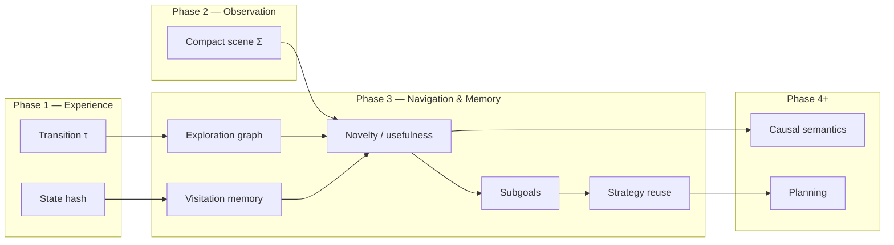
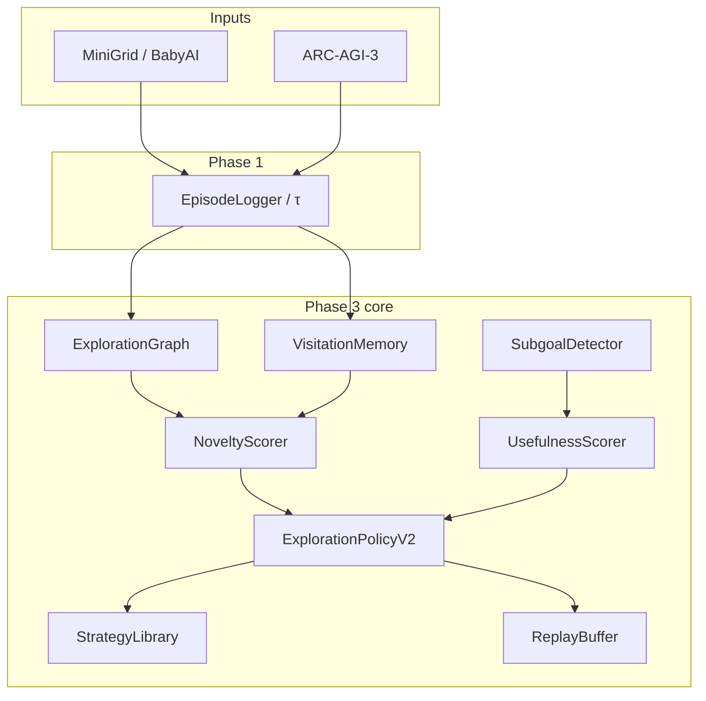

# Directed Exploration and Episodic Memory: ASRA Phase 3 — From Structure to Navigation

**Author:** Ilakkuvaselvi (Ilak) Manoharan  
**Affiliation:** Nature Foundation Models  
**Date:** June 2026  
**Version:** 1.0 — conceptual article for the Phase 3 exploration & memory track (companion to `asra-phase-3-arc-prize-2026.ipynb`)

---

## Abstract

Phase 1 of the Adaptive State–Reasoning Agent (ASRA) established **transition-centric experience**: log every `(state, action, next_state, reward)` tuple, hash grids for identity, and explore under coarse cell-diff semantics. Phase 2 added **object-centric observation**—connected components, transform events, and rule candidates—so that change could be described in structural vocabulary rather than pixel counts alone.

Neither layer answers the questions an agent faces in unknown interactive space: *Where have I already been? What territory remains unexplored? Which action is likely to open new ground rather than repeat a loop? What intermediate goal am I pursuing?*

We describe **ASRA Phase 3** as the **Navigation & Memory Engine**: a stack that extends hash-based state graphs into **exploration graphs** with frontier scores, maintains **visitation memory** at hash and object-fingerprint resolution, separates **novelty** (information gain) from **usefulness** (progress toward reward and subgoals), tracks **compositional subgoals** on BabyAI and DoorKey benchmarks, **reuses strategy patterns** across episodes, and **replays** high-value transitions for analysis. The full engine lives in `asra-arc/src/asra/exploration/`; the Kaggle competition agent embeds a compact **`CompactExplorationHints`** module that preserves Phase 2 object-scene bias while adding visit-count novelty and loop avoidance.

This article presents the theory, architectural decomposition, and design principles. It does not prescribe deployment mechanics; it specifies *what* Phase 3 adds and *why* it sits between Phase 2 observation and Phase 4 causal semantics.

---

## 1. The architectural gap Phase 3 closes

ASRA’s roadmap treats intelligence as a cumulative stack:

```text
Phase 1   Experience Engine      — transitions, hashes, cell diffs, naive exploration
Phase 2   Observation Engine     — objects, transforms, rule hypotheses
Phase 3   Navigation & Memory    — exploration graph, visitation, subgoals, strategy reuse
Phase 4   Action semantics       — causal meaning of interventions
Phase 5+  Goals, planning, robustness
```

Phase 1 answers: *“What happened when we acted?”*  
Phase 2 answers: *“What structural entities changed?”*  
Phase 3 answers: *“Where should we go next, given what we already know?”*

Without Phase 3, an agent with perfect segmentation still **wanders**: it may rediscover the same hash states, ignore frontiers, and treat every untested action as equally promising. Phase 3 is the **directed exploration layer**—not a planner in the BFS/A* sense (that belongs to Phase 6), but the memory substrate that makes planning possible later.



---

## 2. Theoretical stance: memory without abandoning empiricism

ASRA Phase 3 does not introduce oracle maps or hand-coded policies for competition environments. It adds **persistent summaries** over the same transition stream Phase 1 already logs:

```text
G_explore   — directed graph with visit counts, frontiers, edge statistics
M_visit     — exact + soft revisit keys (hash, object fingerprint)
novelty(s)  — expected information gain from visiting s
usefulness(a|s) — progress toward reward, frontiers, subgoals
g_sub       — current compositional subgoal (BabyAI / DoorKey / level progress)
```

The epistemic contract matches Phase 1 and Phase 2: all memory is **induced from experience**. Visit counts are empirical; frontier scores derive from successor visit distributions; subgoal detectors on BabyAI align with environment verifiers only for **evaluation**, not for online oracle steering in the competition agent.

Phase 3 therefore occupies a middle ground between reactive bandits and full symbolic planning:

| Paradigm | Phase 3 stance |
|----------|----------------|
| Uniform random exploration | Rejected — wastes budget on revisits |
| Pure novelty (hash-only) | Insufficient — false novelty from permutations; Phase 2 fingerprints help |
| Hard-coded scripts | Rejected for generalization — strategies are **extracted**, not authored |
| Optimal shortest-path planning | Deferred to Phase 6 — Phase 3 supplies **coverage-oriented** bias |

---

## 3. Exploration graph and visitation memory

### 3.1 From state graph to exploration graph

Phase 1’s `StateGraph` counts nodes and edges from transition logs. Phase 3’s **ExplorationGraph** adds exploration-specific fields:

| Node field | Role |
|------------|------|
| `visit_count`, `first_seen_step`, `last_seen_step` | Temporal coverage |
| `frontier_score` | High when many successors have low visit counts |
| `object_summary` | Optional Phase 2 compact scene attached to the node |

| Edge field | Role |
|------------|------|
| `avg_novelty_gain`, `usefulness_score` | Rolling means from transition metadata |
| `dead_end` | Sticky flag for zero-progress edges |

**Frontier intuition:** a node is exploratory valuable not only when it is rarely visited, but when it **gates access** to lightly visited successors—analogous to frontier nodes in classical exploration, adapted to hash-identified interactive states.

### 3.2 Visitation memory layers

**VisitationMemory** provides fast lookup at multiple resolutions:

| Layer | Key | Use |
|-------|-----|-----|
| Exact | `state_hash` | Precise revisit detection |
| Object | `object_scene_fingerprint` | Soft revisit when grids differ cosmetically |
| Episodic | recent window (20 states) | Loop penalty in policy |

Dual-key novelty becomes important on ARC-style grids where hash identity is strict but **object multiset** may be stable under rearrangement—a direct consumption of Phase 2 output in Phase 3 scoring (`ArcExplorationRunner` with object scenes enabled).

### 3.3 Cross-episode persistence

**ExplorationSessionState** shares memory, graph, strategy library, and replay buffer across batch episodes. This is how Phase 3 achieves **strategy reuse**: a successful DoorKey sequence extracted in episode *n* biases episode *n+1* when preconditions match—without hard-coding the sequence a priori.

---

## 4. Novelty and usefulness: two axes of action quality

Phase 3 separates **information** from **progress**:

### 4.1 Novelty score

Baseline state novelty:

```text
novelty(s) = 1 / sqrt(1 + visit_count(s))
           + α · 1[object_fingerprint unseen]
           + β · frontier_bonus(s)
```

Edge novelty incorporates reward proxy and dead-end penalty:

```text
edge_novelty(s,a) = novelty(s′) + γ·reward − δ·dead_end
```

Defaults (`α=0.3`, `β=0.2`, `γ=0.1`, `δ=0.5`) prioritize unseen states and penalize no-op edges. The design is intentionally simple—calibratable on MiniGrid coverage benchmarks against Phase 1’s `SimpleExplorationPolicy`.

### 4.2 Usefulness score

Usefulness aggregates signals that correlate with **task progress**:

| Signal | Source |
|--------|--------|
| Reward delta | Environment |
| Frontier expansion | New or low-visit successor in graph |
| Subgoal advance | SubgoalDetector completion events |
| Object delta | Phase 2 `delta_num_objects` |
| Dead-end flag | Zero cell change + zero reward |

Combined:

```text
usefulness(a|s) = w_r·Δreward + w_f·frontier_gain + w_g·subgoal_progress
                + w_o·object_delta − w_d·dead_end
```

**ExplorationPolicyV2** ranks actions by blending observed edge statistics (avg novelty + usefulness − repeat penalty) with priors on unexplored edges and optional **strategy bias**. This is Pareto-inspired but implemented as a weighted sum for v1 simplicity.

---

## 5. Subgoal structure: compositional navigation

Phase 3 introduces **SubgoalDetector** and mission parsing for environments where tasks decompose into ordered steps.

### 5.1 BabyAI

BabyAI missions (`go to the red ball`, `pick up the grey key`) map to ordered **SubgoalState** records via a rule-based parser—no LLM mission encoder in v1. Completion is detected with environment-aligned oracles (e.g., GoTo: agent `front_pos` matches target object position).

Transitions carry metadata: `subgoal_id`, `subgoal_index`, `subgoal_complete`, `subgoal_complete_id`. Eval harness **replay-oracle** accuracy reaches 100% on successful GoTo episodes in smoke tests—subgoal boundaries in logs match detector replay on the same action sequence.

### 5.2 MiniGrid DoorKey

DoorKey milestones form a fixed chain: **has_key → door_open → at_goal**. Preconditions feed **StrategyLibrary** matching (`env_type: doorkey`, `has_key`, `door_open`).

### 5.3 ARC-AGI-3 (integration track)

On interactive ARC logs, Phase 3 tracks **level_progress** subgoals when `level_id` changes—lightweight structure without claiming win-condition inference (Phase 5). **ArcExplorationRunner** attaches full exploration metadata to Phase 1 transitions and writes per-episode exploration graphs.

---

## 6. Strategy reuse and memory replay

### 6.1 StrategyLibrary

After **successful** episodes, action sequences are compressed (consecutive duplicates removed) and indexed by **precondition** tags. On matching states, **ExplorationPolicyV2** adds soft bias toward the first action of the stored sequence—reuse without rigid scripting.

A seed DoorKey pattern cold-starts search before any success. Cross-episode shared session state lets later episodes benefit from earlier wins.

### 6.2 TransitionReplayBuffer

A priority buffer (max-heap, capacity 500) retains high-value transitions: high novelty, subgoal boundaries, WIN transitions, large object deltas. Export to JSONL supports offline analysis, Streamlit replay, and future imitation—not neural training in v1.

---

## 7. System architecture (library view)

Phase 3 in `asra-arc` decomposes as:

```text
exploration_graph.py     →  ExplorationGraph, frontier scores
visitation_memory.py     →  hash + object fingerprint visits
novelty.py / usefulness.py →  scorers
policy_v2.py             →  ExplorationPolicyV2
strategies.py            →  StrategyLibrary extract / match / bias
subgoals.py              →  parser, SubgoalDetector
replay.py                →  TransitionReplayBuffer
runner_core.py           →  shared Gym loop (MiniGrid / BabyAI)
minigrid_runner.py       →  DoorKey benchmarks
babyai_runner.py         →  compositional eval
arc_exploration.py       →  ARC-AGI-3 integration
policy_adapter.py        →  Phase 1 baseline for comparisons
```

**Environment adapters:**

| Adapter | Role |
|---------|------|
| MiniGrid / BabyAI | Training ground — coverage, subgoals, strategy reuse |
| ARC-AGI-3 mock/replay/live | Integration — dual-key novelty, level subgoals |



---

## 8. Closing the loop with Phase 1 and Phase 2

Phase 3 **extends** prior layers; it does not replace them.

| Layer | Phase 3 consumption |
|-------|---------------------|
| Phase 1 transitions | Canonical τ records; exploration metadata attached |
| Phase 1 hash keys | Primary node IDs in exploration graph |
| Phase 1 dead-end detector | Penalty input for usefulness and ARC runner |
| Phase 2 compact scenes | Object fingerprint in visitation memory; object delta in usefulness |
| Phase 2 object hints (Kaggle) | Retained in competition agent alongside exploration hints |

**Phase 1 baseline comparison:** `Phase1PolicyAdapter` wraps `SimpleExplorationPolicy` with the same interface as `ExplorationPolicyV2`, enabling fair DoorKey benchmarks (`eval_phase3_doorkey_benchmark.py`).

**Kaggle competition agent (`asra-v0.5-phase3`):** embeds Phase 2 `compact_scene()` and Phase 3 `CompactExplorationHints` in a single `ASRAExplorer.choose_action()`:

```text
score(action) = Phase1_terms + OBJECT_HINT_WEIGHT · object_bonus
              + EXPLORATION_HINT_WEIGHT · exploration_score(action)
```

Reasoning strings cite both object count and visit count (`objects=7 | visits=2`), making traces auditable. Weights default to 0.35 and 0.45 respectively.

The notebook (`asra-phase-3-arc-prize-2026.ipynb`) writes `my_agent.py` and validates with `--self-test`; Kaggle scoring re-runs the agent in an isolated venv—Swarm is not executed in the notebook cells themselves.

---

## 9. Empirical landscape

Phase 3 metrics differ from Phase 2 ARC rule coverage. They measure **exploration efficiency** and **subgoal fidelity**, not puzzle solve rate.

### 9.1 MiniGrid

| Metric | Intent |
|--------|--------|
| Coverage | Fraction of reachable cells visited |
| Revisit rate | Revisits / total steps — lower is better |
| Unique nodes | Exploration graph size |
| Frontier efficiency | New nodes per 100 steps |

DoorKey benchmark script compares Phase 3 v2 vs Phase 1 baseline on identical seeds. Success rates depend on episode budget; the benchmark **infrastructure** is the deliverable—stable headline numbers require longer batch runs.

### 9.2 BabyAI

| Metric | Smoke result |
|--------|--------------|
| Subgoal detection accuracy (replay oracle) | 1.0 on successful GoTo episodes |
| Success rate | Environment-dependent; varies by seed and step budget |

### 9.3 ARC-AGI-3 ablation

`eval_phase3_arc_ablation.py` compares baseline vs Phase 3 on mock episodes: unique nodes, loop count, reward non-regression. Phase 3 targets **fewer loops** and **richer exploration graphs** at fixed action budget—not guaranteed leaderboard gains in v1.

### 9.4 What Phase 3 metrics are not

- Original ARC 800-task rule coverage (Phase 2)
- Competition win rate or Milestone #2 claims (Phase 6)
- PHYRE or biology benchmarks (later phases)

---

## 10. Position in the ASRA research program

| Question | Phase 2 | Phase 3 |
|----------|---------|---------|
| Unit of memory | Scene Σ per frame | Graph G + visit counts + strategies |
| State key | Hash (+ optional object signature) | Hash + object fingerprint for novelty |
| Action selection | Object-effect bias | Novelty + usefulness + subgoals + strategy |
| Supervision | ARC demos + episodes | MiniGrid / BabyAI structure + episodes |
| Success criterion | Segment, explain pairs | Explore efficiently, tag subgoals, reuse strategies |

Phase 3 teaches ASRA **directed curiosity**: prefer actions that expand known frontiers, advance compositional goals, and reuse proven sequences—while still logging every transition for later causal analysis (Phase 4).

---

## 11. Kaggle submission and agent evolution

| Version | Tag | Layer added |
|---------|-----|-------------|
| Phase 1 | `asra-v0.1` … v4 | Transition logging, semantics inferencer |
| Phase 2 | `asra-v0.4-phase2` | Compact object-scene hints |
| Phase 3 | `asra-v0.5-phase3` | Visit memory, novelty/usefulness, loop penalty |

**Submitted kernel:** `ilakkmanoharan/asra-phase-3-arc-prize-2026` (competition ref 53270909, v1).

The notebook pattern matches Phase 2: bootstrap venv at `/tmp/asra_venv`, avoid mirroring agent trees into `/kaggle/working`, smoke-test with venv Python, emit placeholder `submission.parquet` for validation gate.

Full library capabilities (exploration graph batch build, BabyAI eval CSV, DoorKey benchmark JSON) remain in `asra-arc` for offline research; the competition agent carries the **minimal sufficient** hint stack.

---

## 12. Open problems and next theory steps

1. **Causal semantics (Phase 4)** — map action tokens to transform families using Phase 2 event types as effect descriptors; novelty/usefulness become priors for intervention design.  
2. **Goal inference (Phase 5)** — rank win-condition hypotheses; subgoal detectors become evidence nodes.  
3. **Planning (Phase 6)** — compile exploration graphs into search frontiers for BFS/A* / MCTS at competition scale.  
4. **DoorKey success calibration** — longer batches and curriculum; strategy extraction quality vs hand-tuned baselines.  
5. **Unified metrics** — relate MiniGrid coverage gains to ARC-AGI-3 levels completed under fixed action budgets.  
6. **Object-graph memory** — persist object identities across frames instead of re-segmenting each step (bridge from Phase 2 snapshots to Phase 3 graph nodes).

---

## 13. Conclusion

ASRA Phase 3 is the project’s shift from **seeing structure** to **acting with memory**: exploration graphs and visitation counters make unknown space legible; novelty and usefulness disentangle curiosity from progress; subgoals and strategy reuse introduce compositional navigation without abandoning the transition-centric spine established in Phase 1.

The Phase 3 Kaggle extension is not a new agent philosophy—it is Phase 2 plus **remembered territory**. Object-centric observation still biases toward structural change; exploration memory ensures the agent does not pay twice for the same ground.

Transition-centric adaptive reasoning remains the core; directed exploration is how those transitions become **efficient**.

---

## Reference notebook (GitHub)

Interactive companion with Phase 2 object-scene hints plus Phase 3 exploration memory:

- [ASRA Phase 3 — ARC Prize 2026 (ASRA repository)](https://github.com/ilakkmanoharan/asra/blob/main/kaggle-notebooks/phase3/asra-phase-3-arc-prize-2026.ipynb)
- [SciLayer archive copy](https://github.com/ilakkmanoharan/SciLayer/blob/main/content/kaggle-notebooks/asra-phase-3-arc-prize-2026.ipynb)

---

## References

1. Chollet, F. On the Measure of Intelligence. *arXiv* (2019).  
2. Ilakkuvaselvi Manoharan. Transition-Centric Adaptive Reasoning: ASRA Phase 1 for Interactive Environments. https://sci-layer.vercel.app/articles/transition-centric-adaptive-reasoning-asra-phase-1  
3. Ilakkuvaselvi Manoharan. Object-Centric Adaptive Reasoning: ASRA Phase 2 — From Pixel Transitions to Symbolic Structure. https://sci-layer.vercel.app/articles/object-centric-adaptive-reasoning-asra-phase-2  
4. Ilakkuvaselvi Manoharan. ASRA Phase 3 — Exploration, Memory, and Navigation (Technical Specification). https://sci-layer.vercel.app/articles/asra-phase-3-exploration-memory-navigation-spec  
5. Ilakkuvaselvi Manoharan. ASRA: Adaptive Scientific Reasoning Architecture. https://github.com/ilakkmanoharan/asra  
6. Phase 3 exploration implementation — https://github.com/ilakkmanoharan/asra/tree/main/asra-arc/src/asra/exploration  
7. Chevalier-Boisvert et al. BabyAI: A Platform to Study the Sample Efficiency of Grounded Language Learning. *arXiv* (2018).

---

*Correspondence: ilakkmanoharan@gmail.com*
