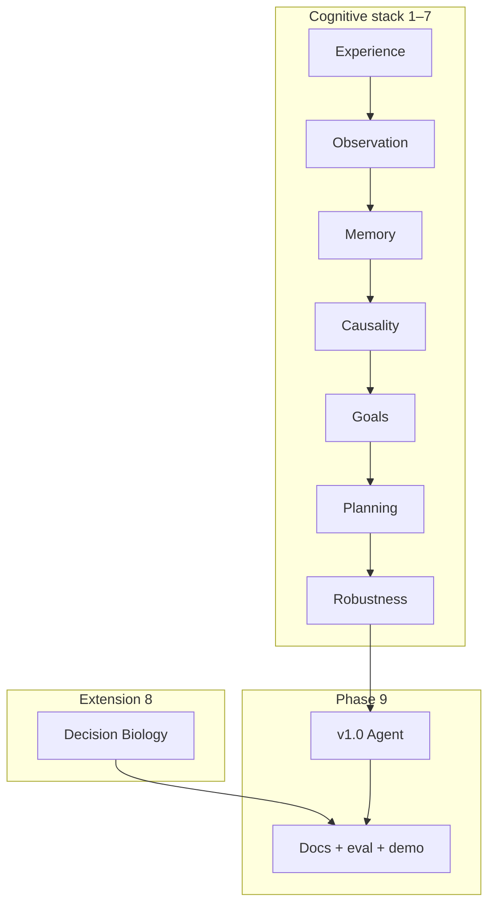

# Final Submission and Research Story: ASRA Phase 9 — Integrating Adaptive Scientific Reasoning

**Author:** Ilakkuvaselvi Manoharan  
**Affiliation:** Nature Foundation Models  
**Date:** November 2026  
**Version:** 1.0 — SciLayer preprint (companion: [Phase 9 Kaggle notebook](https://www.kaggle.com/code/ilakkmanoharan/asra-phase-9-arc-prize-2026))


## Abstract

Phases 1–8 of the Adaptive Scientific Reasoning Architecture (ASRA) constructed a nine-layer cognitive stack: from transition logging through object-centric observation, exploration memory, causal semantics, goal inference, planning, robustness, and a Decision Biology bridge. Each phase added a distinct scientific question; each produced an agent version, a specification, and eval evidence.

We describe **ASRA Phase 9** as **integration and narrative** — not a new cognitive layer. Phase 9 selects tuned weights from Phase 7, composes the full embedded stack into **`asra-v1.0-phase9`**, submits the final ARC Prize 2026 agent, and packages the research story: architecture diagram, evaluation report, demo video, GitHub README, and Decision Biology extension section.

This article presents the unified theory, the integrated architecture, and the communication deliverables that make ASRA legible to competition judges, open-source collaborators, and the Nature Foundation Models program.

---

## 1. The architectural completion Phase 9 represents

```text
Phase 1   Experience           — What happened when we acted?
Phase 2   Observation          — What structural entities exist?
Phase 3   Memory & exploration — Where have we been? What's novel?
Phase 4   Causality            — What does this action do?
Phase 5   Goals                — What are we trying to achieve?
Phase 6   Planning             — How do we sequence actions toward that goal?
Phase 7   Robustness           — Where do we fail? How do we recover?
Phase 8   Decision Biology     — Does the same loop apply to cells?
Phase 9   Integration          — Submit, document, explain.
```

Phase 9 does not ask a new scientific question. It asks: **Can we present the answers coherently?**



---

## 2. Theoretical stance: transition-centric reasoning as unifying principle

ASRA's thesis:

> Adaptive intelligence in unknown environments emerges from **logging interventions**, **abstracting structure**, **inferring semantics and objectives**, **planning under partial models**, and **monitoring failure** — not from memorizing solutions.

This thesis is tested in two domains:

| Domain | State | Intervention | Objective |
|--------|-------|--------------|-----------|
| ARC-AGI-3 | Grid + objects | ACTION1–5 | Inferred win condition |
| Biology (LINCS) | Gene signature | Perturbation | Pathway survival |

Phase 9's research story argues that these are **one architecture, two instantiations** — not two projects glued together.

The epistemic hierarchy (extending Pearl):

```text
Association     — Phase 1–2: what correlates with what changed?
Intervention    — Phase 4: what does action a cause?
Counterfactual  — Phase 4: what if we had taken a′?
Objective       — Phase 5: what is the system optimizing toward?
Control         — Phase 6–7: how do we act reliably toward that objective?
Transfer        — Phase 8: does the control loop generalize across domains?
```

---

## 3. Integrated architecture

### 3.1 Final agent composition

`FinalStackEngine` in `asra_phase9_my_agent.py` composes:

```text
RobustnessEngine
  └── PlanningEngine
        └── GoalHypothesisEngine
              └── CausalSemanticsEngine
                    └── ExplorationEngine
                          └── ObservationEngine
                                └── ExperienceEngine
```

Biology bridge: metadata constants + shared schema; full demo offline.

### 3.2 Composite scoring

```text
score(a) = w_exp · novelty
         + w_sem · semantic_confidence
         + w_goal · goal_alignment
         + w_plan · plan_step_match
         + w_disc · discrimination
         - w_waste · action_waste
         × meta_blend(mode)
```

Weights tuned from Phase 7 dashboard; frozen for v1.0 submission.

### 3.3 Agent evolution

| Tag | Milestone |
|-----|-----------|
| `asra-v0.1` | Functional baseline |
| `asra-v0.6-phase4` | Causal semantics |
| `asra-v0.7-phase5` | Goal inference |
| `asra-v0.8-phase6` | Planning — Milestone #2 |
| `asra-v0.85-phase7` | Robustness — final candidate |
| `asra-v0.9-phase8` | Biology bridge |
| **`asra-v1.0-phase9`** | **Integrated release** |

---

## 4. Dataset narrative across phases

Phase 9 cites evidence without new data ingestion:

| Dataset | Phase | Story role |
|---------|-------|------------|
| ARC-AGI-3 | 1–7, 9 | Competition benchmark; primary results |
| Original ARC | 2, 5 | Abstraction; template bootstrap |
| MiniGrid / BabyAI | 3, 6 | Memory + planning |
| PHYRE / CLEVRER | 4, 5 | Causal + temporal reasoning |
| Procgen / Crafter | 6–7 | Generalization + long horizon |
| LINCS / OmniPath | 8 | Decision Biology demo |
| scPerturb / HCA | 8 | Single-cell + context |

**Narrative arc:**

1. **Problem** — Agents must reason in unknown environments with sparse feedback.  
2. **Method** — ASRA's transition-centric cognitive stack.  
3. **Evidence** — Phase-by-phase metrics culminating in v1.0 win rate.  
4. **Extension** — Same architecture on perturbation–response biology.  
5. **Vision** — Foundation models for adaptive scientific reasoning.

---

## 5. Deliverables as scientific communication

Phase 9 maps engineering artifacts to communication goals:

| Deliverable | Audience | Content |
|-------------|----------|---------|
| Kaggle submission | Competition judges | v1.0 agent performance |
| GitHub README | Developers | Install, CLI, phase map |
| Architecture diagram | All | Layers 1–8 + dual domain |
| Evaluation report | Reviewers | Reproducible metrics |
| Demo video | General | Replay + biology demo |
| Research writeup | Publication | Full theory + results |
| Biology section | Nature FM | LINCS demo + limits |

The evaluation report is **not** a leaderboard screenshot. It decomposes:

- Win rate and actions-to-win (Phase 6–7).
- Semantic accuracy and calibration (Phase 4).
- Hypothesis accuracy (Phase 5).
- Generalization Δ (Phase 7 Procgen).
- Pathway rank @k (Phase 8).

---

## 6. Architecture diagram specification

The Phase 9 diagram must show:

**View A — Cognitive stack (vertical):**

```text
┌─────────────────────────────────┐
│  Phase 7: Robustness guards     │
├─────────────────────────────────┤
│  Phase 6: Planning + strategies │
├─────────────────────────────────┤
│  Phase 5: Goal hypotheses       │
├─────────────────────────────────┤
│  Phase 4: Causality + semantics │
├─────────────────────────────────┤
│  Phase 3: Exploration + memory  │
├─────────────────────────────────┤
│  Phase 2: Observation           │
├─────────────────────────────────┤
│  Phase 1: Experience / τ log    │
└─────────────────────────────────┘
```

**View B — Transition loop (horizontal):**

```text
s ──[a]──▶ s′ ──[log]──▶ graph ──[infer]──▶ sem, goal ──[plan]──▶ a*
```

**View C — Dual domain (Phase 8):**

```text
Grid world τ  ═══ isomorphic schema ═══  Biology τ
```

Output: `docs/architecture/asra-architecture-v1.svg`

---

## 7. Agent integration

**Final Kaggle package:** `kaggle-notebooks/phase9/`

```bash
cd kaggle-notebooks/phase9
python3 build_phase9_kaggle_notebook.py
python3 asra_phase9_my_agent.py --self-test
./submit.sh
```

**Self-test requirements:** all layer flags green — perception, exploration, causality, goals, planning, robustness.

**Reasoning string:**

```text
ASRA v1.0: ACTION3 | objects=5 | sem=translate conf=0.81 u=0.12 | goal=move_to_target | strat=reach_target | plan=bfs:2/4 | guard=ok
```

**Regression guard:** v1.0 must not regress >5% on Phase 7 fixture set vs `asra-v0.85-phase7`.

---

## 8. Decision Biology in the final story

Phase 9's biology section is **not optional garnish**. It demonstrates:

1. **Schema reuse** — biology transitions validate Phase 1 schema.  
2. **Module reuse** — Phase 5 ranking runs on pathway hypotheses.  
3. **Honest scope** — demo-scale eval with explicit limitations.  
4. **Future work** — neural encoders atop transition scaffold.

Side-by-side figure: ARC state graph and LINCS biology graph with identical edge schema — the visual anchor of the Nature FM narrative.

---

## 9. Limitations (required in writeup)

Phase 9 must state clearly:

| Limitation | Detail |
|------------|--------|
| No neural world model | Symbolic planners over partial graphs |
| Heuristic perception | Phase 2 objects, not learned vision |
| Biology demo scale | LINCS subset, not clinical cohorts |
| Kaggle sandbox | No live API, no biology network |
| Competition vs science | Win rate ≠ pathway prediction AUC |

Honest limitations **increase** credibility for reviewers.

---

## 10. Position in the research program

ASRA began as an ARC Prize 2026 entry. It ends Phase 9 as:

```text
A reproducible cognitive architecture
  + competition agent (v1.0)
  + open-source library (asra-arc)
  + scientific extension (decision_biology/)
  + documented evidence (eval report)
```

The ARC competition is the **stress test**; Decision Biology is the **mission statement**; Phase 9 is the **publication**.

---

## 11. Open problems beyond Phase 9

1. **Neural encoders** for state (grid and cell).  
2. **Live ARC-AGI-3 API** integration at scale.  
3. **Closed-loop biological experimentation** with ASRA planning.  
4. **Cross-domain transfer learning** between game semantics and perturbation semantics.  
5. **Foundation model training** on unified transition corpora.

---

## 12. Conclusion

ASRA Phase 9 is the capstone of a nine-phase research program: integrate the stack, submit the agent, document the evidence, tell the story. No new algorithms — only **clarity**.

`asra-v1.0-phase9` is Phases 1–7 composed with tuned weights, plus Phase 8's bridge identity. The evaluation report proves what each layer contributed. The architecture diagram shows how they connect. The Decision Biology section shows why the connection matters beyond games.

Transition-centric adaptive reasoning was the method from Phase 1. Phase 9 makes that method **visible** — to judges, collaborators, and the scientific community ASRA was built to serve.

---

## References (conceptual)

- ASRA roadmap — `ASRA-roadmap-datasets.md` (Phase 9 deliverables)  
- Phases 4–8 articles — `kaggle-notebooks/phase*/asra-phase*.md`  
- Phase 9 specification — [`phase9-final-submission.md`](phase9-final-submission.md)  
- Memory graph — `memory-graph/system-architecture.md`  
- Phase 9 implementation — [`phase9-implementation.md`](phase9-implementation.md)  
- ARC Prize 2026 — competition context  
- Nature Foundation Models — Decision Biology mission
