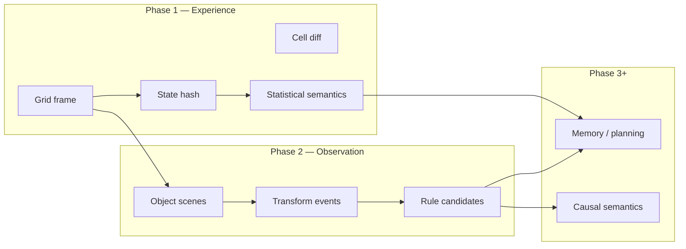
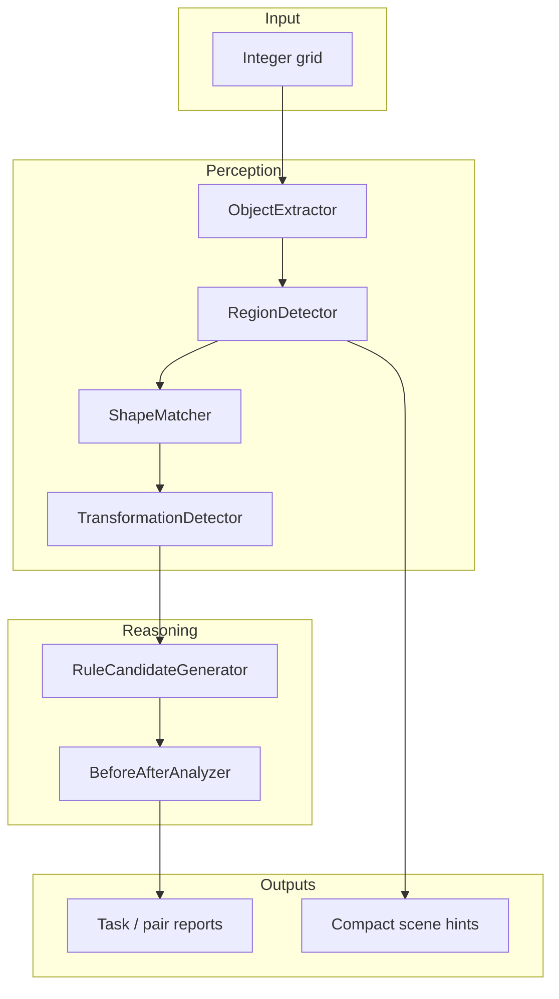

# Object-Centric Adaptive Reasoning: ASRA Phase 2 — From Pixel Transitions to Symbolic Structure

**Author:** Ilakkuvaselvi (Ilak) Manoharan  
**Affiliation:** Nature Foundation Models  
**Date:** June 2026  
**Version:** 1.0 — conceptual article for the Phase 2 perception track (companion to `asra-phase-2-arc-prize-2026.ipynb`)

---

## Abstract

Phase 1 of the Adaptive State–Reasoning Agent (ASRA) established that interactive intelligence can begin with **transition evidence alone**: log state changes, infer coarse action semantics from cell-level diffs, and explore under uncertainty. That foundation is necessary but not sufficient. Human-like reasoning over grid worlds—whether static ARC puzzles or interactive ARC-style games—operates on **objects, relations, and transformations**, not on raw pixel arrays.

We describe **ASRA Phase 2** as the **Observation Engine** layer: a pipeline that segments integer grids into connected objects, detects region structure, aligns shapes across frames, classifies object-level transform events, and induces **rule candidates** that explain demonstration pairs. Phase 2 runs primarily on the Original ARC corpus as a supervised laboratory for abstraction; its compact object-scene representation also feeds back into the interactive agent as **structural hints** that bias exploration when cell counts alone are ambiguous.

This article presents the big-picture theory, architectural decomposition, and design principles. It does not prescribe deployment mechanics; it specifies *what* is being built and *why* it sits between Phase 1 logging and later phases of memory, causality, and planning.

---

## 1. The architectural gap Phase 2 closes

ASRA’s long-range roadmap treats intelligence as a stack of competencies, each consuming the output of the previous layer:

```text
Phase 1   Experience Engine     — transitions, hashes, cell diffs, exploratory policy
Phase 2   Observation Engine    — objects, regions, transforms, rule hypotheses
Phase 3   Exploration / memory  — navigation, subgoals, graph reuse
Phase 4   Action semantics      — causal meaning of interventions
Phase 5+  Goals, planning, robustness
```

Phase 1 answers: *“What happened to the grid when we acted?”*  
Phase 2 answers: *“What structural entities changed, and what operator class describes that change?”*

Without Phase 2, semantics inference collapses to coarse buckets—*no-op*, *localized update*, *multi-cell change*—that cannot distinguish rotating a component from creating a new one, nor reuse knowledge across visually similar configurations. Phase 2 is therefore not an optional embellishment; it is the **symbolization layer** that makes later causal and strategic reasoning tractable.



---

## 2. Theoretical stance: transitions remain primary, structure is inferred

ASRA does not abandon the Phase 1 commitment to **empirical transitions**. Phase 2 adds a *parallel* interpretation function over consecutive observations:

```text
τ = (s, a, s′, r)           # Phase 1 transition record
Σ(s) = {o₁, o₂, …}          # Phase 2 object scene for grid s
Δ_obj(Σ(s), Σ(s′))          # object-level event multiset
```

The agent still acts in an unknown interactive world; Phase 2 does not assume access to ground-truth object labels from the environment. On static ARC tasks, demonstration pairs `(input, output)` play the role of **controlled experiments**: each pair is one step of a latent program applied to structured input. Rule induction over demos is therefore **abductive**:

> Given scenes before and after, what transformation family best explains the multiset of object events, and is that family **stable across demos**?

When demos disagree, the correct epistemic stance is not to force a single global rule at low confidence, but to emit **branched per-demo hypotheses**—a direct encoding of “this task is not one homogeneous operator.” That design choice mirrors human ARC solving: many puzzles combine multiple micro-rules across examples before a unifying principle becomes visible.

---

## 3. Object-centric representation

### 3.1 Why connected components

Integer ARC grids use a small color palette (typically 0–15). Phase 2 adopts the standard **connected-component** model: pixels of equal non-background color form candidate **objects**. Background is estimated as the modal color unless overridden.

Each object carries:

| Field | Role |
|-------|------|
| `object_id` | Stable label within a frame |
| `color` | Foreground color index |
| `area`, `bbox` | Scale and extent |
| `centroid` | Coarse spatial anchor |
| `shape_hash` | Rotation/reflection-invariant signature for matching |

This is deliberately minimal. Phase 2 avoids heavy vision models; the goal is **interpretable structure** that supports differencing and rule templates, not photorealistic segmentation.

### 3.2 Compact scenes for interactive loops

In long interactive episodes, storing full pixel lists per object in every transition is wasteful. ASRA therefore distinguishes:

- **Full scenes** — used in offline ARC analysis and debugging overlays  
- **Compact scenes** — counts, bboxes, centroids, and shape hashes only; attached to transition metadata when object hints are enabled

Compact scenes preserve the information needed for Phase 2–style reasoning at episode scale: *Did the number of objects change? Which action precedents correlate with object creation or removal?*

### 3.3 Regions (context, not just blobs)

Beyond objects, Phase 2 annotates **regions**: background, frame-like borders, and content bounding boxes. Regions anchor spatial context—useful when objects are numerous or when the grid is mostly empty. They do not replace objects; they constrain where matching and transform detection should attend.

---

## 4. Transformation detection

### 4.1 Object alignment

Given scenes `Σ_A` and `Σ_B`, a shape matcher aligns objects by normalized shape signatures and similarity under rotation/reflection variants. Unmatched objects in `A` yield **DELETE** events; unmatched in `B` yield **CREATE** events. Matched pairs are classified by color change, centroid displacement, and hash equality:

| Transform class | Typical trigger |
|-----------------|-----------------|
| `IDENTITY` | Same shape hash and color |
| `RECOLOR` | Same shape, different color |
| `TRANSLATE` | Matched shape, centroid shift |
| `ROTATE` / `REFLECT` | Shape equivalence up to symmetry group |
| `CREATE` / `DELETE` | Unmatched object |
| `COMPOSE` | Multiple event types in one pair |

A pair’s **summary** aggregates the event multiset (e.g., “12 events: CREATE, DELETE, ROTATE”). This is the bridge from geometry to language-ready tokens for rule induction.

### 4.2 Limits of the baseline detector

The Phase 2 baseline is **heuristic**, not complete. Recolor and reflection may collapse into rotate/identity when shape hashes align. Large grids with many small components produce noisy event counts. The evaluation corpus (800 Original ARC tasks) shows DELETE/CREATE/ROTATE dominating aggregate statistics—consistent with greedy matching and recomposition-heavy puzzles, not with human-level program synthesis.

Phase 2 metrics measure **perception coverage and demo consistency**, not test-set solve rate. That distinction is intentional: the Observation Engine must be measurable before it is asked to drive a winning game agent.

---

## 5. Rule induction and branched hypotheses

### 5.1 RuleCandidateGenerator

From a list of per-demo transform detections, the generator proposes templates:

1. **Global common rule** — if every demo shares the same transform-type set, emit `APPLY_{TYPES}_TO_MATCHED_OBJECTS` with confidence 1.0.  
2. **Per-object marginal rules** — `PER_OBJECT_ROTATE`, etc., with support = fraction of demos exhibiting that type.  
3. **Branched model** — when demo summaries diverge, emit `BRANCHED_PER_DEMO` plus `PER_DEMO_{i}_{DOMINANT_TYPES}` for each demonstration index.

The branched form resolves a systematic failure mode: ~2% of ARC training tasks (and a similar fraction of evaluation tasks) previously showed top rules with confidence below 1.0 not because parsing failed, but because **cross-demo operator heterogeneity** was real. Encoding branches explicitly turns inconsistency into structure instead of noise.

### 5.2 What “confidence 1.0” means here

High confidence indicates **internal consistency of the heuristic rule template across demos**, not correctness on hidden test outputs. It is a consistency score for the perception stack’s own abstractions—a prerequisite for downstream solvers, not a substitute for them.

---

## 6. System architecture (library view)

The Phase 2 stack in `asra-arc` decomposes as follows:

```text
arc_loader          →  task JSON → train pairs
ObjectExtractor     →  grid → ObjectScene
RegionDetector      →  annotate regions on scene
ShapeMatcher        →  cross-scene object alignment
TransformationDetector → scene pair → TransformDetection
RuleCandidateGenerator → demo list → RuleCandidate[]
BeforeAfterAnalyzer →  end-to-end task report
```

**Offline batch path:** iterate tasks in a directory, write per-task JSON reports (pair scenes, transform events, ranked rules).

**Interactive path:** on each logged transition, compute compact scenes for `state` and `next_state`, extend the diff record with `delta_num_objects` and scene payloads; feed object-effect statistics into the explorer’s action scoring.

These paths share the same geometric core; they differ only in **when** segmentation runs and **how much** structure is retained in memory.



---

## 7. Closing the loop with Phase 1: structural action semantics

Phase 1’s **ActionSemanticsInferencer** maps `(state_hash, action)` to hypotheses over `num_changed_cells`. Phase 2 enriches the same table with **object-level statistics**:

- `delta_num_objects` per observed transition  
- Running preference for actions that historically altered object count in a given hash bucket  

Exploration scoring becomes a blend of Phase 1 terms (novelty, uncertainty, mean reward) and a **structural bonus** for actions correlated with object change. The agent still does not know true action names; it merely biases toward interventions that appear to restructure the scene rather than stall.

Reasoning strings exposed to the environment can cite object count (“objects=7”), making traces auditable to humans without claiming symbolic ground truth.

This is a deliberate **soft integration**: Phase 2 hints steer search; they do not replace transition logging or hash-based state keys. Hard integration—planning over explicit rules, object-graph memory—belongs to Phase 3 and beyond.

---

## 8. Empirical landscape (Original ARC)

Batch evaluation over 800 tasks (400 training + 400 evaluation) yields stable headline facts useful for theory, not leaderboard claims:

| Observation | Training (~400) | Evaluation (~400) |
|-------------|-----------------|-------------------|
| Tasks with any rule candidate | 100% | 100% |
| Single global pattern across demos (pre-branch) | ~98% | ~98% |
| Mean objects per input scene | ~13 | ~25 |
| Mean transform events per pair | ~17 | ~31 |

Evaluation splits are structurally harder: more objects, more events per pair, heavier ROTATE/DELETE/CREATE mixes. The branched-rule extension addresses the minority where demo homogeneity fails.

---

## 9. Position in the ASRA research program

| Question | Phase 1 | Phase 2 |
|----------|---------|---------|
| Unit of memory | Transition τ | Transition τ + scene Σ |
| State key | Grid hash | Hash + optional object signature (future) |
| Action meaning | Cell-diff statistics | Cell-diff + object-effect correlation |
| Supervision | Interactive episodes | ARC demos + episodes |
| Success criterion | Explore, log, replay | Segment, explain pairs, rank rules |

Phase 2 teaches ASRA the **vocabulary of change**—create, destroy, move, rotate—on static tasks where outputs are known. Interactive ARC-style worlds then benefit from the same vocabulary applied online, even when outputs are not labeled.

---

## 10. Open problems and next theory steps

1. **Graph memory over objects** — Phase 3 should lift scenes into persistent object graphs, not re-segment from scratch every frame.  
2. **Causal semantics** — Phase 4 maps action tokens to transform families using Phase 2 event types as effect descriptors.  
3. **Solver coupling** — rule candidates must compile into executable hypotheses on test inputs, not stop at classification.  
4. **Matcher robustness** — reduce DELETE/CREATE churn from over-segmentation and under-segmentation.  
5. **Unified metrics** — relate demo-consistency scores to interactive progress (levels completed, win rate).

---

## 11. Conclusion

ASRA Phase 2 is the project’s shift from **pixels to predicates**: objects as first-class citizens, transformations as typed events, rules as explicit hypotheses—with honesty about demo heterogeneity via branched models. It preserves Phase 1’s empirical spine while supplying the symbolic substrate later phases require.

The Phase 2 interactive extension is not a new agent philosophy; it is the same philosophy with richer observations. Transition-centric adaptive reasoning remains the core; object-centric structure is how those transitions become **understandable**.

---

## References (conceptual)

- Chollet, F. — *On the Measure of Intelligence* / Abstraction and Reasoning Corpus  
- ASRA roadmap — `ASRA-roadmap-datasets.md` (Phase 2: abstraction and symbolic reasoning)  
- Phase 1 article — transition-centric adaptive reasoning (Experience Engine)  
- Phase 2 implementation — `asra-arc/src/asra/perception/`  
- Phase 2 evaluation — `asra-arc/data/analysis/phase2/PHASE2_EVALUATION_REPORT.md`

---

*Companion notebook: `asra-phase-2-arc-prize-2026.ipynb` (interactive agent with compact object-scene hints). This document is the conceptual layer; implementation details live in the library and analysis reports.*
