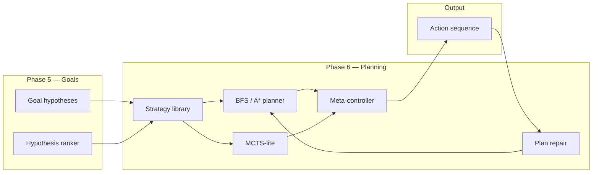
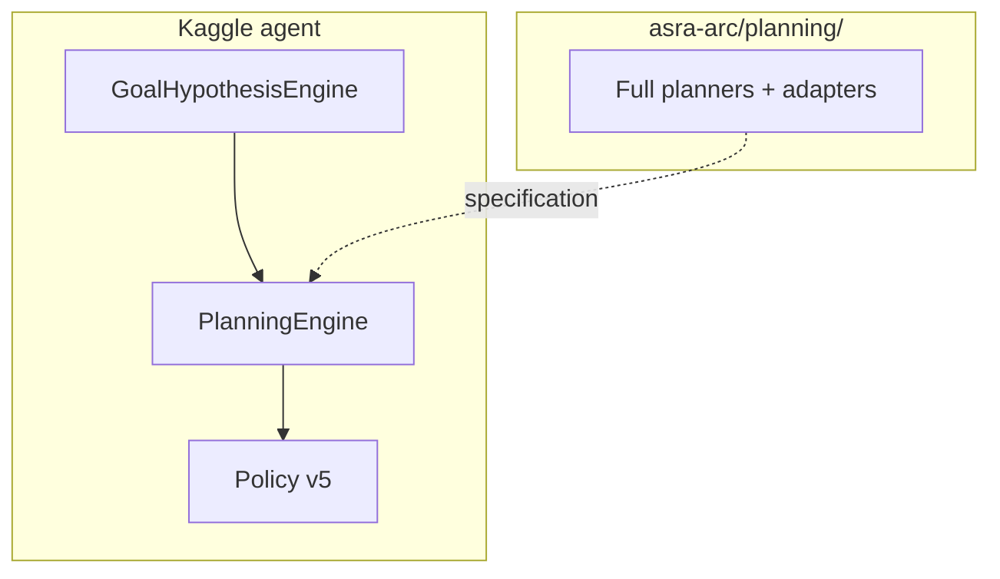

# Planning and Strategy Invention: ASRA Phase 6 — From Goals to Action Sequences

**Author:** Ilakkuvaselvi Manoharan  
**Affiliation:** Nature Foundation Models  
**Date:** August 2026  
**Version:** 1.0 — SciLayer preprint (companion: [Phase 6 Kaggle notebook](https://www.kaggle.com/code/ilakkmanoharan/asra-phase-6-arc-prize-2026))

---

## Abstract

Phases 1–5 of the Adaptive Scientific Reasoning Architecture (ASRA) established transition logging, object-centric observation, directed exploration, action semantics, and goal hypothesis ranking. Phase 5 answers *what* the environment is trying to achieve; it does not yet answer *how* to compose multiple actions into a coherent pursuit of that objective.

We describe **ASRA Phase 6** as the **Planning & Strategy Invention** layer: BFS and A* planners over observed transition graphs, MCTS-lite rollouts when graphs are sparse, a reusable **strategy library** mapping goal templates to operator sequences, a **meta-controller** for explore-exploit balance, and **reset** and **plan repair** mechanisms for recovery. The competition agent embeds a compact `PlanningEngine` atop Phase 5's `GoalHypothesisEngine`; the full research stack lives in `asra-arc/src/asra/planning/`.

This article presents the theory, architectural decomposition, and design principles. Phase 6 is the pivot from scientific inquiry toward **Milestone #2** — a competition agent that plans, not only scores single actions.

---

## 1. The architectural gap Phase 6 closes

ASRA's cumulative cognitive stack:

```text
Phase 1   Experience Engine           — transitions, hashes, cell diffs
Phase 2   Observation Engine          — objects, transforms, rule hypotheses
Phase 3   Navigation & Memory         — exploration graph, visitation, subgoals
Phase 4   Semantics & Causal Inference — action meaning, prediction, counterfactuals
Phase 5   Goal Inference & Hypotheses   — win conditions, progress, experiment design
Phase 6   Planning & Strategy Invention — multi-step plans, strategies, meta-control
Phase 7+  Robustness, Decision Biology, final submission
```

Phase 5 asks: *What are we trying to accomplish?*  
Phase 6 asks: *Given that belief, what sequence of actions should we execute — and when should we abandon the plan?*

Without Phase 6, an agent with a leading goal hypothesis still selects actions **myopically**: each step is scored independently, with no commitment to multi-step structure. Human problem-solving in unknown environments — and biological experiment design — routinely requires **sequencing**: reach before collect, unlock before traverse, transform before match.



---

## 2. Theoretical stance: plans as commitments under uncertainty

Interactive environments provide **partial transition models**: the agent knows only edges it has observed. ASRA Phase 6 does not assume a full world model. Instead, planning operates on three information sources:

1. **Observed graph** — Phase 1 state graph and Phase 3 exploration graph.
2. **Semantic predictions** — Phase 4 transition model for unobserved edges (low weight).
3. **Goal-conditioned strategies** — Phase 5 leading hypothesis maps to operator preferences.

The epistemic object is a **plan**:

```text
π = (strategy, steps=[(a₁, ŝ₁), …, (aₖ, ŝₖ)], mode, success)
```

Plans are **conditional commitments**: they execute until progress stalls, a step fails, or the meta-controller shifts to explore mode. This mirrors experimental protocols in biology: a perturbation sequence is followed until the response contradicts the pathway hypothesis, then the protocol is **repaired**.

| Paradigm | Phase 6 stance |
|----------|----------------|
| Full RL policy over actions | Deferred — v1 uses symbolic plans |
| Hand-coded level solutions | Rejected — plans built from observed transitions |
| LLM chain-of-thought planning | Deferred — no instruction channel in ARC-AGI-3 |
| MCTS with learned value net | Deferred — v1 uses semantic rollouts |
| BFS over logged transitions | **Adopted** — primary planner |

---

## 3. Strategy library as reusable scientific protocols

Phase 6 introduces a **strategy library** — explicit mappings from Phase 5 goal templates to preferred semantic operators:

| Strategy | Goal template | Scientific reading |
|----------|---------------|-------------------|
| `reach_target` | `move_to_target` | Navigate to target region in state space |
| `collect` | `collect_tokens` | Aggregate or remove discrete markers |
| `align` | spatial subgoals | Minimize structural misalignment |
| `avoid` | `avoid_hazard` | Constrained navigation |
| `unlock` | `unlock_passage` | Enable latent pathway |
| `transform` | `match_pattern`, `transform_to_goal` | Mechanism application |
| `sequence` | multi-step compositions | Protocol with ordered stages |
| `explore` | weak goals | Discovery mode |

Strategies are **not** hardcoded solutions. They are **bias functions** over Phase 4 semantics that guide BFS edge preference and MCTS rollouts. The same strategy (`reach_target`) applies across games with different grid layouts — analogous to the same experimental protocol (e.g., dose escalation) across cell lines with different response curves.

---

## 4. Planners: BFS, A*, and MCTS-lite

### 4.1 BFS over observed transitions

When the agent has explored sufficiently, `BFSPlanner` finds shortest paths from the current state hash to known WIN-adjacent or high-reward states. Depth is capped (v1: 6) for competition latency. BFS is **sound** on observed edges: if a path exists in the log, the planner finds it.

### 4.2 A* with semantic heuristic

When multiple paths exist, `AStarPlanner` breaks ties using:

```text
f(s) = g(s) + h(s)
h(s) = α · semantic_alignment(strategy, s) + β · graph_distance(s, goal_region)
```

This biases search toward states where Phase 4 semantics match the active strategy.

### 4.3 MCTS-lite for sparse graphs

When BFS fails (`success=False`), `MCTSPlannerLite` performs lightweight rollouts:

1. Match goal template → strategy.
2. Score each candidate action by strategy–semantic alignment + Phase 4 confidence.
3. Select best action; replan next step.

MCTS-lite is **single-step** in v1 — not full tree search — preserving Kaggle runtime bounds.

---

## 5. Meta-control: explore, exploit, and plan

Phase 5 experiment planning maximizes **hypothesis discrimination**. Phase 6 planning maximizes **goal pursuit**. These objectives conflict early in episodes when goals are uncertain.

The `MetaController` resolves this with three modes:

| Mode | Condition | Effect |
|------|-----------|--------|
| `explore` | Low visitation or high uncertainty | Down-weight plan; up-weight novelty |
| `exploit` | High goal confidence | Up-weight plan and goal alignment |
| `balanced` | Default | Equal weight blend |

```text
w_explore, w_goal, w_plan = blend(mode)
score(a) = w_explore · novelty + w_goal · goal(a) + w_plan · plan(a) + w_sem · sem(a)
```

This is the game analog of **adaptive experimentation**: explore broadly until the objective is sufficiently identified, then commit to a perturbation protocol.

---

## 6. Reset and plan repair

Plans fail. ASRA Phase 6 treats failure as **first-class**:

**Plan repair (`PlanRepairSystem`):**

1. Remove failed action from remaining steps.
2. Re-run BFS from current state.
3. Fall back to MCTS-lite if repair fails.

**Reset policy (`ResetPolicy`):**

- Trigger when stuck counter ≥ 5 or action budget exhausted.
- Clears plan cache but **preserves goal hypotheses** — the objective belief survives; only execution restarts.

Without repair, planners would cause **oscillation**: repeating failed edges until episode timeout. Phase 7 extends stuck detection; Phase 6 provides the recovery mechanism.

---

## 7. Closing the loop with Phases 1–5

| Layer | Phase 6 consumption |
|-------|---------------------|
| Phase 1 transitions | BFS edge table |
| Phase 2 scenes | Plan preconditions, alignment checks |
| Phase 3 exploration graph | BFS frontier; novelty for meta-controller |
| Phase 3 subgoals | Plan milestones |
| Phase 4 semantics | MCTS scoring; A* heuristic |
| Phase 4 uncertainty | Meta-controller explore trigger |
| Phase 5 leading hypothesis | Strategy selection, plan objective |
| Phase 5 experiment planner | Fallback when goal confidence < threshold |

**Kaggle agent scoring (embedded):**

```text
score(action) = Phase1–5_terms + PLAN_WEIGHT · plan_step_match + STRAT_WEIGHT · strategy_score
```

Reasoning strings:

```text
ASRA Phase6: ACTION3 | sem=translate conf=0.81 | goal=move_to_target | strat=reach_target | plan=bfs:2/4 | mode=exploit
```

---

## 8. Empirical landscape

Phase 6 metrics target **competition performance** (Milestone #2):

| Benchmark | Metric |
|-----------|--------|
| ARC-AGI-3 | Win rate; actions to win; plan usage rate |
| MiniGrid | Path length vs optimal; unlock sequences |
| Procgen | Plan success on held-out seeds |
| Crafter | Long-horizon `sequence` strategy survival |

Phase 6 **claims Milestone #2** — the first phase where competition win rate is the primary success criterion.

---

## 9. Architecture: library and embedded engine

**Research library** (`asra-arc/src/asra/planning/`):

```text
schemas.py           — Plan, PlanStep, Strategy
bfs_planner.py       — BFS over transition graph
mcts_planner.py      — MCTSPlannerLite
strategy_library.py  — Goal template → strategy mapping
meta_controller.py   — ExploreExploitMode, ResetPolicy, PlanRepairSystem
policy_v5.py         — PlanningExplorationPolicyV5
```

**Kaggle embedded engine** (`asra_phase6_my_agent.py`):

- `PlanningEngine` — compact BFS + MCTS-lite + meta-controller
- No external imports; self-contained for sandbox
- Composes atop embedded Phase 5 `GoalHypothesisEngine`



---

## 10. Agent integration

| Version | Tag | Layer added |
|---------|-----|-------------|
| Phase 5 | `asra-v0.7-phase5` | Goal hypotheses |
| **Phase 6** | **`asra-v0.8-phase6`** | **Planning, strategies, meta-control** |

Package: `kaggle-notebooks/phase6/`

Build:

```bash
cd kaggle-notebooks/phase6
python3 build_phase6_kaggle_notebook.py
python3 asra_phase6_my_agent.py --self-test
```

The notebook writes `my_agent.py`, self-tests perception + exploration + causality + goals + **planning**, emits validation parquet.

---

## 11. Position in the ASRA research program

| Question | Phase 5 | Phase 6 |
|----------|---------|---------|
| Why try action a? | Goal alignment, discrimination | + Plan step, strategy |
| Unit of task memory | Ranked hypotheses | + Active plan |
| What is success? | Inferred win condition | + Action sequence toward win |
| Bridge to biology | Latent objective | Perturbation protocol sequencing |

From the Decision Biology roadmap:

```text
pathway hypothesis  →  perturbation protocol  →  measured response
goal hypothesis     →  action plan            →  observed progress
```

Phase 6 is where **objectives become procedures** — the direct precursor to Phase 8 perturbation sequencing on LINCS data.

---

## 12. Open problems and next steps

1. **Robustness (Phase 7)** — stuck detection, generalization suite, action waste.  
2. **Learned value functions** — when semantic rollouts saturate.  
3. **Hierarchical planning** — Crafter-scale goal decomposition.  
4. **Cross-game plan transfer** — strategy library priors from Original ARC.  
5. **Decision Biology (Phase 8)** — pathway protocol planner on OmniPath graphs.

---

## 13. Conclusion

ASRA Phase 6 transforms goal beliefs into **action sequences**: the strategy library indexes reusable protocols; BFS and MCTS-lite search over partial transition knowledge; the meta-controller balances exploration, discrimination, and execution; reset and plan repair prevent commitment traps.

The Phase 6 Kaggle extension is not a new agent philosophy — it is Phases 1–5 + **commitment**. Goals describe why actions matter; plans describe **how to chain them**.

Transition-centric adaptive reasoning remains the core; planning is how inferred objectives become **operational** — the prerequisite for robustness tuning, final submission, and biological perturbation protocols in later phases.

---
## Reference notebook (GitHub & Kaggle)

Interactive companion with Phases 2–5 stacks plus Phase 6 planning hints (`PlanningEngine`, strategy library, meta-controller):

- [ASRA Phase 6 — ARC Prize 2026 (Kaggle kernel)](https://www.kaggle.com/code/ilakkmanoharan/asra-phase-6-arc-prize-2026)
- [ASRA Phase 6 — ARC Prize 2026 (ASRA repository)](https://github.com/ilakkmanoharan/asra/blob/main/kaggle-notebooks/phase6/asra-phase-6-arc-prize-2026.ipynb)
- [SciLayer archive copy](https://github.com/ilakkmanoharan/SciLayer/blob/main/content/kaggle-notebooks/asra-phase-6-arc-prize-2026.ipynb)

---

## References

1. Sutton, R. S. & Barto, A. G. Reinforcement Learning: An Introduction (conceptual lineage for explore-exploit).  
2. Pearl, J. Causality: Models, Reasoning, and Inference. Cambridge University Press (intervention sequencing).  
3. Ilakkuvaselvi Manoharan. Transition-Centric Adaptive Reasoning: ASRA Phase 1. https://sci-layer.vercel.app/articles/transition-centric-adaptive-reasoning-asra-phase-1  
4. Ilakkuvaselvi Manoharan. Object-Centric Adaptive Reasoning: ASRA Phase 2. https://sci-layer.vercel.app/articles/object-centric-adaptive-reasoning-asra-phase-2  
5. Ilakkuvaselvi Manoharan. Directed Exploration and Episodic Memory: ASRA Phase 3. https://sci-layer.vercel.app/articles/directed-exploration-episodic-memory-asra-phase-3  
6. Ilakkuvaselvi Manoharan. Causal Action Semantics: ASRA Phase 4. https://sci-layer.vercel.app/articles/causal-action-semantics-asra-phase-4  
7. Ilakkuvaselvi Manoharan. Goal Inference and Hypothesis Ranking: ASRA Phase 5. https://sci-layer.vercel.app/articles/goal-inference-hypothesis-ranking-asra-phase-5  
8. Phase 6 planning implementation — https://github.com/ilakkmanoharan/asra/tree/main/asra-arc/src/asra/planning

---

*Related: [ASRA Phase 5](https://sci-layer.vercel.app/articles/goal-inference-hypothesis-ranking-asra-phase-5) · [ASRA Phase 4](https://sci-layer.vercel.app/articles/causal-action-semantics-asra-phase-4) · [Decision Biology](https://sci-layer.vercel.app/articles/asra-for-decision-biology) · Nature Foundation Models*

*Correspondence: ilakkmanoharan@gmail.com*
