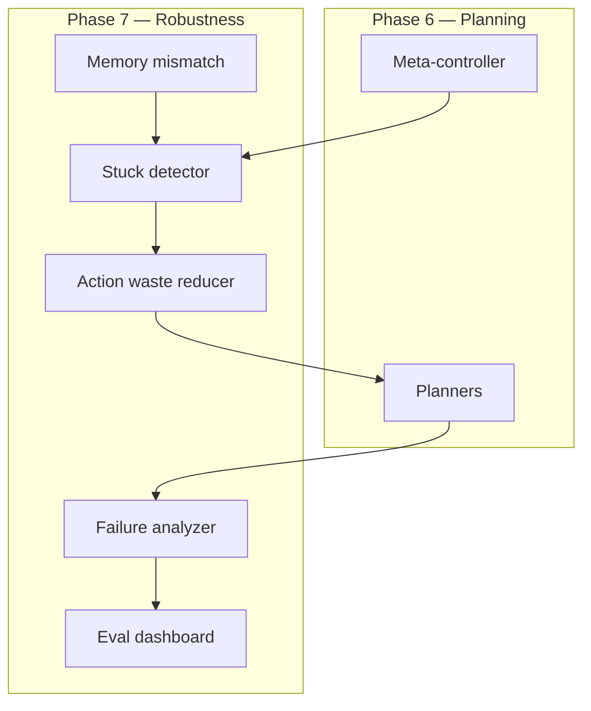
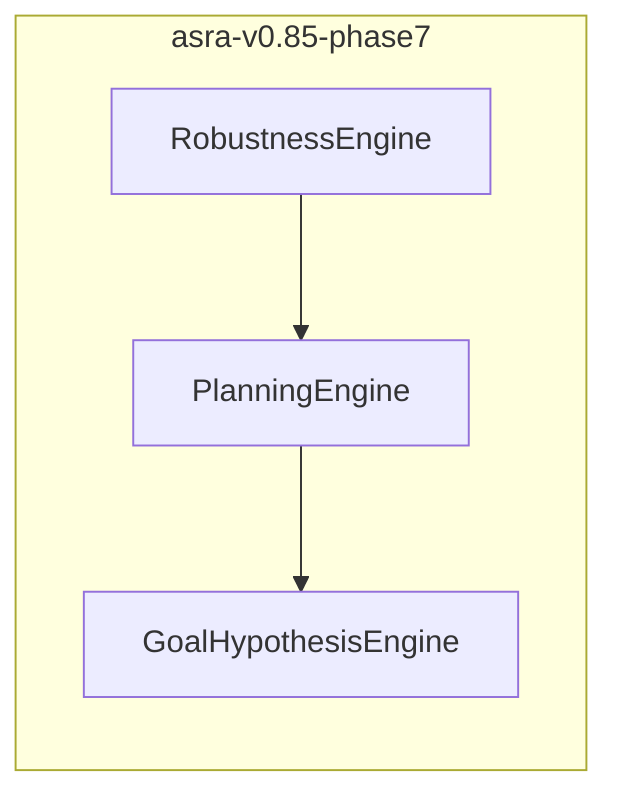

# Robustness and Generalization: ASRA Phase 7 — From Capability to Reliability

**Author:** Ilakkuvaselvi Manoharan  
**Affiliation:** Nature Foundation Models  
**Date:** September 2026  
**Version:** 1.0 — SciLayer preprint (companion: [Phase 7 Kaggle notebook](https://www.kaggle.com/code/ilakkmanoharan/asra-phase-7-arc-prize-2026))

---

## Abstract

Phases 1–6 of the Adaptive Scientific Reasoning Architecture (ASRA) built a complete cognitive stack ending in goal-conditioned planning and strategy invention. Phase 6 optimizes *capability* — can the agent plan toward inferred objectives? Phase 7 optimizes *reliability* — does that capability persist across unseen layouts, long horizons, and memory–perception mismatch?

We describe **ASRA Phase 7** as the **Robustness & Generalization** layer: a failure analyzer clustering dead-ends and wrong-goal episodes, a generalization benchmark suite across Procgen and DMLab, memory mismatch detection, planner stuck detection, action waste reduction, and a consolidated evaluation dashboard. The competition agent embeds `RobustnessEngine` wrapping Phase 6's `PlanningEngine`; the research library lives in `asra-arc/src/asra/robustness/`.

This article presents the theory and architecture for preparing the **final candidate agent** (`asra-v0.85-phase7`) before Phase 9 integration.

---

## 1. The architectural gap Phase 7 closes

```text
Phase 1–5   Cognitive core + goal inference
Phase 6     Planning & strategy invention (Milestone #2)
Phase 7     Robustness & generalization (final candidate)
Phase 8     Decision Biology bridge
Phase 9     Final submission & research story
```

Phase 6 asks: *Can we win on games we have partially explored?*  
Phase 7 asks: *Where do we fail on games we have not? And can we detect failure before wasting the action budget?*

Competition agents that plan well on familiar state graphs often **collapse** under procedural variation: Procgen layout shifts break memorized BFS paths; long DMLab episodes trigger stuck loops; stale visitation memory misleads the meta-controller. Phase 7 makes these failure modes **measurable and interruptible**.



---

## 2. Theoretical stance: failures as structured evidence

Scientific reasoning systems fail in **repeatable ways**. ASRA Phase 7 treats failures not as noise but as **labeled evidence**:

| Failure type | Operational definition | Biological analog |
|--------------|------------------------|-------------------|
| `dead_end` | `(s,a)` produces zero grid change, no reward | Non-responder perturbation |
| `no_progress` | Streak without Phase 5 progress signal | Flat dose–response |
| `wrong_goal` | WIN achieved but leading hypothesis inconsistent | Pathway misidentification |
| `plan_exhausted` | Repair + reset cycles without advancement | Protocol termination |
| `memory_mismatch` | Visitation disagrees with perception | Batch effect / sample swap |

The epistemic shift: robustness is not a separate module bolted on — it is **meta-reasoning over the existing stack's outputs**. Phase 7 reads Phase 1–6 telemetry and emits **interrupts** (penalties, early resets, plan invalidation).

| Paradigm | Phase 7 stance |
|----------|----------------|
| Train on all levels, hope for generalization | Rejected — explicit holdout eval |
| Ignore stuck loops | Rejected — stuck detector + waste penalty |
| Single win-rate metric | Insufficient — decomposed dashboard |
| Domain-specific robustness per game | Rejected — unified failure taxonomy |
| Cross-environment benchmark suite | **Adopted** |

---

## 3. Failure analysis as scientific postmortem

The `FailureAnalyzer` aggregates transition-level signals into episode-level classifications:

```text
On each τ = (s, a, s′, r):
  if Δ_cells = 0 and r ≤ 0 → dead_end[s:a] += 1

On episode end without WIN:
  classify by dominant signal → FailureReport
```

**Top failures** per game reveal systematic weaknesses:

- High `dead_end` on ACTION2 → Phase 4 semantic relabel or waste hard-ban.
- High `wrong_goal` → Phase 5 template prior adjustment.
- High `plan_exhausted` → Phase 6 depth cap or strategy switch threshold.

This is the game analog of **reviewing failed clinical assays**: cluster by failure mode before redesigning the protocol.

---

## 4. Generalization as held-out evidence

Phase 6 may achieve strong win rates on **training seeds** while failing on held-out layouts. Phase 7's `GeneralizationSuite` enforces:

```text
Δ = metric(test_seeds) - metric(train_seeds)
```

| Benchmark | Train | Test | Metric |
|-----------|-------|------|--------|
| Procgen | seeds 0–99 | seeds 100–199 | Win rate |
| ARC-AGI-3 | levels 1–N/2 | levels N/2+1–N | Actions to win |
| DMLab | maze A | maze B | Exploration cost |

A small Δ indicates **strategy transfer** — the agent generalizes because it reasons over semantics and goals, not memorized paths. A large Δ triggers tuning before Phase 9 final submission.

---

## 5. Memory mismatch and stuck detection

### 5.1 Memory mismatch

Phase 3 visitation memory assumes **state hash stability**: revisiting a hash means revisiting an identical world configuration. When perception changes substantially at the same hash (or vice versa), the meta-controller receives **stale signals**.

`MemoryMismatchDetector` flags:

- Object count drift vs cached scene
- Semantic confidence collapse on repeated `(s,a)`
- Object role flip without progress event

**Response:** invalidate plan cache; boost exploration; optionally clear stale semantics.

### 5.2 Stuck detection

`StuckDetector` identifies loops before reset budget exhaustion:

| Signal | Threshold |
|--------|-----------|
| State repeat | ≥ 4 visits |
| Zero-effect `(s,a)` repeat | ≥ 3 times |
| Plan repair in 10 steps | ≥ 3 repairs |

Early interrupt preserves actions for productive exploration — critical under ARC-AGI-3 action limits.

---

## 6. Action waste reduction

Zero-effect actions are not merely unproductive — they **actively mislead** planners by adding spurious graph edges. `ActionWasteReducer` applies:

```text
score(a) ← score(a) - WASTE_PENALTY · waste_count(s,a)
```

Penalties escalate for:

1. Known dead-end `(s,a)` pairs (hard).
2. Repeated semantics without progress (soft).
3. Re-attempted failed plan steps (medium).

Waste reduction interacts with Phase 6 meta-controller: in `explore` mode, penalties are capped to avoid blocking necessary retries.

---

## 7. Evaluation dashboard as reproducible evidence

Phase 7 consolidates scattered phase metrics into a **single dashboard**:

| Panel | Phase source |
|-------|--------------|
| Win rate by game | ARC batch |
| Actions to win | Phase 1 episodes |
| Failure breakdown | Failure analyzer |
| Generalization Δ | Procgen suite |
| Hypothesis accuracy | Phase 5 eval |
| Planner success | Phase 6 plans |
| Stuck / waste rates | Phase 7 guards |

The dashboard is the **evidence artifact** Phase 9's evaluation report will cite. JSON-first generation ensures CI reproducibility; HTML provides human review.

---

## 8. Closing the loop with Phases 1–6

| Layer | Phase 7 consumption |
|-------|---------------------|
| Phase 1 logs | Failure mining, waste detection |
| Phase 3 visitation | Mismatch detection |
| Phase 5 progress | No-progress classification |
| Phase 5 hypotheses | Wrong-goal analysis |
| Phase 6 plans | Stuck on plan oscillation |
| Phase 6 reset | Earlier triggers via stuck |

**Kaggle agent (embedded):**

```text
ASRA Phase7: ACTION2 | goal=collect_tokens | strat=collect | plan=mcts:1 | stuck=0 waste=0 mismatch=0 guard=ok
```

`RobustPlanningPolicyV6` wraps Phase 6 without replacing it — a **guard layer**, not a new policy philosophy.

---

## 9. Architecture

**Research library** (`asra-arc/src/asra/robustness/`):

```text
failure_analyzer.py      — FailureReport clustering
generalization_suite.py  — Cross-seed benchmarks
memory_mismatch.py       — Stale memory detection
stuck_detector.py        — Loop detection
action_waste.py          — Penalty computation
eval_dashboard.py        — HTML + JSON aggregation
policy_v6.py             — RobustPlanningPolicyV6
```

**Kaggle embedded engine:**

- `RobustnessEngine` — stuck + waste + mismatch guards
- Composes atop `PlanningEngine` → `GoalHypothesisEngine` → …



---

## 10. Agent integration

| Version | Tag | Layer added |
|---------|-----|-------------|
| Phase 6 | `asra-v0.8-phase6` | Planning |
| **Phase 7** | **`asra-v0.85-phase7`** | **Robustness guards, failure logging** |

Package: `kaggle-notebooks/phase7/`

Phase 7 produces the **final candidate backbone** for Phase 9 (`asra-v1.0-phase9`). Weights and thresholds tuned via dashboard feed v1.0 integration.

---

## 11. Empirical landscape

Roadmap metrics (all reported in dashboard):

| Metric | Intent |
|--------|--------|
| Win rate | Primary competition indicator |
| Average actions to win | Efficiency |
| Exploration cost | Novelty integrals before first progress |
| Hypothesis accuracy | Phase 5 leading template at WIN |
| Transfer across levels | Held-out generalization |
| Planner success rate | Plan steps achieving predicted change |
| Stuck rate | Loop frequency |
| Generalization Δ | Procgen train vs test |

NetHack remains **optional** — specified but disabled in v1 CI.

---

## 12. Position in the research program

| Question | Phase 6 | Phase 7 |
|----------|---------|---------|
| Primary metric | Win rate (Milestone #2) | Win rate + reliability decomposition |
| Cross-layout | Implicit | Explicit Procgen holdout |
| Failure handling | Reset + repair | + Classify + prevent |
| Bridge to biology | Protocol sequencing | Assay failure taxonomy |

Phase 7 evidence supports Phase 8 claims that the architecture **transfers** — not just to new games, but to perturbation–response domains where failed experiments are expensive.

---

## 13. Open problems

1. **Phase 9 integration** — select v0.85 weights; final submit.  
2. **Neural domain adaptation** — when heuristic guards saturate.  
3. **NetHack probe** — if schedule permits sparse-reward stress.  
4. **Biology failure analog** — Phase 8 non-responder clusters.

---

## 14. Conclusion

ASRA Phase 7 is the project's shift from **demonstrating capability** to **certifying reliability**: failures become structured reports; generalization becomes held-out measurement; stuck loops and wasted actions become detectable and penalized before they cost wins.

The Phase 7 agent is not a new cognitive layer — it is Phases 1–6 with **self-monitoring**. That monitoring produces the evidence base Phase 9 needs for a defensible final submission and the credibility Phase 8 needs when claiming cross-domain architectural transfer.

Transition-centric adaptive reasoning remains the core; robustness is how that reasoning **survives contact** with procedural variation and partial memory — the standard a final competition agent must meet.

---
## Reference notebook (GitHub & Kaggle)

Interactive companion with Phases 2–6 stacks plus Phase 7 robustness guards (`RobustnessEngine`, failure analyzer, stuck detection, action waste reduction):

- [ASRA Phase 7 — ARC Prize 2026 (Kaggle kernel)](https://www.kaggle.com/code/ilakkmanoharan/asra-phase-7-arc-prize-2026)
- [ASRA Phase 7 — ARC Prize 2026 (ASRA repository)](https://github.com/ilakkmanoharan/asra/blob/main/kaggle-notebooks/phase7/asra-phase-7-arc-prize-2026.ipynb)
- [SciLayer archive copy](https://github.com/ilakkmanoharan/SciLayer/blob/main/content/kaggle-notebooks/asra-phase-7-arc-prize-2026.ipynb)

---

## References

1. Cobbe, K. et al. Procgen Benchmark: Procedurally-Generated Game-Like Environments for Generalization in RL.  
2. Ilakkuvaselvi Manoharan. Transition-Centric Adaptive Reasoning: ASRA Phase 1. https://sci-layer.vercel.app/articles/transition-centric-adaptive-reasoning-asra-phase-1  
3. Ilakkuvaselvi Manoharan. Object-Centric Adaptive Reasoning: ASRA Phase 2. https://sci-layer.vercel.app/articles/object-centric-adaptive-reasoning-asra-phase-2  
4. Ilakkuvaselvi Manoharan. Directed Exploration and Episodic Memory: ASRA Phase 3. https://sci-layer.vercel.app/articles/directed-exploration-episodic-memory-asra-phase-3  
5. Ilakkuvaselvi Manoharan. Causal Action Semantics: ASRA Phase 4. https://sci-layer.vercel.app/articles/causal-action-semantics-asra-phase-4  
6. Ilakkuvaselvi Manoharan. Goal Inference and Hypothesis Ranking: ASRA Phase 5. https://sci-layer.vercel.app/articles/goal-inference-hypothesis-ranking-asra-phase-5  
7. Ilakkuvaselvi Manoharan. Planning and Strategy Invention: ASRA Phase 6. https://sci-layer.vercel.app/articles/planning-strategy-invention-asra-phase-6  
8. Phase 7 robustness implementation — https://github.com/ilakkmanoharan/asra/tree/main/asra-arc/src/asra/robustness

---

*Related: [ASRA Phase 6](https://sci-layer.vercel.app/articles/planning-strategy-invention-asra-phase-6) · [ASRA Phase 5](https://sci-layer.vercel.app/articles/goal-inference-hypothesis-ranking-asra-phase-5) · [Decision Biology](https://sci-layer.vercel.app/articles/asra-for-decision-biology) · Nature Foundation Models*

*Correspondence: ilakkmanoharan@gmail.com*
