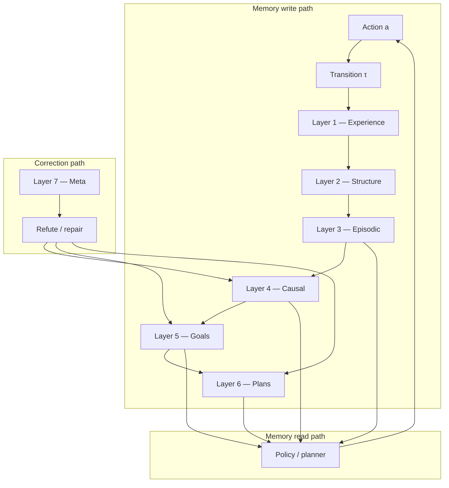

# A Transition-Centric Theory of Memory: How ASRA Learns Knowledge from Interaction

**Author:** Ilakkuvaselvi Manoharan  
**Affiliation:** Nature Foundation Models  
**Date:** June 2026  
**Version:** 1.0 — conceptual monograph (ASRA memory layer across Phases 1–9)  
**Companion:** [ASRA vs Buchanan–Ma comparison](https://sci-layer.vercel.app/articles/asra-vs-buchanan-mathematical-theory-of-memory) · [Phase bundles](./README.md)

---

## Preface: memory as the spine of scientific intelligence

Every intelligent system—biological or artificial—must answer the same question:

> **What from the past should constrain the next action?**

Classical representation learning often answers this by **compressing observations**: find a low-dimensional code that preserves sensory structure. That is a powerful notion of memory when data arrives passively and action semantics are fixed.

The Adaptive Scientific Reasoning Architecture (ASRA) answers differently. In ARC-AGI-3, Decision Biology, and other **scientific interaction** settings, the environment does not publish action manuals, win conditions, or full dynamics. Memory cannot be only *what the world looks like*. It must record **what changed when we intervened**, under what uncertainty, toward which inferred objectives—and which beliefs were later **refuted**.

This document is ASRA’s memory theory: not a survey of deep autoencoders, but a principled account of **how ASRA learns memory** across its nine-phase stack. It is written in the spirit of a mathematical theory of memory—definitions, layers, operations, closed loops—but the mathematics is **empirical and intervention-centric**: hashes, graphs, signatures, ranked hypotheses, and replay buffers rather than rate–distortion codes alone.

**Intended reader:** researchers building adaptive agents, scientific reasoning systems, or perturbation–response pipelines who want a single map of *what ASRA remembers, where, and why*.

---

## Abstract

We present **ASRA’s theory of memory** as a layered stack of **transition-induced knowledge structures**. Phase 1 establishes **transition memory**—the immutable empirical substrate \(\tau = (s, a, s', r)\). Phase 2 adds **structural memory**—object scenes and transform events that compress frames into intervention-relevant summaries. Phase 3 introduces **episodic navigation memory**—exploration graphs, visitation counters, strategy libraries, and priority replay. Phase 4 builds **causal intervention memory**—action-effect signatures, successor distributions, and counterfactual lookups. Phase 5 maintains **teleological memory**—ranked goal hypotheses with support, refute, and progress scores. Phase 6 stores **procedural memory**—plans, strategy bindings, and repair state. Phase 7 audits **meta-memory**—staleness, mismatch, and failure clusters. Phase 8 extends the same schema to **biological perturbation memory**. Phase 9 unifies the stack as a single scientific narrative.

Memory in ASRA is **never** a frozen snapshot of the world. It is **continuously written** by interaction, **selectively read** by hint stacks and planners, and **corrected** by refutation—an operational closed loop analogous to cybernetic self-correction, but implemented as inspectable data structures rather than end-to-end weight updates.

---

## 1. Design principles (P.1–P.6)

ASRA adopts six desiderata for memory in unknown dynamical systems:

**P.1 — Intervention grounding.** Every durable memory trace must be anchored to an observed **intervention** (game action, perturbation, protocol step). Passive observation alone is insufficient for action semantics and causal structure.

**P.2 — Append-first, mutate-second.** New evidence **appends** to logs and counters; belief updates **mutate** summaries (signatures, hypothesis scores) only through explicit aggregation rules—never silent overwrite of raw transitions.

**P.3 — Hash-stable identity.** States receive reproducible IDs (`state_hash`, `game_id`, cell-profile keys) so memory remains **portable** across episodes, exports, and competition scoring reruns.

**P.4 — Layered compression with preserved provenance.** Higher layers compress lower layers (grid → objects → semantics → goals), but each layer retains pointers to the evidence that induced it (transition IDs, observation counts, refute events).

**P.5 — Refutation as first-class memory operation.** Memory is not accumulation-only. **Refute** counters on semantic and goal hypotheses implement self-correction without retraining.

**P.6 — Competition-sufficient embedding.** Full research engines live in `asra-arc/`; Kaggle agents carry **minimal sufficient** memory modules (`CompactExplorationHints`, `CausalSemanticsEngine`, `GoalHypothesisEngine`, etc.) that preserve P.1–P.5 under step and latency budgets.

---

## 2. The ASRA memory stack

```text
Layer 0   Raw frames           — ephemeral perception (not stored long-term)
Layer 1   Transition memory    — Phase 1: τ, hashes, cell diffs, dead-ends
Layer 2   Structural memory    — Phase 2: object scenes Σ, transform events
Layer 3   Episodic memory      — Phase 3: graphs G, visits M, replay, strategies
Layer 4   Causal memory        — Phase 4: effect signatures, P(s'|s,a), CF table
Layer 5   Teleological memory  — Phase 5: goal hypotheses H, progress stream
Layer 6   Procedural memory    — Phase 6: plans π, strategy library, repair state
Layer 7   Meta-memory          — Phase 7: failure clusters, mismatch flags
Layer 8   Cross-domain memory  — Phase 8: isomorphic bio perturbation logs
```



**Key distinction:** Buchanan–Ma-style memory compresses **distributions of sensed data**. ASRA memory compresses **distributions of intervention outcomes** conditioned on state identity and game context.

---

## 3. Layer 1 — Transition memory (Phase 1)

### 3.1 The primitive: the transition record

Phase 1 defines the atom of ASRA memory:

```text
τ = (game_id, s, a, s′, r, terminal, metadata)
```

where `s` and `s′` are canonical integer grids, `a` is an opaque action token, and `metadata` carries `num_changed_cells`, timestamps, and later-phase attachments.

**Transition memory** is the append-only set \(\mathcal{T} = \{\tau_1, \tau_2, \ldots\}\). It is the analog of a lab notebook: every row is an experiment.

### 3.2 State identity memory

```python
state_hash(grid) = SHA256(json.dumps(canonical_grid(grid)))
```

Hash-stable IDs let the agent recognize **revisitation** without pixel-wise comparison at decision time. This is ASRA’s answer to “what is the same situation again?”—not learned metric embeddings, but **reproducible cryptographic identity** of discrete observations.

### 3.3 Effect memory and dead-end taboo

Phase 1 accumulates per `(state_hash, action)`:

- changed-cell counts and reward proxies  
- `state_action_counts` — how often each pair was tried  
- `dead_ends` — pairs that produced zero change and zero reward  

Dead-end memory is **negative knowledge**: the agent remembers what **not** to repeat. This is early **refutation memory** before Phase 4 formalizes hypothesis refute.

### 3.4 Coarse semantic memory (Phase 1 stub)

Before Phase 4, Phase 1’s `ActionSemanticsInferencer` stores a coarse \(\hat{\phi}(a \mid s)\): buckets like `no_change`, `small_change`, `large_change`, `dead_end`. This is **pre-causal semantic memory**—enough to bias exploration, later subsumed by effect signatures.

### 3.5 What Phase 1 does not store

- Full frame video (too costly; grids suffice)  
- Oracle action definitions (unknown by design)  
- Win-condition labels (deferred to Phase 5)  

Phase 1 memory is **sparse and forensic**: enough to reconstruct what happened, not enough to plan long horizons alone.

---

## 4. Layer 2 — Structural memory (Phase 2)

### 4.1 Object scenes as compressive summaries

Phase 2 transforms each grid into a **compact scene** \(\Sigma\):

```text
Σ = { grid_shape, background_color, objects: [{object_id, color, area, bbox, centroid}, ...] }
```

This is ASRA’s form of **dimensionality reduction**: high-D pixel arrays → low-D object lists. Unlike neural autoencoders, the codec is **explicit** (connected components on dominant background)—interpretable at the cost of optimality.

### 4.2 Transform event memory

Between \(\Sigma_t\) and \(\Sigma_{t+1}\), Phase 2 records **transform events**: `translate`, `recolor`, `create`, `delete`, `identity`, aggregated in `transform_histogram`. These events attach to transitions as memory of **structural change**, not raw pixels.

### 4.3 Rule hypothesis memory (offline / eval)

On Original ARC pairs, Phase 2 can bootstrap **rule hypothesis memory**—candidate transforms that explain input→output. This is **prior memory** imported from static tasks, used to warm-start templates in Phase 5 without oracle access during interactive play.

### 4.4 Structural memory’s role in later layers

- Phase 3 uses object fingerprints in visitation keys (soft revisit detection)  
- Phase 4 uses transform histograms in semantic labels  
- Phase 5 uses object roles and pattern progress  

Structural memory is the bridge between **pixel transitions** and **symbolic intervention vocabulary**.

---

## 5. Layer 3 — Episodic navigation memory (Phase 3)

Phase 3 is ASRA’s most explicit **memory engine**. It answers: *Where have we been? What frontiers remain? What worked before?*

### 5.1 Exploration graph memory

**ExplorationGraph** \(G_{\text{explore}}\) extends Phase 1’s state graph:

**Node memory**

- `visit_count`, `first_seen_step`, `last_seen_step`  
- `frontier_score` — gates access to low-visit successors  
- `object_summary` — optional \(\Sigma\) snapshot  

**Edge memory**

- `avg_novelty_gain`, `usefulness_score` — rolling means per `(s, a)`  
- `dead_end` — sticky flag from repeated zero-progress traversals  

The graph is **directed and weighted by experience**—a map of territory, not a generative model of pixels.

### 5.2 Visitation memory

**VisitationMemory** \(M_{\text{visit}}\) indexes revisits at multiple resolutions:

- exact `state_hash`  
- soft **object fingerprint** (Phase 2-derived) to catch permutation-equivalent layouts  

Novelty scoring uses visit counts:

```text
novelty(s′) ∝ 1 / (1 + visit_count(s′))^α
```

Memory here directly drives **information-directed exploration**—the agent remembers crowded rooms and prefers empty ones.

### 5.3 Strategy library memory

After **successful** episodes, action sequences are compressed (deduplicated) and indexed by **precondition tags**. When a new state matches preconditions, the policy receives soft bias toward the stored first action.

This is **procedural episodic memory** before Phase 6 formalizes strategies: reuse without hard-coded scripts.

### 5.4 Transition replay buffer

A priority buffer (capacity ~500) retains high-value transitions:

- high novelty  
- subgoal boundaries  
- WIN terminals  
- large object deltas  

Replay memory supports offline analysis, Streamlit visualization, and future imitation—not neural training in v1, but **curated episodic recall** of scientifically informative interventions.

### 5.5 Session memory

**ExplorationSessionState** shares \(G_{\text{explore}}\), \(M_{\text{visit}}\), strategy library, and replay across batch episodes—**cross-episode memory** within a competition run.

### 5.6 Embedded competition memory (`CompactExplorationHints`)

The Kaggle agent compresses Phase 3 into:

- `visit_counts: Dict[hash, int]`  
- `recent: deque[hash]` — loop detection  
- `edge_stats: Dict[(s,a), {novelty, usefulness, n}]`  

This is **minimal sufficient episodic memory** under Swarm latency constraints.

---

## 6. Layer 4 — Causal intervention memory (Phase 4)

Phase 4 memory is **what actions mean**—the intervention layer Pearl argues cannot arise from passive distributions alone.

### 6.1 Action-effect signature memory

For each key `(game_id, state_hash, action)`, ASRA stores an **ActionEffectSignature**:

```text
σ(s,a) = {
  observations: n,
  cell_change_mean, cell_change_std,
  object_delta_mean,
  transform_histogram,
  semantic_label,
  confidence, uncertainty,
  terminal_rate, dead_end_rate
}
```

Signatures are **sufficient statistics** over transition memory—compressed causal memory with preserved observation count.

### 6.2 Successor distribution memory

```text
P̂(s′ | s, a) = count(s,a,s′) / Σ_{s*} count(s,a,s*)
```

This lookup table is ASRA’s v1 **transition model**: empirical dynamics memory, not a neural world model. It enables prediction and counterfactual queries over **logged** alternates.

### 6.3 Counterfactual memory

`counterfactual(s, a_actual, a_alt)` reads \(\sigma(s, a_{\text{alt}})\) and \(\hat{P}(s'|s,a_{\text{alt}})\) without executing \(a_{\text{alt}}\)—**memory-backed imagination** of unrealized interventions.

### 6.4 Hypothesis confirm / refute memory (causal level)

Semantic labels carry belief status. Repeated inconsistent effects increment **refute**; consistent effects increment **support**. This is **self-correcting causal memory**—the encoder–decoder transcription game of representation learning, reimplemented as explicit counters on interpretable signatures.

### 6.5 Embedded engine (`CausalSemanticsEngine`)

Competition agents store:

- `effects: Dict[(s,a), List[diff]]`  
- `successors: Dict[(s,a), Counter[s′]]`  

Online `observe()` appends; `infer()` aggregates. Memory grows with play; confidence saturates with consistent evidence.

---

## 7. Layer 5 — Teleological memory (Phase 5)

Phase 5 memory is **belief over hidden objectives**—what the system is trying to achieve.

### 7.1 Goal hypothesis records

Each hypothesis \(h\) is memory of a **win-condition explanation**:

```text
h = {
  hypothesis_id, template_id,
  preferred_semantics, progress_weights,
  support, refute, progress_score, status
}
```

Templates (`move_to_target`, `match_pattern`, `collect_tokens`, …) are **prior memory**—falsifiable classes bootstrapped from Original ARC and scene structure.

### 7.2 Progress event stream

`progress_events` append `{reward, level_delta, semantic_label, delta_num_objects}`—a **temporal memory of meaningful change** distinct from raw transition volume.

### 7.3 Ranking memory as belief state

```text
score(h) = w_p · progress_score(h) + w_s · support(h) - w_r · refute(h)
```

The **leading hypothesis** is read memory at decision time (`goal=move_to_target` in reasoning strings). Wrong goals persist in memory as refuted or weak hypotheses—Popper-style **memory of failed theories**.

### 7.4 Experiment discrimination memory

Phase 5 does not store experiments separately; it **reads** Phase 4 uncertainty and top-two hypotheses at each step to score discriminating actions. Teleological memory is thus **relational**—defined over causal and progress memory jointly.

---

## 8. Layer 6 — Procedural memory (Phase 6)

Phase 6 memory is **commitment to multi-step behavior**.

### 8.1 Active plan memory

A plan \(\pi\) is a sequence \((a_1, \ldots, a_k)\) with:

- source state hash  
- target strategy / goal template  
- step index, stall counter  
- repair generation count  

Plans are **conditional commitments** stored until progress stalls or meta-control interrupts.

### 8.2 Strategy library (formalized)

Phase 6 extends Phase 3 reuse into named strategies (`reach_target`, `collect`, `unlock`, `transform`, `explore`) bound to Phase 5 templates and Phase 4 semantic operators.

### 8.3 Planner cache memory

BFS/A* over **observed** edges reads Layers 1–4; MCTS-lite reads strategy–semantic alignment. Planner memory is **derived**—recomputed from graphs, not stored independently except as active \(\pi\).

### 8.4 Meta-controller mode memory

`explore | exploit | balanced` modes are **short-horizon policy memory** balancing Phase 3 novelty vs Phase 5 goal vs Phase 6 plan weights.

---

## 9. Layer 7 — Meta-memory and reliability (Phase 7)

Phase 7 memory is **memory about memory**—when to distrust what was stored.

### 9.1 Failure cluster memory

Failures typed as `dead_end`, `no_progress`, `wrong_goal`, `plan_exhausted`, `memory_mismatch` are clustered for dashboard export—**episodic meta-evidence** of stack breakdown.

### 9.2 Memory mismatch detection

When visitation memory predicts revisitation but perception shows novel structure (or vice versa), Phase 7 flags **memory_mismatch**—analogous to batch effects in biology. Triggers plan invalidation and explore-mode bias.

### 9.3 Stuck-loop memory

Recent action/state rings detect repetitive trajectories; **stuck detector** memory interrupts plan execution before budget exhaustion.

### 9.4 Robustness as corrective read path

Meta-memory does not replace Layers 1–6; it **gates** reads—penalizing stale visitation, exhausted plans, and inconsistent goal beliefs.

---

## 10. Layer 8 — Cross-domain memory (Decision Biology bridge)

Phase 8 asserts **schema isomorphism**:

```text
game state hash     ↔  cell state profile
game action         ↔  perturbation ID
transition log      ↔  LINCS / scPerturb response row
goal hypothesis     ↔  pathway survival objective
strategy / plan     ↔  experimental protocol
```

Memory operations are **unchanged**; only field names and datasets swap. Phase 8 is the proof that ASRA’s theory of memory is not ARC-specific—it is **intervention–response memory** portable to high-dimensional cell state spaces.

---

## 11. Memory operations (the ASRA algebra)

ASRA defines six primitive operations over layers:

| Operation | Definition | Primary phases |
|-----------|------------|----------------|
| **LOG** | Append \(\tau\) to \(\mathcal{T}\) | 1 |
| **INDEX** | Assign `state_hash`, graph node, signature key | 1–4 |
| **SUMMARIZE** | Aggregate lists into \(\Sigma\), \(\sigma\), \(h\) | 2–5 |
| **READ** | Query visits, signatures, leading \(h\), plan \(\pi\) for scoring | 1–6 |
| **REFUTE** | Decrement belief on inconsistent evidence | 4–5 |
| **REPLAY** | Retain high-value \(\tau\) in priority buffer | 3 |
| **REUSE** | Match preconditions → bias toward stored sequence | 3, 6 |
| **REPAIR** | Invalidate plan, reset subgraph, explore fallback | 6–7 |

**Closed-loop property:** every decision cycle executes `READ → act → LOG → SUMMARIZE` with optional `REFUTE` and `REPAIR`. No forward pass over all historical weights; memory updates are **local** to touched keys.

---

## 12. How ASRA learns memory (the learning dynamics)

ASRA does not “train memory” in a single offline phase. Memory **learns online** through interaction:

### 12.1 Write on every intervention

Each `append_frame` / transition hook writes Layer 1 and triggers updates up-stack (exploration observe, causal observe, goal observe_progress). **Learning rate** is event-driven: one write per environment step.

### 12.2 Summarization as compression

Summaries are **lossy but keyed**:

- Many \(\tau\) with same \((s,a)\) → one \(\sigma(s,a)\)  
- Many visits → scalar `visit_count` + frontier score  
- Many progress events → scalar `progress_score(h)`  

Compression preserves **intervention-relevant** statistics, not sensory fidelity—ASRA’s analogue to rate–distortion, with distortion measured in **semantic and goal utility**, not pixel MSE.

### 12.3 Confidence-gated read

Low `confidence(s,a)` increases exploration and uncertainty hints; high confidence increases semantic and plan weights. Memory **controls its own influence** on policy—uncertainty-aware gating without Bayesian neural nets in v1.

### 12.4 Refutation as forgetting without erasure

ASRA rarely deletes raw transitions. **Forgetting** is implemented as refute counters and dead-end flags that down-weight reads. The lab notebook remains; theories are demoted.

### 12.5 Cross-episode consolidation

Strategy reuse and session-shared graphs consolidate **within-run** experience. Cross-game transfer (Phase 7, Original ARC priors) is **template-level** consolidation—hypothesis classes and transform vocabularies persist; per-game hashes do not.

---

## 13. Memory in the competition agent (minimal sufficient stack)

Each Kaggle phase embeds a memory slice:

| Agent tag | Memory modules added |
|-----------|---------------------|
| `asra-v0.1-phase1` | Transition counts, dead-ends, coarse semantics |
| `asra-v0.4-phase2` | + object-effect scores on scenes |
| `asra-v0.5-phase3` | + `CompactExplorationHints` |
| `asra-v0.6-phase4` | + `CausalSemanticsEngine` |
| `asra-v0.7-phase5` | + `GoalHypothesisEngine` |
| `asra-v0.8-phase6` | + `PlanningEngine` / plan state |
| `asra-v0.85-phase7` | + `RobustnessEngine` interrupts |

**Design rule:** never embed a research data structure the scoring runtime cannot update in O(1) or O(log n) per step. Full `asra-arc` engines trade latency for completeness.

---

## 14. Comparison axis: distributional memory vs transition memory

Without referencing external frameworks as authority, ASRA’s position is:

**Distributional memory** asks: what low-dimensional structure explains **observations** \(x \sim p(x)\)?

**Transition memory** asks: what structured knowledge explains **interventions** \((s, a) \mapsto s'\) under hidden semantics and objectives?

ASRA requires both **compression** (Phase 2 scenes, Phase 4 signatures) and **abstraction** (semantic labels, goal templates, strategies). Compression alone cannot discover what `ACTION3` means; abstraction without logging cannot be falsified.

The ASRA synthesis:

```text
Memory = append-only interventions
       + layered sufficient statistics
       + refutable hypotheses
       + episodic maps of where novelty remains
```

---

## 15. Open problems

1. **Neural compressive layers** — learned scene codes and signature embeddings when heuristic \(\Sigma\) saturates (Phase 2/4 v2).  
2. **Persistent object identity** — track `object_id` across frames instead of re-segmenting (bridge Phase 2 snapshots to Phase 3 nodes).  
3. **Cross-game memory transfer** — meta-templates from Original ARC → unseen ARC-AGI-3 games without per-hash collision.  
4. **Consolidation schedules** — when to promote replay-buffer transitions into permanent strategy memory.  
5. **Calibrated uncertainty memory** — beyond count-based confidence; proper Bayesian posteriors on \(\sigma(s,a)\).  
6. **Biological scale** — compressive cell-state memory (millions of features) with ASRA perturbation logs on LINCS/scPerturb (Phase 8).  
7. **Memory–planning tradeoffs** — optimal graph pruning when exploration graphs exceed competition memory bounds.

---

## 16. Conclusion

ASRA’s theory of memory is **transition-centric**: knowledge is what survives disciplined interaction—logged, indexed, summarized, read, refuted, and occasionally replayed. Nine phases are nine **memory strata**, each answering a distinct question:

- **What happened?** (Phase 1)  
- **What structure changed?** (Phase 2)  
- **Where have we been?** (Phase 3)  
- **What do actions do?** (Phase 4)  
- **What are we trying to achieve?** (Phase 5)  
- **What sequence should we run?** (Phase 6)  
- **When should we distrust our recall?** (Phase 7)  
- **Does the same memory schema hold in cells?** (Phase 8)  

Scientific intelligence, in this view, is not a single vector database or a single generative prior. It is a **governed accumulation of intervention evidence**—memory that remains inspectable, correctable, and purposeful under uncertainty.

That is how ASRA learns memory.

---

## References

1. Ilakkuvaselvi Manoharan. Transition-Centric Adaptive Reasoning: ASRA Phase 1. https://sci-layer.vercel.app/articles/transition-centric-adaptive-reasoning-asra-phase-1  
2. Ilakkuvaselvi Manoharan. Object-Centric Adaptive Reasoning: ASRA Phase 2. https://sci-layer.vercel.app/articles/object-centric-adaptive-reasoning-asra-phase-2  
3. Ilakkuvaselvi Manoharan. Directed Exploration and Episodic Memory: ASRA Phase 3. https://sci-layer.vercel.app/articles/directed-exploration-episodic-memory-asra-phase-3  
4. Ilakkuvaselvi Manoharan. Causal Action Semantics: ASRA Phase 4. https://sci-layer.vercel.app/articles/causal-action-semantics-asra-phase-4  
5. Ilakkuvaselvi Manoharan. Goal Inference and Hypothesis Ranking: ASRA Phase 5. https://sci-layer.vercel.app/articles/goal-inference-hypothesis-ranking-asra-phase-5  
6. Ilakkuvaselvi Manoharan. Planning and Strategy Invention: ASRA Phase 6. https://sci-layer.vercel.app/articles/planning-strategy-invention-asra-phase-6  
7. Ilakkuvaselvi Manoharan. Robustness and Generalization: ASRA Phase 7. https://sci-layer.vercel.app/articles/robustness-generalization-asra-phase-7  
8. Ilakkuvaselvi Manoharan. Decision Biology Bridge: ASRA Phase 8. https://sci-layer.vercel.app/articles/decision-biology-bridge-asra-phase-8  
9. Ilakkuvaselvi Manoharan. ASRA vs Buchanan–Ma: A Mathematical Theory of Memory. https://sci-layer.vercel.app/articles/asra-vs-buchanan-mathematical-theory-of-memory  
10. Pearl, J. (2009). *Causality.*  
11. Wiener, N. (1948). *Cybernetics.*

---

*Related: [ASRA concept review](https://sci-layer.vercel.app/articles/architectures-adaptive-scientific-reasoning-under-uncertainty) · [Action semantics inference](https://sci-layer.vercel.app/articles/understanding-action-semantics-inference-through-state-transitions-in-asra) · [content/asra phase bundles](./README.md)*

*Correspondence: ilakkmanoharan@gmail.com*
