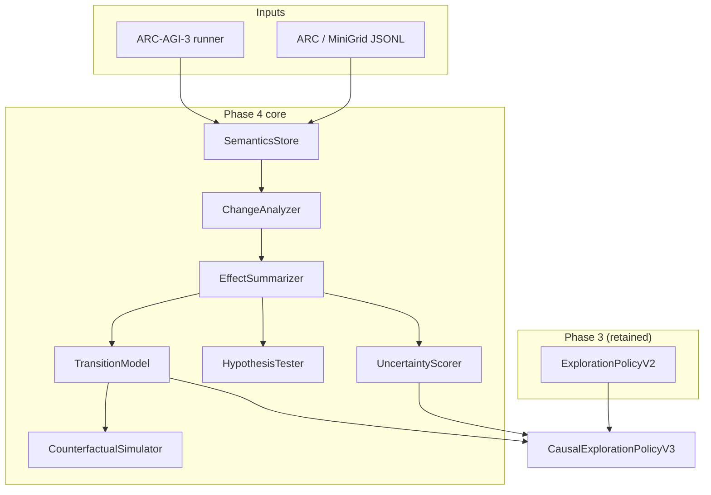

# Causal Action Semantics: ASRA Phase 4 — From Observed Effects to Intervention Reasoning

**Author:** Ilakkuvaselvi (Ilak) Manoharan  
**Affiliation:** Nature Foundation Models  
**Date:** June 2026  
**Version:** 1.0 — conceptual article for the Phase 4 causality track (companion to `asra-phase-4-arc-prize-2026.ipynb`)

---

## Abstract

Phase 1 of the Adaptive State–Reasoning Agent (ASRA) established **transition-centric experience**: log every `(state, action, next_state, reward)` tuple and infer coarse action semantics from cell-level diffs. Phase 2 added **object-centric observation**—transform events and compact scenes. Phase 3 added **directed exploration and episodic memory**—visit counts, novelty, usefulness, subgoals, and strategy reuse.

None of these layers yet answers the questions that define scientific and strategic reasoning over interventions: *If I take ACTION3 here, what will happen? How confident am I? What would have happened if I had taken ACTION1 instead?*

We describe **ASRA Phase 4** as the **Semantics & Causal Inference Engine**: a stack that aggregates action–effect observations into **semantic signatures**, maintains a **causal transition model** for predicting next-state features, tracks **hypotheses** about action meaning with confirm/refute updates, supports **counterfactual** queries over alternate actions, and scores **epistemic uncertainty** per `(state, action)` pair. The full engine lives in `asra-arc/src/asra/causality/`; the Kaggle competition agent embeds a compact **`CausalSemanticsEngine`** that preserves Phase 2 object-scene and Phase 3 exploration hints while adding semantic labels, confidence, uncertainty, and transition prediction.

This article presents the theory, architectural decomposition, and design principles. It does not prescribe deployment mechanics; it specifies *what* Phase 4 adds and *why* it is the first explicit step toward Phase 5 goal inference and the long-range Decision Biology bridge.

---

## 1. The architectural gap Phase 4 closes

ASRA’s roadmap treats intelligence as a cumulative stack:

```text
Phase 1   Experience Engine           — transitions, hashes, cell diffs
Phase 2   Observation Engine          — objects, transforms, rule hypotheses
Phase 3   Navigation & Memory         — exploration graph, visitation, subgoals
Phase 4   Semantics & Causal Inference — action meaning, prediction, counterfactuals
Phase 5   Goal inference              — win-condition hypotheses, experiment design
Phase 6+  Planning, robustness
```

Phase 1 answers: *“What happened when we acted?”*  
Phase 2 answers: *“What structural entities changed?”*  
Phase 3 answers: *“Where should we go next, given what we already know?”*  
Phase 4 answers: *“What does this action **do**, and how sure are we?”*

Without Phase 4, an agent that explores efficiently still **acts blind to semantics**: ACTION3 and ACTION1 may produce identical cell-diff statistics in one context and divergent transform families in another. Phase 3 novelty rewards untested edges; Phase 4 tells the agent **what kind of edge it is testing** and whether repeated observations **confirm or refute** a causal hypothesis.

```mermaid
flowchart LR
  subgraph P1["Phase 1 — Experience"]
    T[Transition τ]
    A[Action reports]
  end
  subgraph P2["Phase 2 — Observation"]
    S[Compact scene Σ]
    X[Transform events]
  end
  subgraph P3["Phase 3 — Memory"]
    G[Exploration graph]
    M[Visitation memory]
  end
  subgraph P4["Phase 4 — Causality"]
    E[Effect signatures]
    P[P(s′|s,a)]
    H[Hypotheses]
    CF[Counterfactuals]
    U[Uncertainty]
  end
  subgraph Future["Phase 5+"]
    GH[Goal hypotheses]
    PL[Planning]
  end
  T --> E
  S --> E
  X --> E
  G --> P
  E --> P
  P --> H
  H --> CF
  E --> U
  U --> GH
  CF --> PL
```

---

## 2. Theoretical stance: intervention–response without oracle labels

ASRA Phase 4 does not assume the environment publishes action names or manuals. Semantics are **induced from observed effects**, exactly as Phase 1’s `classify_effect()` induced coarse buckets from cell counts— but Phase 4 subsumes and extends that taxonomy using Phase 2 transform histograms.

The epistemic object is an **intervention–response tuple**:

```text
(s, a) → Δ_cells, Δ_obj, transform_histogram, s′, r
```

From repeated tuples with the same `(game_id, state_hash, action)` key, Phase 4 builds an **ActionEffectSignature**: distributional stats over diffs, aggregated transform classes, terminal and dead-end rates, a **semantic label**, and a **confidence** score.

This is already the form of **perturbation–response reasoning** used in biological settings—cell state, perturbation, next cell state—without yet switching domains. Phase 4 is the **conceptual bridge** where ASRA begins to resemble Decision Biology in *structure*, not yet in *dataset*.

| Paradigm | Phase 4 stance |
|----------|----------------|
| Hand-coded action meanings per game | Rejected — semantics are empirical |
| Cell-diff-only semantics (Phase 1 stub) | Subsumed — extended with object/transform features |
| Neural world models | Deferred — v1 uses lookup + smoothing |
| Full counterfactual imagination | v1 uses observed alternates + model fallback |
| Goal / win-condition inference | Deferred to Phase 5 |

---

## 3. Action-effect summarization

### 3.1 From coarse buckets to semantic labels

Phase 1’s action tester emits: `no_change`, `small_change`, `large_change`, `dead_end`, `terminal_transition`, `repeated_state`. The Kaggle Phase 3 stub (`ActionSemanticsInferencer`) refined this slightly to *no-op / blocked*, *localized cell update*, *multi-cell transform* using variance of changed-cell counts.

Phase 4’s **ActionEffectSummarizer** adds:

| Feature | Source |
|---------|--------|
| `cell_change_mean`, `cell_change_std` | Phase 1 diffs |
| `object_delta_mean` | Phase 2 `delta_num_objects` |
| `transform_histogram` | Phase 2 transform classes or embedded scene deltas |
| `terminal_rate`, `dead_end_rate` | Episode outcomes |

**Semantic labels** (v1) include: `no_op`, `localized_transform`, `translate`, `recolor`, `create_object`, `delete_object`, `object_count_change`, `multi_cell_transform`, `terminal_transition`, `dead_end`.

Label assignment combines distributional cell stats with the **dominant transform class** in the histogram—so two actions with similar cell counts but different transform profiles receive different semantics.

### 3.2 Confidence and consistency

Confidence grows with observation count and **consistency** (low variance in changed-cell counts):

```text
confidence(s,a) = min(1, (n/5)·0.6 + (1/(1+σ_cells))·0.4)
```

where `n` is the number of observed `(s,a)` transitions and `σ_cells` is the standard deviation of changed-cell counts. This replaces the Phase 3 stub’s `consistency_score` with an explicit confidence usable in policy weighting and metadata export.

---

## 4. Causal transition model

Phase 4’s **CausalTransitionModel** (v1) is deliberately non-neural: a **lookup table** over `(game_id, state_hash, action)` → successor hash distribution plus averaged feature vectors (changed cells, object delta, transform list).

Given sufficient coverage from Phase 3 exploration, the model answers:

```text
P(s′ | s, a)  ≈  count(s,a,s′) / Σ_s′ count(s,a,s′)
predicted_Δ_cells(s,a)  ≈  mean observed changed cells for top successor
```

When no observations exist, prediction returns zero support and the policy falls back to Phase 3 exploration terms—Phase 4 **augments** rather than replaces directed curiosity.

**Evaluation:** `eval_prediction_mae` compares predicted vs actual changed cells on held-out transition order (predict before observe each row). Beating a global-mean naive baseline is the initial success criterion on ARC JSONL logs.

---

## 5. Hypothesis testing and counterfactuals

### 5.1 CausalHypothesis records

The **HypothesisTester** maintains explicit records:

```text
hypothesis = (game_id, action, predicted_effect, support, refute, status)
status ∈ {active, weak, confirmed, refuted}
```

New effect signatures **upsert** hypotheses. Subsequent transitions **confirm** when observed semantics match prediction within tolerance, or **refute** when cell-diff divergence exceeds a threshold. Weak hypotheses (support < 3) contribute extra uncertainty in the **UncertaintyScorer**.

This is lightweight **scientific method** over transitions: propose an effect class from data, test on new evidence, update status—without a separate symbolic logic engine.

### 5.2 Counterfactual simulator

The **CounterfactualSimulator** answers: *“What if action a′ instead of a from state s?”*

v1 mechanism:

1. Lookup observed `(s, a′)` transitions in the transition model.  
2. If unseen, return low-confidence empty prediction.  
3. Return predicted changed cells, object delta, transform list, and source flag (`observed` vs `model` vs `none`).

Full **imagined** grid states are out of scope for v1; counterfactuals operate on **effect features**, aligning with CLEVRER-style multiple-choice reasoning in later eval tracks without requiring video models in Phase 4.

---

## 6. Uncertainty and the unified change analyzer

### 6.1 Epistemic uncertainty

**UncertaintyScorer** assigns per-action uncertainty:

```text
uncertainty(s,a) = 1 / sqrt(1 + n_obs)
                 + w_h · 1[hypothesis weak]
                 + w_v · variance_penalty(effect_signature)
```

High uncertainty **aligns with Phase 3 novelty**: actions worth probing because their effects are not yet stable. Low uncertainty plus high predicted progress **aligns with exploitation**—reuse actions whose semantics are confirmed.

Phase 4 therefore unifies *explore because unseen* (Phase 3) and *explore because semantically unstable* (Phase 4).

### 6.2 ChangeReport

The **ChangeAnalyzer** merges Phase 1 cell diffs with Phase 2 **TransformationDetector** output into a single **ChangeReport**: changed cells, object scene deltas, transform histogram, graph-edge-created flag, level-changed flag, and a human-readable summary.

This is the attach point for transition metadata and batch semantics mining—one diff object consumed by summarizer, model, and hypothesis tester.

---

## 7. System architecture (library view)

Phase 4 in `asra-arc` decomposes as:

```text
effect_summarizer.py   →  ActionEffectSummarizer, semantic labels
transition_model.py    →  CausalTransitionModel, TransitionPrediction
hypothesis_tester.py   →  CausalHypothesis confirm/refute
counterfactual.py      →  CounterfactualSimulator
uncertainty.py         →  UncertaintyScorer
change_analyzer.py     →  ChangeReport (cell + object + transform)
semantics_store.py     →  online ingest, persistent per-game JSON
arc_semantics.py       →  batch mine JSONL, eval_prediction_mae
policy_v3.py           →  CausalExplorationPolicyV3 (extends Phase 3 v2)
schemas.py             →  dataclass contracts
```

**SemanticsStore** orchestrates online updates: ingest transition → update summarizer and model → upsert hypothesis → attach `metadata.causality` block.



**Dataset tracks (roadmap):**

| Dataset | Phase 4 role |
|---------|----------------|
| ARC-AGI-3 transition logs | Primary — ACTION1–ACTION7 semantics per game |
| PHYRE | Physical causal reasoning, experiment efficiency (Milestone 4C, pending) |
| CLEVRER | Counterfactual QA on annotations (optional v1) |

---

## 8. Closing the loop with Phases 1–3

Phase 4 **extends** prior layers; it does not replace them.

| Layer | Phase 4 consumption |
|-------|---------------------|
| Phase 1 transitions | Canonical τ; `metadata.causality` enrichment |
| Phase 1 action reports | Subsumed into effect signatures |
| Phase 2 compact scenes | Object delta + transform histogram inputs |
| Phase 2 transform events | Dominant class for semantic labeling |
| Phase 3 exploration graph | Edge observation counts weight model confidence |
| Phase 3 novelty / usefulness | Retained; uncertainty and prediction add terms |
| Phase 3 strategy reuse | Unchanged — semantics bias sits alongside |

**Kaggle competition agent (`asra-v0.6-phase4`):** embeds Phase 2 `compact_scene()`, Phase 3 `CompactExplorationHints`, and Phase 4 `CausalSemanticsEngine` in a single `ASRAExplorer.choose_action()`:

```text
score(action) = Phase1_terms
              + OBJECT_HINT_WEIGHT · object_bonus
              + EXPLORATION_HINT_WEIGHT · exploration_score
              + SEMANTICS_HINT_WEIGHT · confidence
              + PREDICTION_HINT_WEIGHT · predicted_progress
              + UNCERTAINTY_HINT_WEIGHT · uncertainty
```

Reasoning strings cite semantic label, confidence, and uncertainty:

```text
ASRA Phase4: ACTION3 | objects=5 | visits=2 | sem=translate conf=0.81 u=0.12
```

The notebook (`asra-phase-4-arc-prize-2026.ipynb`) writes `my_agent.py` and validates with `--self-test` (perception, exploration, and causality smoke tests without ARC runtime); Kaggle scoring re-runs the agent in an isolated venv.

---

## 9. Empirical landscape

Phase 4 metrics differ from Phase 2 rule coverage and Phase 3 coverage percentages. They measure **semantic consistency** and **effect prediction quality**.

### 9.1 ARC-AGI-3 transition logs

| Metric | Intent |
|--------|--------|
| Semantics consistency | Same `(s,a)` → stable label across replay |
| Effect prediction MAE | \|predicted − actual\| changed cells vs naive global mean |
| Hypothesis confirm rate | Confirmed / active hypotheses over episodes |
| Mean confidence / uncertainty | Aggregate signature quality |

CLI: `python -m asra build-action-semantics`, `python -m asra eval-phase4-arc`.

### 9.2 PHYRE and CLEVRER (roadmap)

PHYRE targets success prediction and probe efficiency under physical causality. CLEVRER targets counterfactual question accuracy on processed annotations. Both are **secondary** to ARC log mining in v1; PHYRE adapter remains Milestone 4C pending.

### 9.3 What Phase 4 metrics are not

- Original ARC 800-task rule coverage (Phase 2)  
- MiniGrid coverage % (Phase 3)  
- Competition win rate or Milestone #2 claims (Phase 6)  
- Biological perturbation prediction (Phase 8)

---

## 10. Position in the ASRA research program

| Question | Phase 3 | Phase 4 |
|----------|---------|---------|
| Why try action a? | Novelty, usefulness, strategy | + Semantics, uncertainty, predicted effect |
| Unit of causal memory | Edge stats on exploration graph | Effect signatures + transition model |
| Counterfactuals | None | Alternate-action effect lookup |
| Bridge to biology | Memory / coverage analogy | Explicit intervention–response structure |

Phase 4 is where ASRA begins **scientific-style reasoning** over interventions: hypotheses, evidence, uncertainty, and counterfactual queries—still grounded in the same transition stream as Phase 1.

From the Decision Biology roadmap:

```text
environment state  →  action  →  next state        (Phase 4, games)
cell state         →  perturbation  →  next cell state   (Phase 8, biology)
```

The inference loop is shared; only the state encoder and action vocabulary change.

---

## 11. Kaggle submission and agent evolution

| Version | Tag | Layer added |
|---------|-----|-------------|
| Phase 1 | `asra-v0.1` … v4 | Transition logging, coarse semantics |
| Phase 2 | `asra-v0.4-phase2` | Compact object-scene hints |
| Phase 3 | `asra-v0.5-phase3` | Visit memory, novelty, loop penalty |
| **Phase 4** | **`asra-v0.6-phase4`** | **Causal semantics, confidence, uncertainty, prediction** |

**Submitted kernel:** `ilakkmanoharan/asra-phase-4-arc-prize-2026` (v1 ref **53273876**; CLI `kaggle.json` enabled via `setup_kaggle_cli.sh`)

The notebook pattern matches Phase 2–3: bootstrap venv at `/tmp/asra_venv`, avoid mirroring agent trees into `/kaggle/working`, smoke-test with venv Python (including `causality_self_test`), emit placeholder `submission.parquet` for validation gate.

Full library capabilities (batch semantics JSON, hypothesis store export, `CausalExplorationPolicyV3` on MiniGrid) remain in `asra-arc` for offline research; the competition agent carries the **minimal sufficient** causal hint stack.

---

## 12. Open problems and next theory steps

1. **Goal inference (Phase 5)** — rank win-condition hypotheses; semantics labels become operator vocabulary for progress detection.  
2. **PHYRE integration (4C)** — physical experimentation policy tied to uncertainty reduction.  
3. **Conditional semantics** — same action token, different effects by object context; precondition fields on signatures.  
4. **Neural transition models (v2)** — when lookup tables saturate, tabular or small models over Phase 2 scene features.  
5. **Planning (Phase 6)** — use confirmed semantics and transition predictions as edge costs in BFS/A* / MCTS.  
6. **Decision Biology (Phase 8)** — swap grid state for cell-state embeddings; reuse SemanticsStore loop on LINCS / scPerturb.

---

## 13. Conclusion

ASRA Phase 4 is the project’s shift from **remembering territory** to **understanding interventions**: action-effect signatures make implicit button-press semantics explicit; transition models and uncertainty scores turn exploration into **targeted experimentation**; hypothesis confirm/refute and counterfactual lookup introduce the minimal machinery of scientific reasoning over `(state, action, effect)` tuples.

The Phase 4 Kaggle extension is not a new agent philosophy—it is Phase 2 plus Phase 3 plus **causal memory of what actions do**. Object scenes still describe structure; exploration memory still penalizes loops; semantics layer tells the agent **which unknowns are worth resolving next**.

Transition-centric adaptive reasoning remains the core; causal semantics is how those transitions become **meaningful**.

---

## Reference notebook (GitHub)

- [ASRA Phase 4 — ARC Prize 2026 (ASRA repository)](https://github.com/ilakkmanoharan/asra/blob/main/kaggle-notebooks/phase4/asra-phase-4-arc-prize-2026.ipynb)

*Module-level detail lives in `asra-arc/src/asra/causality/`.*
