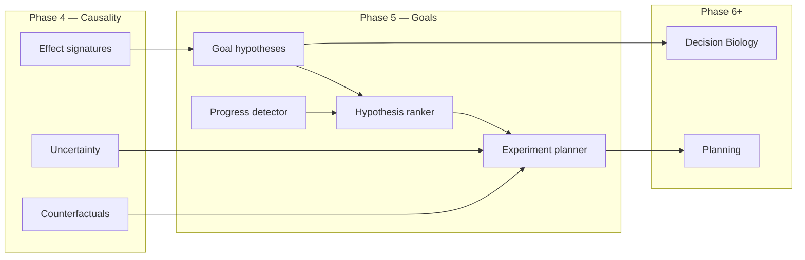

# Goal Inference and Hypothesis Ranking: ASRA Phase 5 — From Interventions to Scientific Objectives

**Author:** Ilakkuvaselvi (Ilak) Manoharan  
**Affiliation:** Nature Foundation Models  
**Date:** June 2026  
**Version:** 1.0 — conceptual article for the Phase 5 hypothesis track (companion to `asra-phase-5-arc-prize-2026.ipynb`)

---

## Abstract

Phases 1–3 of the Adaptive Scientific Reasoning Architecture (ASRA) established **transition logging**, **object-centric observation**, and **directed exploration**. Phase 4 added **action semantics**, **transition prediction**, **hypothesis confirm/refute**, and **counterfactual lookup** — the machinery of intervention reasoning.

None of these layers yet answers: *What is this system trying to achieve? Which hidden objective best explains the progress we have seen? What experiment should we run next to distinguish competing explanations?*

We describe **ASRA Phase 5** as the **Goal Inference & Hypothesis Engine**: a stack that generates **win-condition hypotheses** from scene structure and semantic operators, detects **progress signals** from sparse rewards and structural change, classifies **object roles**, **ranks** competing goal explanations, and plans **discriminating experiments** using Phase 4 uncertainty and counterfactuals. The competition agent embeds a compact **`GoalHypothesisEngine`** atop Phase 4's `CausalSemanticsEngine`; the full research engine is specified for `asra-arc/src/asra/goals/`.

This article presents the theory, architectural decomposition, and design principles. It specifies *what* Phase 5 adds and *why* it is the pivot from exploration and causality toward Phase 6 planning and the Phase 8 Decision Biology bridge.

---

## 1. The architectural gap Phase 5 closes

ASRA's cumulative cognitive stack:

```text
Phase 1   Experience Engine           — transitions, hashes, cell diffs
Phase 2   Observation Engine          — objects, transforms, rule hypotheses
Phase 3   Navigation & Memory         — exploration graph, visitation, subgoals
Phase 4   Semantics & Causal Inference — action meaning, prediction, counterfactuals
Phase 5   Goal Inference & Hypotheses   — win conditions, progress, experiment design
Phase 6+  Planning, robustness
```

Phase 1 asks: *What happened when we acted?*  
Phase 2 asks: *What structural entities changed?*  
Phase 3 asks: *Where should we go next, given memory?*  
Phase 4 asks: *What does this action do, and how sure are we?*  
Phase 5 asks: *What are we trying to accomplish, and how do we test that belief?*

Without Phase 5, an agent that understands interventions still **acts without purpose**: it knows ACTION3 translates an object but not whether translation serves collection, pattern matching, or hazard avoidance. Phase 4 uncertainty drives *semantic* testing; Phase 5 directs that testing toward **goal discrimination**.



---

## 2. Theoretical stance: latent objectives without oracle manuals

Interactive environments — and biological systems — rarely publish their win conditions. ASRA Phase 5 treats goals as **latent variables** inferred from:

1. **Progress events** — rewards, level changes, WIN terminals, structural alignment.
2. **Operator sequences** — Phase 4 semantic labels composed over time.
3. **Object roles** — which entities behave as agents, targets, tokens, or hazards.
4. **Template priors** — abstractions bootstrapped from Original ARC and domain adapters.

The epistemic object is a **goal hypothesis**:

```text
h = (template, preferred_operators, object_roles, preconditions, confidence)
```

Evidence updates `support`, `refute`, and `progress_score` — analogous to Phase 4's causal hypothesis confirm/refute, but at the **task level** rather than the **action-effect level**.

This mirrors **Decision Biology** at the conceptual layer:

```text
Game:     hidden win condition  ← inferred from perturbation–response paths
Cell:     survival objective    ← inferred from perturbation–response paths (Phase 8)
```

Phase 5 is the first phase where the **objective function itself** is uncertain and learned — not just the transition dynamics.

| Paradigm | Phase 5 stance |
|----------|----------------|
| Hand-coded win conditions per game | Rejected — goals are inferred |
| Reward-only RL | Insufficient — reward is sparse; structure carries signal |
| LLM goal parsing from instructions | Deferred — no instruction channel in ARC-AGI-3 |
| Full neural goal encoders | Deferred — v1 uses templates + ranking |
| Planning (Phase 6) | Requires Phase 5 objective first |

---

## 3. Goal templates as scientific hypotheses

Phase 5 v1 uses a **template library** — explicit, falsifiable win-condition families:

| Template | Scientific reading | Example operators |
|----------|-------------------|-------------------|
| `move_to_target` | Reach a target state in state space | translate |
| `match_pattern` | Minimize structural distance to goal configuration | recolor, transform |
| `collect_tokens` | Remove or aggregate discrete markers | delete_object |
| `avoid_hazard` | Constrained optimization under danger | translate, no_op |
| `unlock_passage` | Enable latent pathway | create_object, recolor |
| `transform_to_goal` | Sequential mechanism discovery | multi_cell_transform |

Each template is a **hypothesis class**, not a single hypothesis. Instantiation depends on scene-specific object roles and Phase 4 semantics.

**Original ARC** provides offline supervision: input/output pairs reveal which template family applies — the analog of **known biological endpoint assays** that constrain pathway hypotheses without revealing full mechanism.

---

## 4. Progress detection as evidence accumulation

Scientific reasoning requires distinguishing **meaningful change** from noise. Phase 5's progress detector aggregates:

| Signal type | Source | Hypothesis update |
|-------------|--------|-------------------|
| `reward` | Environment | +weight if semantics match leading hypothesis |
| `level_up` | `levels_completed` | Strong support for progress-aligned hypotheses |
| `win` | Terminal WIN | Weak confirmation of leading hypothesis |
| `object_progress` | Centroid/bbox movement toward target role | Spatial template evidence |
| `pattern_progress` | Phase 2 similarity to inferred output | match_pattern evidence |

Progress is **not** assumed monotonic. Refutation occurs when repeated applications of a hypothesized operator fail to produce expected progress — the same loop as Phase 4 hypothesis refute, elevated to goal level.

---

## 5. Object roles: from pixels to functional entities

Phase 2 extracts **objects**; Phase 5 assigns **roles**. Without roles, "move to target" is undefined.

v1 heuristics (no neural net):

- **agent** — moves across transitions; unique color.
- **target** — static focal region; often distinct color at border.
- **token** — multiple identical instances; count decreases on progress.
- **hazard** — associated with dead-ends or negative progress.
- **key / door** — state change after specific semantic operator.

CLEVR provides eval signal for relational roles; ARC-AGI-3 provides interactive stress test.

Roles attach to transitions as `metadata.goals.object_roles` and condition template instantiation.

---

## 6. Hypothesis ranking as belief maintenance

Given active hypotheses \(\{h_1, \ldots, h_n\}\), Phase 5 maintains scores:

```text
score(h) = w_p · progress_score(h) + w_s · support(h) - w_r · refute(h) + ...
```

The **leading hypothesis** guides action selection but does not eliminate exploration — wrong goals are common early in episodes.

**Status lifecycle:**

```text
active → leading → confirmed (on WIN) / refuted (on counter-evidence) / weak (low support)
```

Ranking output feeds:

- Kaggle agent reasoning strings (`goal=move_to_target`).
- Phase 6 planner objective selection.
- Phase 8 pathway hypothesis priors.

---

## 7. Experiment planning: discrimination over confirmation

Phase 4 asks: *Which action reduces semantic uncertainty?*  
Phase 5 asks: *Which action separates hypothesis A from hypothesis B?*

Given top hypotheses \(h_1, h_2\) and candidate action \(a\):

```text
discrimination(a) = |match(sem(a), h_1) - match(sem(a), h_2)| × uncertainty(s, a)
```

High discrimination + high uncertainty → **priority experiment**. This is the game analog of **designed biological perturbations** that distinguish competing signaling models.

Phase 4 counterfactuals supply predicted alternate outcomes for planning; Phase 5 chooses *which counterfactual question matters* for goal belief.

---

## 8. Closing the loop with Phases 1–4

| Layer | Phase 5 consumption |
|-------|---------------------|
| Phase 1 transitions | Progress event stream; WIN mining |
| Phase 2 scenes | Object roles; pattern progress |
| Phase 2 Original ARC | Template bootstrap |
| Phase 3 subgoals | `level_progress` as progress signal |
| Phase 3 exploration | Fallback when hypotheses weak |
| Phase 4 semantics | Operator vocabulary for templates |
| Phase 4 uncertainty | Experiment planner information gain |
| Phase 4 counterfactuals | Predicted outcomes for discrimination |

**Kaggle agent scoring (embedded):**

```text
score(action) = Phase1–4_terms
              + GOAL_HINT_WEIGHT · action_goal_score(leading, sem)
              + EXPERIMENT_HINT_WEIGHT · discrimination(top-2, sem, u)
```

Reasoning strings:

```text
ASRA Phase5: ACTION3 | objects=5 | visits=2 | sem=translate conf=0.81 u=0.12 | goal=move_to_target
```

---

## 9. Empirical landscape

Phase 5 metrics measure **goal reasoning quality**, not competition win rate (Phase 6).

| Benchmark | Metric |
|-----------|--------|
| ARC-AGI-3 | Leading hypothesis stability; progress correlation; WIN hindsight rank |
| Original ARC | Template family classification from input grid |
| PHYRE | Success-template match; experiments-to-success |
| CLEVR/CLEVRER | Object role accuracy; CF refute rate |

Phase 5 deliberately **does not** claim Milestone #2 — it builds the **objective layer** planners require.

---

## 10. Position in the ASRA research program

| Question | Phase 4 | Phase 5 |
|----------|---------|---------|
| Why try action a? | Semantics, uncertainty | + Goal alignment, discrimination |
| Unit of task memory | Effect signatures | Ranked goal hypotheses |
| What is success? | Observed reward | Inferred win condition |
| Bridge to biology | Intervention form | Latent objective form |

From the Decision Biology roadmap:

```text
environment state  →  action  →  next state        (Phase 4)
hidden goal        →  inferred from responses     (Phase 5)
cell objective     →  survival / adaptation         (Phase 8)
```

Phase 5 introduces **objective uncertainty** — the missing variable between causal dynamics and adaptive planning.

---

## 11. Kaggle submission and agent evolution

| Version | Tag | Layer added |
|---------|-----|-------------|
| Phase 4 | `asra-v0.6-phase4` | Causal semantics |
| **Phase 5** | **`asra-v0.7-phase5`** | **Goal hypotheses, progress, experiment hints** |

Package: `private/phase5/` — notebook writes `my_agent.py`, self-tests perception + exploration + causality + goals, emits validation parquet.

Full library (`goals/` package, ARC batch mining, PHYRE/CLEVR eval) remains specified for offline research; competition agent carries **minimal sufficient** goal stack.

---

## 12. Open problems and next theory steps

1. **Planning (Phase 6)** — use leading hypothesis as planner objective; BFS/A* over semantic operators.  
2. **Conditional goals** — same template, different parameters by game context.  
3. **Neural goal encoders (v2)** — when template library saturates.  
4. **Cross-game goal transfer** — meta-templates from Original ARC to unseen ARC-AGI-3 games.  
5. **Decision Biology (Phase 8)** — swap templates for pathway survival objectives; reuse ranking loop on LINCS/scPerturb.

---

## 13. Conclusion

ASRA Phase 5 is the project's shift from **understanding interventions** to **inferring objectives**: goal templates make implicit win conditions explicit; progress detectors turn sparse feedback into evidence; hypothesis ranking maintains belief over competing explanations; experiment planning directs action toward **discrimination**, not only discovery.

The Phase 5 Kaggle extension is not a new agent philosophy — it is Phase 2 + Phase 3 + Phase 4 + **purpose**. Semantics still describe what actions do; goals describe **why they matter**.

Transition-centric adaptive reasoning remains the core; goal inference is how those transitions become **meaningful toward an objective** — the prerequisite for planning, robustness, and the Decision Biology bridge.

---

## References (conceptual)

- ASRA roadmap — `ASRA-roadmap-datasets.md` (Phase 5: goal inference, ARC, PHYRE, CLEVR)  
- ASRA theory arc — `ASRA-detailed-roadmap.md` (Phase 4–5 Decision Biology bridge)  
- Phase 4 article — `kaggle-notebooks/phase4/asra-phase4-action-semantics-causal-inference.md`  
- Phase 5 specification — [`phase5-goal-inference-hypothesis-engine.md`](phase5-goal-inference-hypothesis-engine.md)  
- Phase 5 implementation — [`phase5-implementation.md`](phase5-implementation.md)  
- Pearl — causal hierarchy (association → intervention → counterfactual); Phase 5 adds objective layer  
- Original ARC — Felzenszwalb & McAllester task families as template priors
