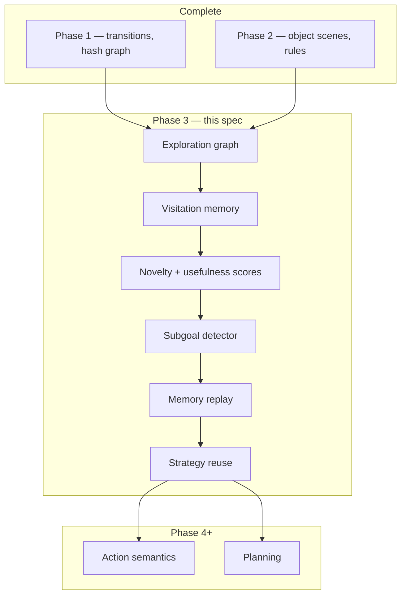

# ASRA Phase 3 — Exploration, Memory, and Navigation

**Track:** Phase 3 (core ASRA roadmap)  
**Source roadmap:** `private/documents/ASRA-theory/ASRA-roadmap-datasets.md`, `ASRA-detailed-roadmap.md`  
**Timeline:** July 2026  
**Status:** **COMPLETE** — Milestones 3A–3D (see `asra-arc/src/asra/exploration/`)  
**Implementation reference:** [phase3-implementation.md](phase3-implementation.md)  
**Conceptual article:** [asra-phase3-exploration-memory-navigation.md](asra-phase3-exploration-memory-navigation.md)  
**Author:** Ilakkuvaselvi (Ilak) Manoharan  
**Last updated:** June 2026  
**Depends on:** Phase 1 (Experience Engine) ✅, Phase 2 (Observation Engine) ✅ baseline

---

## 1. Mission

Phase 3 makes ASRA **efficient in unknown space**. Phase 1 proved transition logging and naive exploration; Phase 2 added object-centric structure. Neither phase answers:

> *Where have I been? What is still unknown? Which action opens new territory? What intermediate goal am I pursuing?*

Phase 3 builds the **Navigation & Memory Engine** — the layer that turns episodic transitions into **persistent spatial and strategic knowledge** so the agent explores with direction instead of repeating loops.

```text
Phase 1:  τ = (s, a, s′, r)           — log everything
Phase 2:  Σ(s), Δ_obj                  — interpret structure
Phase 3:  G_explore, M_visit, g_sub    — remember, prioritize novelty, infer subgoals
Phase 4+: causal semantics of actions
```

**Primary goal:** deliver **ASRA exploration engine v1**, **memory system v1**, and **subgoal inference module**, validated on MiniGrid and BabyAI before heavy integration into ARC-AGI-3 Milestone #2 work (Phase 6).

**Non-goals for Phase 3:**

- Full causal action semantics (roadmap Phase 4)
- Goal hypothesis ranking / win-condition inference (Phase 5)
- BFS/A* / MCTS planners at competition scale (Phase 6)
- Procgen / Crafter generalization (Phase 6–7)
- Decision Biology datasets (Phase 8)
- Replacing Phase 1 transition schema or Phase 2 perception stack

---

## 2. Position in ASRA theory

From `ASRA-detailed-roadmap.md`, Phases 1–3 form the **general adaptive intelligence substrate**:

| Phase | Cognitive role | ASRA module name |
|-------|----------------|------------------|
| 1 | Experience | Experience Engine |
| 2 | Observation | Observation Engine |
| 3 | Exploration & memory | **Navigation & Memory Engine** |
| 4–5 | Causality & hypotheses | Semantics + Hypothesis engines |
| 6–7 | Planning & robustness | Strategy / planner stack |
| 8 | Domain: Decision Biology | Biology transition graphs |

Phase 3 is the last phase before ASRA begins to look like **scientific reasoning** in the Phase 4–5 sense. Exploration memory and subgoal structure are prerequisites for later perturbation–response modeling: a biologist does not re-test every well from scratch; they remember what was tried and what remained unexplored.



---

## 3. Why Phase 3 follows Phase 2

| After Phase 2 only | Phase 3 adds |
|--------------------|--------------|
| Object hints bias single-step scoring | Multi-step **coverage** and **frontier** tracking |
| Hash graph counts visits | **Novelty-weighted** action selection |
| No map of “unseen” regions | Explicit **exploration graph** with frontiers |
| No task structure | **Subgoals** from BabyAI-style composition |
| No cross-episode reuse | **Strategy patterns** stored and replayed |

**Roadmap rationale:** *“After ASRA can parse states, it needs to learn how to explore efficiently instead of randomly trying actions.”*

Phase 2 object scenes become **node annotations** and **soft equivalence keys** on the exploration graph (two hash-distinct grids with similar object multiset may share strategic context). Phase 3 does not require perfect object segmentation — it requires **better exploration than hash-only novelty**.

---

## 4. Inputs from Phase 1 and Phase 2

### 4.1 From Phase 1 (existing in `asra-arc/`)

| Artifact | Location | Phase 3 use |
|----------|----------|-------------|
| Transition schema | `memory/transition_schema.py` | Canonical τ records; attach memory metadata |
| Episode logger | `memory/episode_logger.py` | Episode boundaries for replay |
| State graph (hash) | `memory/state_graph.py` | **Extend** → exploration graph |
| Simple exploration policy | `agent/exploration_policy.py` | Baseline to beat |
| Dead-end detector | `agent/dead_end_detector.py` | Penalize useless edges in graph |
| Dataset exporter | `export/dataset_exporter.py` | Export memory-enriched transitions |
| ARC-AGI-3 runner | `env/arc_agi3_runner.py` | Optional: plug exploration engine v2 |

### 4.2 From Phase 2 (existing)

| Artifact | Location | Phase 3 use |
|----------|----------|-------------|
| `compact_scene_dict` | `perception/snapshot.py` | Node features: `num_objects`, shape summaries |
| Object extractor | `perception/objects.py` | Partial-obs merge / object-stable keys |
| Transform events | `perception/transforms.py` | Detect “progress” micro-events during navigation |
| Rule candidates | `perception/rules.py` | Not primary for MiniGrid; useful for ARC-AGI-3 feedback |

### 4.3 Gap (what Phase 3 must add)

New package (proposed): **`src/asra/exploration/`**

| Module | Responsibility |
|--------|----------------|
| `exploration_graph.py` | Directed graph with visit counts, frontiers, object-annotated nodes |
| `visitation_memory.py` | Per-episode and cross-episode visit tables |
| `novelty.py` | State / edge / object-set novelty scores |
| `usefulness.py` | Action usefulness from reward + frontier expansion |
| `subgoals.py` | Parse BabyAI missions; detect milestone states |
| `replay.py` | Prioritized transition replay buffer |
| `strategies.py` | Named strategy templates + reuse index |
| `minigrid_runner.py` | Gymnasium adapter for MiniGrid |
| `babyai_runner.py` | Instruction-conditioned episodes |

---

## 5. Datasets

Per roadmap: **MiniGrid** (primary), **BabyAI** (compositional / subgoal). Do **not** mix in PHYRE, Procgen, or biology yet.

### 5.1 MiniGrid

**Role:** Controlled **partially observable grid navigation** with sparse rewards, doors, keys, and layout variation — the standard testbed for exploration and memory in RL, adapted here for **explicit graph-based reasoning** rather than black-box policy gradients.

**Why ASRA needs it:**

| Capability | MiniGrid teaches |
|------------|------------------|
| Map building | Agent must infer layout from egocentric views |
| Partial observability | `MiniGrid-*-Partial-Obs-*` variants |
| Sparse reward | Reward often only at goal — exploration must be intrinsic |
| Memory | Remember visited cells / object locations across steps |
| Navigation planning | Shortest paths, door-key sequences |
| Transfer | Same policy structure across grid sizes |

**Recommended environment curriculum (easy → hard):**

| Stage | Environment(s) | Phase 3 focus |
|-------|----------------|---------------|
| A | `MiniGrid-Empty-8x8-v0` | Coverage, novelty, visit memory |
| B | `MiniGrid-FourRooms-v0` | Room graph, frontiers |
| C | `MiniGrid-DoorKey-8x8-v0` | Subgoal: get key → open door → goal |
| D | `MiniGrid-MultiRoom-N6-v0` | Longer horizons, strategy reuse |
| E | Partial-obs variants | Belief / aggregated node keys |

**Acquisition:**

```bash
pip install minigrid gymnasium
```

Pin versions in `pyproject.toml` optional extra `[exploration]`.

**Data layout (proposed):**

```text
asra-arc/data/minigrid/
  episodes/           # JSONL transitions per env
  graphs/             # exploration graphs per env
  analysis/phase3/    # coverage, steps-to-goal, novelty metrics
```

**ASRA use pattern:**

1. Run N episodes with exploration engine v2 (not pure random).
2. Log transitions with **exploration metadata** (novelty, frontier distance, subgoal id).
3. Build exploration graph; compute coverage % of reachable cells (oracle for Empty/FourRooms).
4. Compare against Phase 1 `SimpleExplorationPolicy` on same step budget.

---

### 5.2 BabyAI

**Role:** **Compositional language missions** over MiniGrid worlds — “go to the red ball”, “pick up the key then go to the door”. Teaches **task decomposition** and **reusable strategy patterns**.

**Why ASRA needs it:**

| Capability | BabyAI teaches |
|------------|----------------|
| Subgoal structure | Missions factor into ordered subtasks |
| Compositional generalization | New word combinations from known primitives |
| Strategy reuse | Same “pick up X” across layouts |
| Instruction grounding | Map text mission → exploration objective (lightweight; no LLM required for Phase 3 baseline) |

**Recommended progression:**

| Stage | Setting | Focus |
|-------|---------|-------|
| A | `BabyAI-GoToRedBallGrey-v0` | Single subgoal, object-centric target |
| B | `BabyAI-GoToObjMaze-v0` | Navigation + object identity |
| C | `BabyAI-PickupLoc-v0` | Pickup subgoal before navigation |
| D | `BabyAI-UnlockPickup-v0` | Multi-step: unlock → pickup → goto |

**Acquisition:**

```bash
pip install babyai
# or minigrid[babyai] depending on release channel — pin in extras
```

**Phase 3 scope on BabyAI:**

- Parse mission string into **subgoal list** (rule-based parser for v1; no neural mission encoder required).
- Tag transitions with `subgoal_index` and `subgoal_complete` events.
- Measure **subgoal completion rate** and **steps per subgoal** vs Phase 1 baseline.

**Explicit non-goal:** Natural-language understanding via LLM — Phase 3 uses **structured mission parsers** aligned with BabyAI’s synthetic grammar.

---

### 5.3 ARC-AGI-3 (secondary, integration track)

MiniGrid/BabyAI are the **training ground**. ARC-AGI-3 remains the **north-star interactive benchmark** but Phase 3 does not require leaderboard gains yet.

**Integration plan (light):**

- Attach exploration graph builder to logged ARC-AGI-3 episodes.
- Use Phase 2 `num_objects` + hash for **dual-key novelty** (avoid false novelty from permutation-equivalent grids).
- Feed novelty/usefulness into Kaggle agent as **Phase 3 hints** (parallel to Phase 2 object hints) — target Milestone #1 v5+ / Milestone #2 prep.

Do **not** block Phase 3 completion on ARC-AGI-3 win rate.

---

### 5.4 Dataset ordering (roadmap discipline)

```text
Phase 3 trains on:     MiniGrid → BabyAI
Phase 3 integrates:    ARC-AGI-3 logs (optional parallel)
Phase 3 excludes:      PHYRE, Procgen, Crafter, biology
```

---

## 6. What to build (seven modules + runners)

Roadmap list mapped to concrete ASRA modules.

### 6.1 Exploration graph

**Purpose:** Extend Phase 1 `StateGraph` into an **exploration-centric directed graph** suitable for coverage analysis and planning prep.

**Node schema (proposed):**

```python
@dataclass
class ExplorationNode:
    node_id: str                    # primary: state_hash; optional: object_signature_hash
    state_hash: str
    visit_count: int
    first_seen_step: int
    last_seen_step: int
    terminal: bool
    object_summary: dict | None     # compact_scene from Phase 2
    grid_shape: tuple[int, int]
    frontier_score: float           # higher = more unexplored neighbors expected
```

**Edge schema:**

```python
@dataclass
class ExplorationEdge:
    from_id: str
    to_id: str
    action: str
    count: int
    avg_reward: float
    avg_novelty_gain: float
    usefulness_score: float
    dead_end: bool
```

**Algorithms:**

- Ingest transitions incrementally (online) or batch from JSONL.
- Mark **frontier nodes**: visited states with outgoing actions that led to low visit-count successors.
- Optional **object-signature bucketing**: cluster nodes with identical `(num_objects, sorted shape_hashes)` for ARC-like grids.

**Output:** `exploration_graph.json` + optional GraphML.

**Extends:** `asra.memory.state_graph.StateGraph` — do not fork unrelated graph code.

---

### 6.2 State visitation memory

**Purpose:** Fast lookup for “have we been here before?” at multiple resolutions.

**Layers:**

| Layer | Key | Use |
|-------|-----|-----|
| Exact | `state_hash` | Precise revisit detection |
| Object | `object_scene_fingerprint` | Soft revisit (Phase 2) |
| Spatial (MiniGrid) | `(room_id, cell_x, cell_y)` when oracle layout available for eval |
| Episodic | `(episode_id, step)` | Replay indexing |

**API (proposed):**

```python
class VisitationMemory:
    def observe(self, state_hash: str, step: int, object_scene: dict | None = None) -> None: ...
    def visit_count(self, state_hash: str) -> int: ...
    def is_novel(self, state_hash: str) -> bool: ...
    def recent_window(self, n: int) -> list[str]: ...
```

**Integration:** Called from runner after each transition; feeds novelty and policy.

---

### 6.3 Novelty score

**Purpose:** Quantify **expected information gain** from visiting a state or taking an edge.

**Baseline formula (v1):**

```text
novelty(s) = 1 / sqrt(1 + visit_count(s))
           + α · 1[object_fingerprint unseen]
           + β · frontier_bonus(s)
```

**Edge novelty:**

```text
edge_novelty(s, a) = novelty(s′) · (1 + γ · reward_proxy)
                     − δ · dead_end_penalty(s, a)
```

**Calibration:** Tune α, β, γ, δ on `MiniGrid-Empty-8x8` to maximize cell coverage in fixed step budget vs Phase 1 policy.

**Output:** Stored in transition `metadata.exploration.novelty` for analysis.

---

### 6.4 Action usefulness score

**Purpose:** Separate **novelty** (information) from **utility** (progress toward reward/subgoal).

**Signals:**

| Signal | Source |
|--------|--------|
| Reward delta | Environment |
| Frontier expansion | Exploration graph — new node created |
| Subgoal advance | BabyAI parser |
| Object delta | Phase 2 `delta_num_objects` (ARC) |
| Dead-end flag | Phase 1 dead-end detector |

**Combined score (v1):**

```text
usefulness(a | s) = w_r · Δreward + w_f · frontier_gain + w_g · subgoal_progress
                  − w_d · dead_end(s, a)
```

Used with novelty in Pareto-style action ranking or weighted sum for v1 simplicity.

---

### 6.5 Subgoal detector

**Purpose:** Infer **current subgoal** and detect **subgoal completion** without environment oracle (BabyAI) or with oracle for metrics only.

**BabyAI (supervised structure):**

- Parse mission template → ordered subgoals: `[GoTo(type=ball, color=red), Done]`.
- Detect completion via environment `mission` API or observation predicates (agent at target cell, carrying object).

**MiniGrid (unsupervised heuristics):**

- Key acquired → subgoal “has_key”
- Door open → subgoal “door_open”
- Goal visible → subgoal “see_goal”

**ARC-AGI-3 (heuristic v1):**

- Level counter increase → subgoal “level_progress”
- WIN status → terminal subgoal

**Output schema:**

```python
@dataclass
class SubgoalState:
    subgoal_id: str
    index: int
    description: str
    status: Literal["pending", "active", "completed"]
    entered_at_step: int | None
    completed_at_step: int | None
```

---

### 6.6 Memory replay system v1

**Purpose:** Reuse **high-value transitions** for analysis, policy refinement, and debugging — not neural training initially.

**Priority queue criteria:**

1. High novelty at first visit  
2. Subgoal boundary crossings  
3. WIN / level-complete transitions  
4. High object-delta (Phase 2)  
5. Low visit count successor

**Storage:** Ring buffer per environment + spill to JSONL (`data/replay/`).

**API:**

```python
class TransitionReplayBuffer:
    def push(self, transition: dict, priority: float) -> None: ...
    def sample(self, k: int) -> list[dict]: ...
    def export(self, path: Path) -> None: ...
```

**Use cases:**

- Streamlit / notebook replay of “best discoveries”
- Batch re-run perception on stored frames
- Future: offline RL or imitation (out of scope for v1)

---

### 6.7 Strategy reuse mechanism

**Purpose:** Capture **reusable macro-patterns** across episodes and environments.

**Strategy template (v1):**

```python
@dataclass
class StrategyPattern:
    strategy_id: str
    name: str                    # e.g. "door_key_sequence", "frontier_dfs"
    precondition: dict           # object/scene tags or subgoal types
    action_sequence: list[str]   # compressed edge sequence
    success_count: int
    source_env: str
```

**Mechanism:**

1. After successful BabyAI / DoorKey episodes, extract action subgraph from exploration graph.
2. Index by precondition (e.g. “see closed door + have no key”).
3. On matching state fingerprint, **bias** action scores toward first edge of stored sequence (soft reuse, not hard script).

**Phase 3 success:** Demonstrate **one** reused strategy across ≥2 episodes in `DoorKey-8x8` with reduced steps vs first episode.

---

## 7. System architecture

```text
                    ┌─────────────────────────────────────┐
                    │         Environment adapters         │
                    │  MiniGrid │ BabyAI │ ARC-AGI-3      │
                    └─────────────────┬───────────────────┘
                                      │ frames, reward
                                      ▼
                    ┌─────────────────────────────────────┐
                    │   Phase 1 — EpisodeLogger / τ schema   │
                    └─────────────────┬───────────────────┘
                                      │
          ┌───────────────────────────┼───────────────────────────┐
          ▼                           ▼                           ▼
┌─────────────────┐       ┌─────────────────┐       ┌─────────────────┐
│ Phase 2 snapshot│       │ ExplorationGraph │       │ VisitationMemory│
│ (object scene)  │──────▶│ + frontiers      │◀──────│                 │
└─────────────────┘       └────────┬─────────┘       └─────────────────┘
                                   │
                    ┌──────────────┼──────────────┐
                    ▼              ▼              ▼
              NoveltyScore  UsefulnessScore  SubgoalDetector
                    │              │              │
                    └──────────────┼──────────────┘
                                   ▼
                    ┌─────────────────────────────────────┐
                    │   ExplorationPolicyV2 (action select)  │
                    └─────────────────┬───────────────────┘
                                      │
                    ┌─────────────────┴─────────────────┐
                    ▼                                   ▼
           TransitionReplayBuffer              StrategyLibrary
```

**Policy interface (proposed):**

```python
class ExplorationPolicyV2:
    name = "exploration_v2"

    def select_action(
        self,
        state_hash: str,
        available_actions: list[str],
        graph: ExplorationGraph,
        memory: VisitationMemory,
        subgoal: SubgoalState | None,
        object_scene: dict | None,
    ) -> dict[str, Any]: ...
```

---

## 8. Transition metadata extension

Phase 3 enriches Phase 1 transitions without breaking schema:

```json
{
  "metadata": {
    "exploration": {
      "novelty": 0.82,
      "usefulness": 0.45,
      "visit_count_before": 2,
      "frontier_node": true,
      "subgoal_id": "pickup_key",
      "subgoal_index": 1,
      "strategy_hint": "door_key_sequence_v1"
    },
    "object_scenes_attached": true
  }
}
```

Parquet flatten columns (proposed): `novelty`, `usefulness`, `subgoal_index`, `visit_count_before`.

---

## 9. Implementation plan

### Milestone 3A — MiniGrid foundation (week 1–2)

| Task | Deliverable |
|------|-------------|
| `[exploration]` extra in pyproject | minigrid + gymnasium pinned |
| `MiniGridRunner` | Episodes → JSONL |
| `ExplorationGraph` + `VisitationMemory` | Unit tests |
| `NoveltyScore` v1 | Coverage eval on Empty-8x8 |
| CLI `run-minigrid` | Batch runner |

**Exit criteria:** Beat Phase 1 random/simple policy on **coverage %** in 200 steps (Empty-8x8).

---

### Milestone 3B — Useful exploration (week 2–3)

| Task | Deliverable |
|------|-------------|
| `UsefulnessScore` | Combined ranking |
| `ExplorationPolicyV2` | Integrated policy |
| FourRooms + DoorKey eval | `data/analysis/phase3/` reports |
| Replay buffer | Top-100 transitions export |

**Exit criteria:** DoorKey-8x8 — ≥50% success within step budget (baseline TBD) vs ≤20% for Phase 1 policy.

---

### Milestone 3C — BabyAI subgoals (week 3–4)

| Task | Deliverable |
|------|-------------|
| Mission parser | Subgoal list from BabyAI mission string |
| `SubgoalDetector` | Completion events in logs |
| `StrategyLibrary` v1 | One extracted DoorKey pattern |
| BabyAI eval harness | Subgoal metrics CSV |

**Exit criteria:** Correct subgoal boundary detection on ≥90% of successful `GoToRedBall`-class episodes (oracle comparison).

---

### Milestone 3D — ARC-AGI-3 integration (week 4+, optional)

| Task | Deliverable |
|------|-------------|
| Exploration graph from ARC logs | Per-game graphs |
| Object-augmented novelty | Dual-key scoring |
| Kaggle agent v0.5-phase3 | Novelty/usefulness hints |

**Exit criteria:** Documented ablation — with vs without Phase 3 hints on fixed seed episodes (not necessarily public leaderboard gain).

---

## 10. Success metrics

### 10.1 MiniGrid (primary)

| Metric | Definition | Target (initial) |
|--------|------------|------------------|
| **Coverage** | % reachable cells visited | > Phase 1 by ≥20% (Empty-8x8, 200 steps) |
| **Steps to goal** | First success episode length | Lower median vs baseline (DoorKey) |
| **Revisit rate** | Revisits / total steps | Lower than Phase 1 |
| **Frontier efficiency** | New nodes per 100 steps | Higher than Phase 1 |
| **Graph size** | Unique nodes | Correlates with coverage |

### 10.2 BabyAI (secondary)

| Metric | Definition | Target |
|--------|------------|--------|
| **Subgoal detection accuracy** | Match oracle milestones | ≥90% on success episodes |
| **Steps per subgoal** | Mean steps between completions | Decrease vs Phase 1 |
| **Strategy reuse gain** | Steps saved on 2nd+ success | ≥15% reduction |

### 10.3 ARC-AGI-3 (integration)

| Metric | Definition | Target |
|--------|------------|--------|
| **Unique states per episode** | Exploration graph nodes | Increase at fixed action budget |
| **Loop count** | Repeated hash cycles | Decrease |
| **Levels completed** | Competition proxy | Non-regression vs v0.4-phase2 |

### 10.4 What Phase 3 metrics are *not*

- ARC Original 800-task rule coverage (Phase 2)
- PHYRE physics accuracy (Phase 4)
- Milestone #2 win rate (Phase 6)
- Biological perturbation prediction (Phase 8)

---

## 11. Testing strategy

| Layer | Tests |
|-------|-------|
| Unit | Novelty monotonicity, visit counts, subgoal parser on fixed strings |
| Integration | MiniGrid Empty — 50-step episode produces connected graph |
| Regression | Phase 1 + Phase 2 tests remain green |
| Eval scripts | `eval_phase3_minigrid.py`, `eval_phase3_babyai.py` (planned) |

Fixtures: tiny 4×4 grid worlds in `tests/fixtures/minigrid_micro/`.

---

## 12. Repository layout (proposed)

```text
asra-arc/
  src/asra/exploration/
    __init__.py
    exploration_graph.py
    visitation_memory.py
    novelty.py
    usefulness.py
    subgoals.py
    replay.py
    strategies.py
    policy_v2.py
    minigrid_runner.py
    babyai_runner.py
  scripts/
    run_phase3_minigrid_batch.py
    eval_phase3_minigrid.py
    eval_phase3_babyai.py
  tests/
    test_exploration_graph.py
    test_novelty.py
    test_subgoal_parser.py
  data/
    minigrid/
    analysis/phase3/

kaggle-notebooks/phase3/
  phase3-exploration-memory-navigation.md   # this file
  README.md
  # future: asra-phase-3-minigrid-notebook.ipynb
```

**CLI additions (planned):**

```bash
python -m asra run-minigrid --env ... --episodes ...
python -m asra run-babyai --env ... --episodes ...
python -m asra build-exploration-graph --input-dir ...
```

---

## 13. Relationship to Kaggle / competition agents

Phase 3 is **research infrastructure first**, competition second.

| Agent version | Phase 3 features |
|---------------|------------------|
| `asra-v0.4-phase2` | Object-scene hints only |
| `asra-v0.5-phase3` (planned) | + novelty/usefulness, visit memory, optional strategy bias |

A future **`kaggle-notebooks/phase3/`** notebook would embed a **compact** subset (visit counts + frontier bonus) — mirroring how Phase 2 embedded compact perception without the full `asra-arc` library on Kaggle.

---

## 14. Risks and mitigations

| Risk | Mitigation |
|------|------------|
| MiniGrid API drift (Farama) | Pin versions; wrapper adapter |
| Object-hash false merges | Keep hash-primary; object as secondary bonus only |
| BabyAI mission parser fragility | Start with env API ground truth for eval; parser for logging |
| Scope creep into Phase 4 semantics | Freeze v1 scores to graph + reward + subgoals only |
| ARC-AGI-3 gains too small to measure | Accept; MiniGrid is source of truth for Phase 3 done |

---

## 15. Open questions

1. **Belief states** for partial observability — explicit belief vector vs aggregated graph nodes?  
2. **Object-graph memory** — full Phase 2 object graph per node vs compact fingerprint?  
3. **Cross-env strategy transfer** — MiniGrid DoorKey → ARC-AGI-3 analog?  
4. **Neural components** — Phase 3 stays symbolic/heuristic unless metrics plateau.

---

## 16. Summary deliverables (Phase 3 complete)

| Output | Description |
|--------|-------------|
| **ASRA exploration engine v1** | `ExplorationPolicyV2` + graph + scores |
| **Memory system v1** | `VisitationMemory` + `TransitionReplayBuffer` |
| **Subgoal inference module** | Parser + detector + BabyAI eval |
| **Strategy reuse** | `StrategyLibrary` with ≥1 demonstrated reuse |
| **MiniGrid benchmark report** | Coverage, steps, revisit metrics |
| **BabyAI subgoal report** | Detection accuracy, steps per subgoal |
| **Docs** | This spec + updated `asra-arc/README.md` |

---

## 17. References

- ASRA roadmap — `private/documents/ASRA-theory/ASRA-roadmap-datasets.md`  
- ASRA theory arc — `private/documents/ASRA-theory/ASRA-detailed-roadmap.md`  
- Phase 2 spec — `private/documents/phase2-b/phase2-abstraction-symbolic-reasoning.md`  
- Phase 2 article — [`../phase2/asra-phase2-object-centric-reasoning.md`](../phase2/asra-phase2-object-centric-reasoning.md)  
- MiniGrid — [Farama MiniGrid](https://minigrid.farama.org/)  
- BabyAI — [BabyAI paper / env suite](https://arxiv.org/abs/1810.08272)  
- Phase 1 state graph — `asra-arc/src/asra/memory/state_graph.py`  
- Phase 1 exploration — `asra-arc/src/asra/agent/exploration_policy.py`

---

*Phase 3 specification — exploration, memory, and navigation. Implementation pending; see Milestones 3A–3D.*
